# 📦 Week 2: OLAP & Metabase — DW Architecture and Lifecycle

> **Course:** Data Warehousing (การสร้างคลังข้อมูล)  
> **Topic:** DW Architecture, Lifecycle & OLAP Operations with Metabase  
> **Duration:** 2 Hours

---

## 🎯 Learning Objectives / วัตถุประสงค์

1. Understand **Data Warehouse Architecture** and the DW Lifecycle.
2. Restore a real-world PostgreSQL database (`dvdrental`) using `pg_restore`.
3. Classify tables as **Fact** or **Dimension** in a DW context.
4. Perform **OLAP operations** — Roll-up, Drill-down, Slice, Dice, CUBE — using SQL in Metabase.
5. Build an interactive **OLAP Dashboard** in Metabase.

---

## 🧰 Tools & Stack Overview / เครื่องมือที่ใช้

| Tool | What is it? | What is it used for in this lab? |
|---|---|---|
| **PostgreSQL 16** | Relational Database (RDBMS) | Stores the `dvdrental` sample database |
| **pgAdmin 4** | Database GUI Management Tool | Restore the `.tar` dump and run SQL queries |
| **Metabase** | Open-source BI & Visualization Tool | Build OLAP dashboards and charts |
| **dvdrental.tar** | PostgreSQL Database Dump | Sample DVD rental store database |

---

## 📁 Files in This Week / ไฟล์ในสัปดาห์นี้

| File / Folder | Description |
|---|---|
| 📂 [slides/](./slides/) | Lecture slides |
| └── 📄 [2 - DW Architecture & Lifecycle.pdf](./slides/2%20-%20DW%20Architecture%20%26%20Lifecycle.pdf) | Lecture: DW Architecture & Lifecycle |
| 📂 [docs/](./docs/) | Lab instructions |
| ├── 📄 [Lab2 Olap Metabase.pdf](./docs/Lab2%20Olap%20Metabase.pdf) | Lab instruction (PDF) |
| └── 📝 [Lab2 Olap Metabase.docx](./docs/Lab2%20Olap%20Metabase.docx) | Lab instruction (Word) |
| 📂 [lab-week02/](./lab-week02/) | Lab files |
| └── 🗄️ [dvdrental.tar](./lab-week02/dvdrental.tar) | PostgreSQL dvdrental database dump |

---

## 🔧 Part 1: Restore the dvdrental Database

Make sure your Docker stack from Week 1 is running:
```bash
cd week01-data-warehouse-setup/lab-week01
docker compose up -d
docker compose ps
```

### Option A — CLI (Recommended)

1. Copy the dump file into the PostgreSQL container (from the `lab-week01` folder):
```bash
docker cp "../../week02-olap-metabase/lab-week02/dvdrental.tar" dw_postgres:/tmp/dvdrental.tar
```

2. Create the `dvdrental` database:
```bash
docker exec -it dw_postgres psql -U dw_user -d airflow -c "CREATE DATABASE dvdrental;"
```

> ⚠️ **Important:** Always add `-d airflow` when connecting without a target database.
> `psql -U dw_user` alone will fail because psql defaults to connecting to a database
> named the same as the user (`dw_user`), which does not exist — our default DB is `airflow`.

3. Restore from the `.tar` dump:

**Mac / Linux:**
```bash
docker exec -it dw_postgres pg_restore \
  --no-owner \
  --role=dw_user \
  -U dw_user \
  -d dvdrental \
  /tmp/dvdrental.tar
```

**Windows (PowerShell):**
```powershell
docker exec -it dw_postgres pg_restore `
  --no-owner `
  --role=dw_user `
  -U dw_user `
  -d dvdrental `
  /tmp/dvdrental.tar
```

> 💡 *Tip: You can also copy and paste the command as a single line if the line breaks cause errors.*

> **Command explanation:**
> - `pg_restore` — restores a database from a backup file
> - `--no-owner` — do not restore original ownership from another system
> - `--role=dw_user` — set new owner to `dw_user`

4. Verify the tables:
```bash
docker exec -it dw_postgres psql -U dw_user -d dvdrental -c "\dt"
```

<details>
<summary><b>View Screenshot</b></summary>

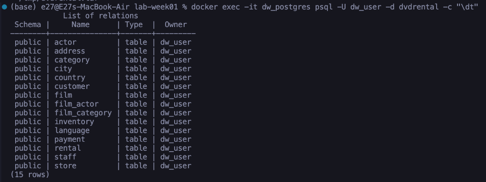

</details>

---

### Option B — pgAdmin GUI *(If you already did Option A, skip to Step 5)*

1. Open **[http://localhost:28880](http://localhost:28880)** → log in with:
   - **Email:** `dw_user@mail.com`
   - **Password:** `dw_pass`

   > ⚠️ **Common mistake:** pgAdmin login requires a **full email address**, not just the username. Using `dw_user` will give you *"Email/Username is not valid"* — use `dw_user@mail.com` instead.
2. Create database **`dvdrental`**: Right-click server ➡️ **Create** ➡️ **Database...**
3. Right-click `dvdrental` ➡️ **Restore...**
   - **Format:** TAR
   - **Filename:** select `dvdrental.tar`
   - **Role name:** `dw_user`
   - **Data Options:** Do not save → **Owner**
4. Click **Restore**
5. Verify: expand **Schemas** ➡️ **public** ➡️ **Tables**

<details>
<summary><b>View Screenshot</b></summary>

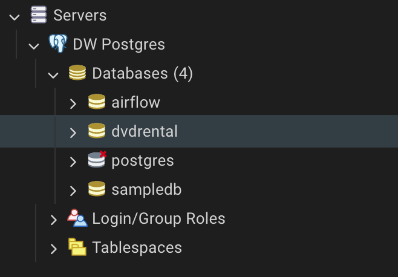

</details>

<details>
<summary><b>View Screenshot</b></summary>

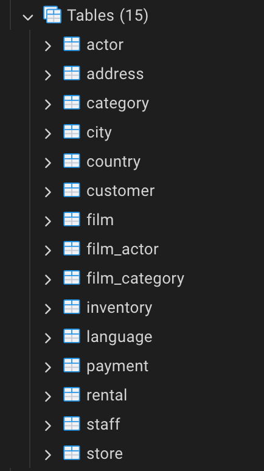

</details>

---

## 🗄️ Part 2: Connect Metabase to dvdrental

1. Open **[http://localhost:23000](http://localhost:23000)**
2. Click **Add your data** in the left sidebar:

   <details>
   <summary><b>View Screenshot</b></summary>

   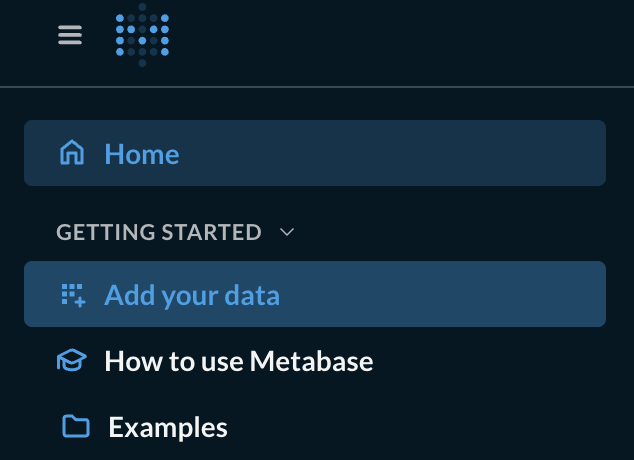

   </details>

3. Select **PostgreSQL** from the database picker:

   <details>
   <summary><b>View Screenshot</b></summary>

   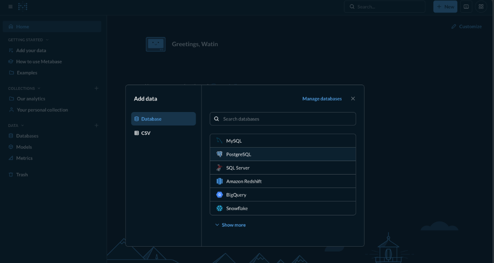

   </details>

4. Fill in the connection form:
   - **Display name:** `dvdrental`
   - **Host:** `dw_postgres` *(Docker container name — NOT localhost)*
   - **Port:** `5432`
   - **Database name:** `dvdrental`
   - **Username:** `dw_user`
   - **Password:** `dw_pass`

   <details>
   <summary><b>View Screenshot</b></summary>

   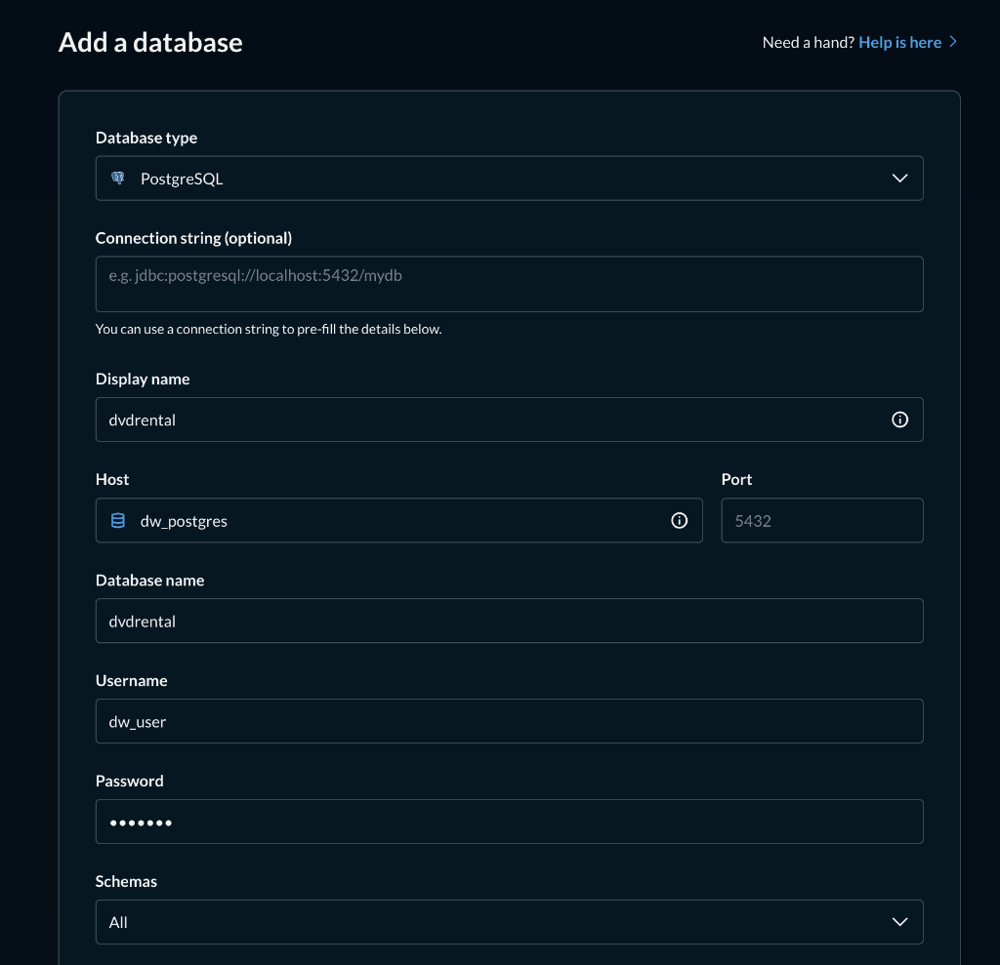

   </details>

5. Click **Save** and wait for sync.

   After saving, Metabase will show the connection status:

   <details>
   <summary><b>View Screenshot</b></summary>

   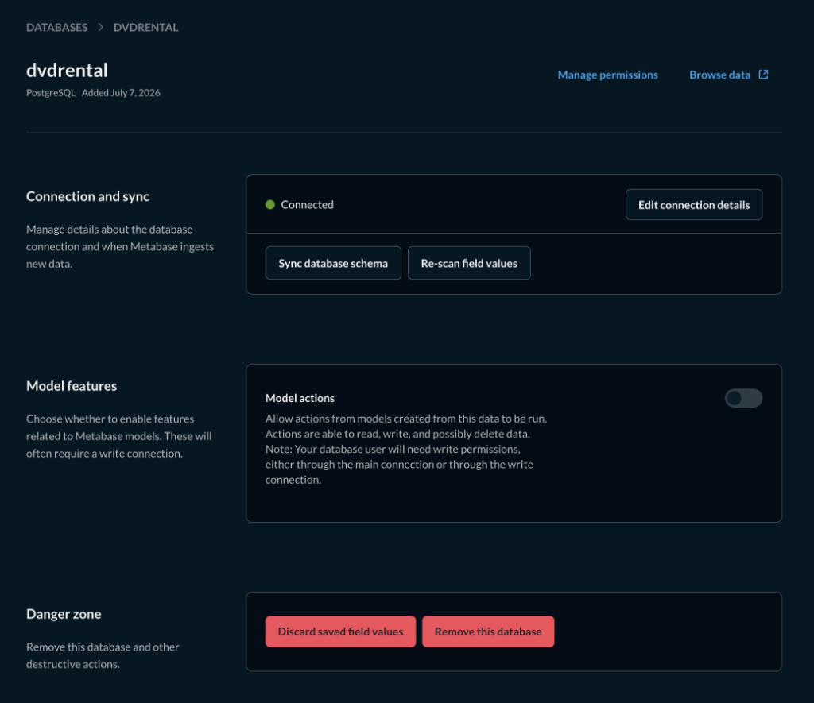

   </details>

   You can also verify under **Data** ➡️ **Databases**:

   <details>
   <summary><b>View Screenshot</b></summary>

   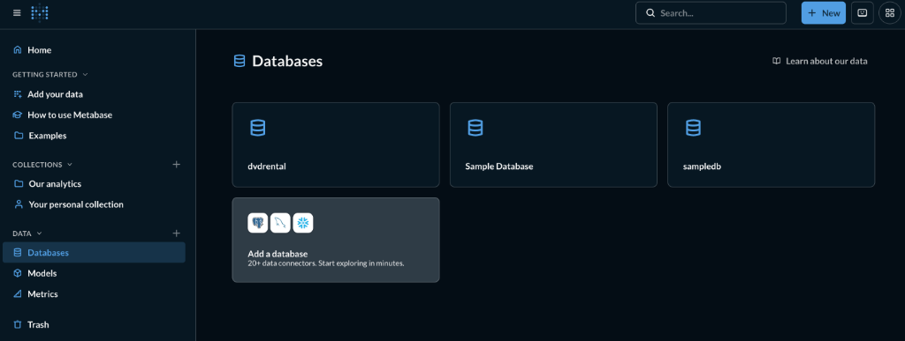

   </details>

---

## 🔍 Part 3: Explore Tables — Fact vs Dimension

The `dvdrental` database simulates a DVD rental store. Understanding Fact vs Dimension helps build efficient DW schemas.

Browse all tables in Metabase under **Data** ➡️ **Databases** ➡️ **DVDRENTAL**:

<details>
<summary><b>View Screenshot</b></summary>

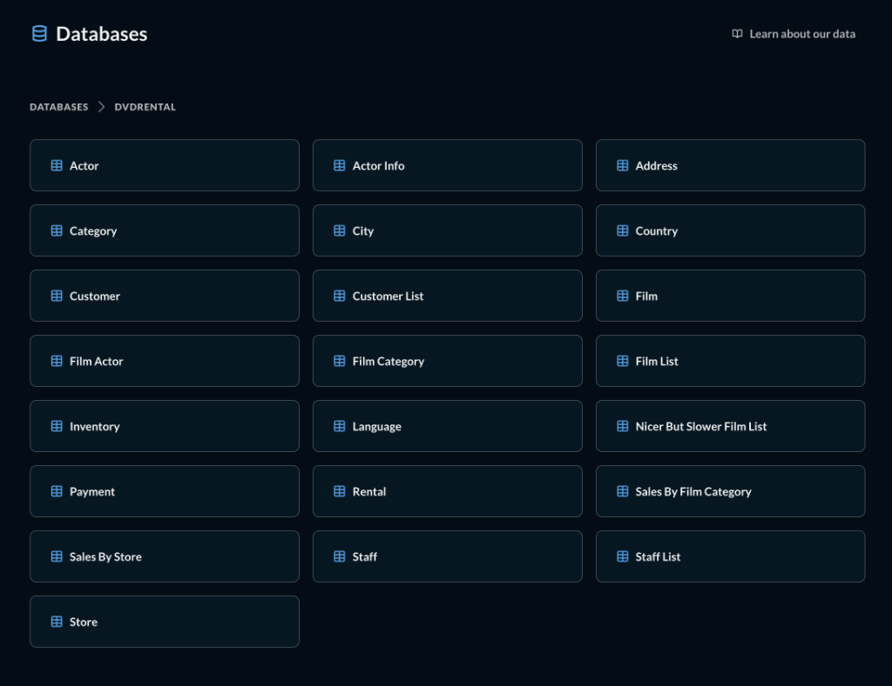

</details>

**ER Diagram — dvdrental schema:**

<details>
<summary><b>View Screenshot</b></summary>

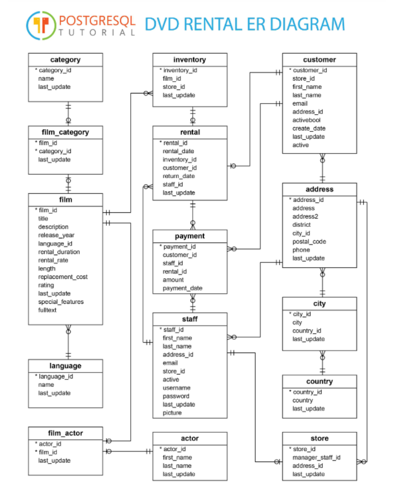

</details>

| Table | Type | Reason |
|---|---|---|
| `payment` | **Fact** | Stores payment transactions with timestamp and amount |
| `rental` | **Fact** | Stores rental event records |
| `customer` | **Dimension** | Identifies who made the payment |
| `staff` | **Dimension** | Identifies who processed the payment |
| `film` | **Dimension** | Movie details and attributes |
| `category` | **Dimension** | Film genre/category |
| `inventory` | **Bridge** | Links film to rental (many-to-many bridge) |
| `store` | **Dimension** | Store location context |
| `city` / `address` | **Dimension** | Geographic context of customers |

> 💡 In OLAP, organizing data into Fact and Dimension tables enables efficient **Roll-up / Drill-down** operations.

---

## 📊 Part 4: OLAP SQL Operations in Metabase

Open **SQL Editor** in Metabase:  
Home ➡️ Databases ➡️ dvdrental ➡️ **+ New** ➡️ **SQL query**

<details>
<summary><b>View Screenshot</b></summary>

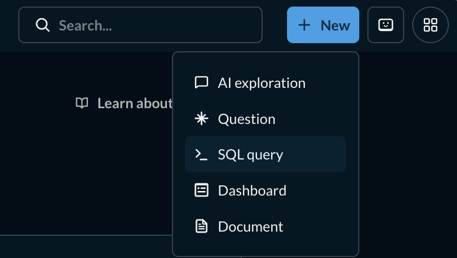

</details>

Select **dvdrental** from the database picker on the left:

<details>
<summary><b>View Screenshot</b></summary>

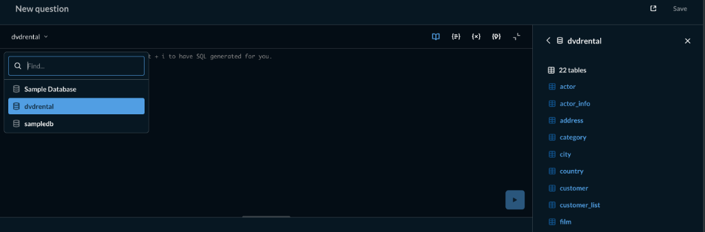

</details>

---

### 🔹 Roll-up: City → Country

Aggregate from city level up to country level.

```sql
SELECT co.country, ci.city, SUM(p.amount) AS total_revenue
FROM payment p
JOIN customer cu ON p.customer_id = cu.customer_id
JOIN address a ON cu.address_id = a.address_id
JOIN city ci ON a.city_id = ci.city_id
JOIN country co ON ci.country_id = co.country_id
GROUP BY ROLLUP (co.country, ci.city)
ORDER BY co.country, ci.city;
```

<details>
<summary><b>View Screenshot</b></summary>

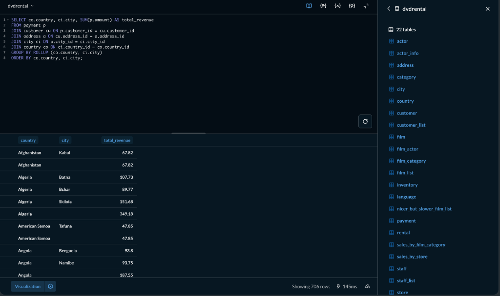

</details>

---

### 🔹 Drill-down: Country → District → Staff

Go deeper into district and staff dimensions.

```sql
SELECT co.country, a.district, s.first_name AS staff_name,
       SUM(p.amount) AS total_revenue
FROM payment p
JOIN staff s ON p.staff_id = s.staff_id
JOIN customer cu ON p.customer_id = cu.customer_id
JOIN address a ON cu.address_id = a.address_id
JOIN city ci ON a.city_id = ci.city_id
JOIN country co ON ci.country_id = co.country_id
GROUP BY co.country, a.district, s.first_name;
```

<details>
<summary><b>View Screenshot</b></summary>

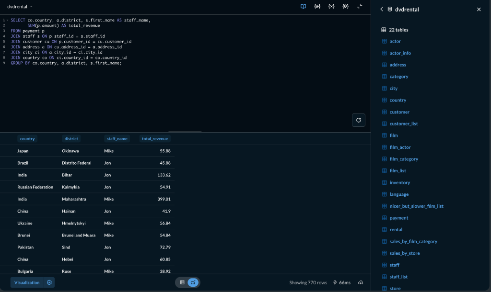

</details>

---

### 🔹 Slice: Filter by Country = Thailand

Show only one "slice" of data — customers from Thailand.

```sql
SELECT ci.city, SUM(p.amount) AS total_revenue
FROM payment p
JOIN customer cu ON p.customer_id = cu.customer_id
JOIN address a ON cu.address_id = a.address_id
JOIN city ci ON a.city_id = ci.city_id
JOIN country co ON ci.country_id = co.country_id
WHERE co.country = 'Thailand'
GROUP BY ci.city;
```

<details>
<summary><b>View Screenshot</b></summary>

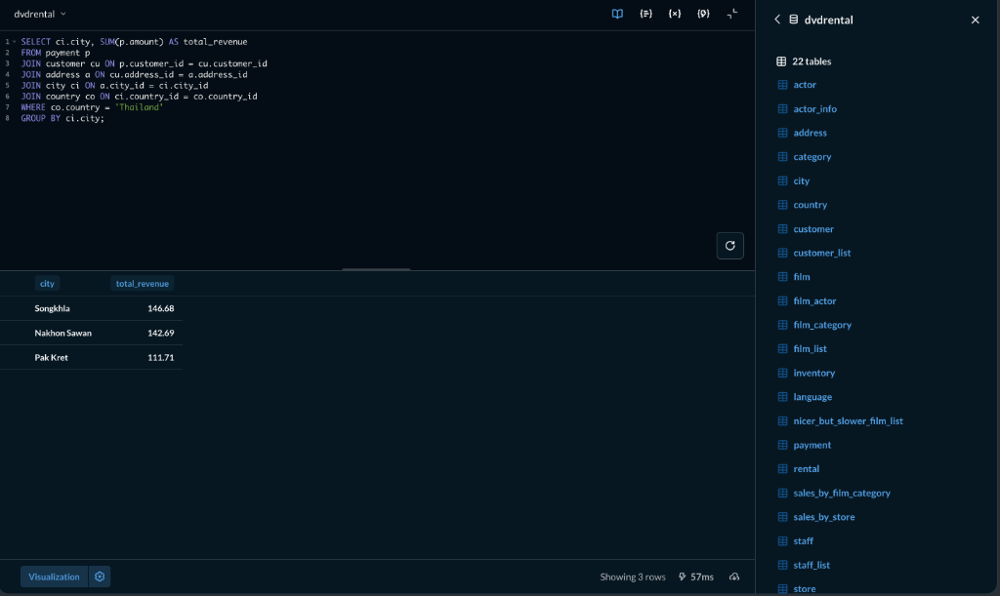

</details>

---

### 🔹 Dice: Multiple Dimension Filters (Country + Staff)

Filter on multiple dimensions simultaneously.

```sql
SELECT co.country, ci.city, s.first_name AS staff_name,
       SUM(p.amount) AS total_revenue
FROM payment p
JOIN staff s ON p.staff_id = s.staff_id
JOIN customer cu ON p.customer_id = cu.customer_id
JOIN address a ON cu.address_id = a.address_id
JOIN city ci ON a.city_id = ci.city_id
JOIN country co ON ci.country_id = co.country_id
WHERE co.country IN ('Thailand', 'Japan')
  AND s.staff_id = 1
GROUP BY co.country, ci.city, s.first_name;
```

<details>
<summary><b>View Screenshot</b></summary>

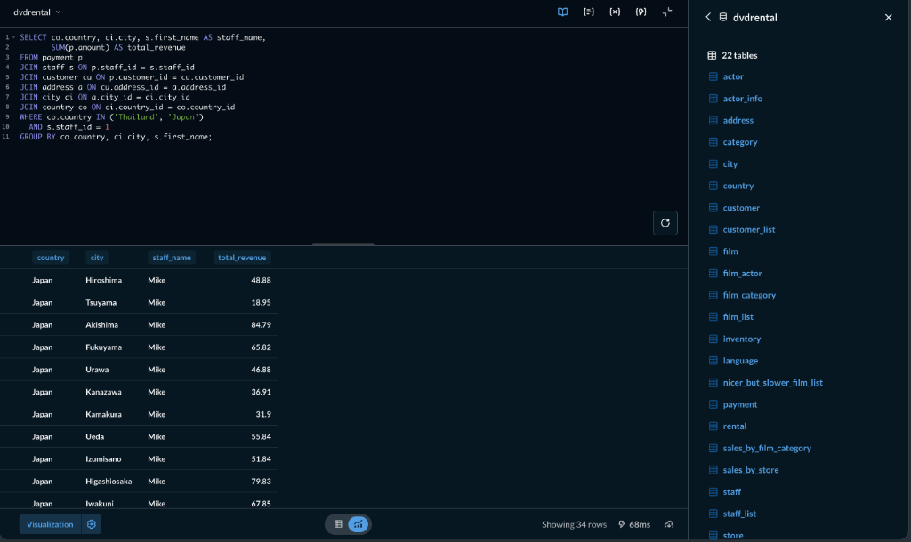

</details>

---

### 🔹 CUBE Operation: All Aggregation Combinations

Generate every possible combination of (country, staff) subtotals automatically.

```sql
SELECT co.country, s.first_name AS staff_name,
       SUM(p.amount) AS total_revenue
FROM payment p
JOIN staff s ON p.staff_id = s.staff_id
JOIN customer cu ON p.customer_id = cu.customer_id
JOIN address a ON cu.address_id = a.address_id
JOIN city ci ON a.city_id = ci.city_id
JOIN country co ON ci.country_id = co.country_id
GROUP BY CUBE (co.country, s.first_name)
ORDER BY co.country, s.first_name;
```

<details>
<summary><b>View Screenshot</b></summary>

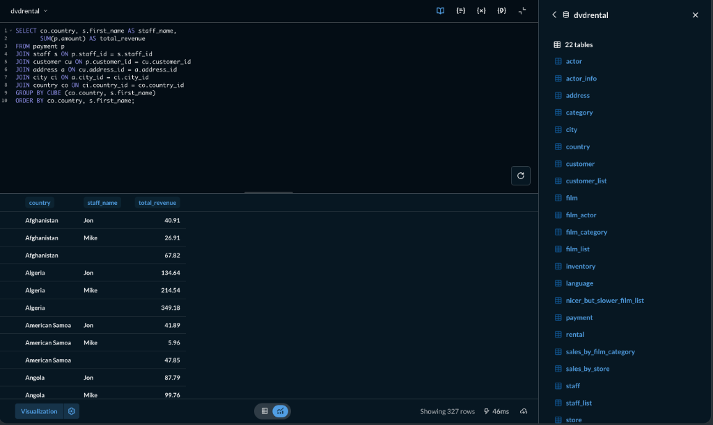

</details>

> PostgreSQL supports `GROUP BY CUBE` — it generates all aggregation combinations:
> `(country, first_name)`, `(country)`, `(first_name)`, and `()` (grand total).

---

## 📈 Part 5: Build a Dashboard in Metabase

### Step 1 — Open SQL Editor
- Home ➡️ Databases ➡️ dvdrental ➡️ **+ New** ➡️ **SQL query**
- Paste any OLAP query from Part 4 and click **Run**

### Step 2 — Change to Chart View
- Click **Visualization** (bottom left)
- Select chart type (Bar, Line, Map, etc.)
- Adjust axes and display settings

  *Example: Roll-up query visualized as a Line chart (X-axis: country, Y-axis: total_revenue)*

  <details>
  <summary><b>View Screenshot</b></summary>

  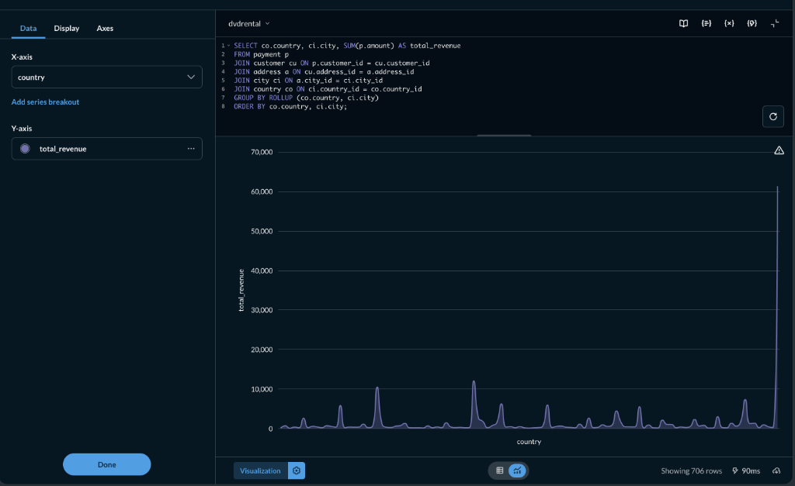

  </details>

### Step 3 — Save the Chart
- Click **Save** → name the chart (e.g., `drill-down`)
- Choose **Save to new dashboard**
- Name the dashboard: **`OLAP Analysis - [your name]`**

### Step 4 — Arrange Layout
- Go to **Dashboards** ➡️ open your dashboard
- Drag and resize charts to arrange neatly

> 📝 You can also build queries without SQL using Metabase's GUI builder — select tables and fields directly.

---

## 📤 Submission / สิ่งที่ต้องส่ง

ส่งคำตอบผ่าน **[Google Form — Lab 2: OLAP ด้วย Metabase และ PostgreSQL](https://docs.google.com/forms/d/16l8AJrzKDnaW7ZZnAhO_swQr4-Js2Ik3CArtRUFNcw8/viewform)**

> ⚠️ หากมีปัญหาในการนำเข้า dvdrental ให้แจ้งอาจารย์ หรือ TA ทันที

---

## 🛠️ Useful Commands Cheat Sheet

> ⚠️ Run Docker commands from inside the `week01-data-warehouse-setup/lab-week01` directory.

| Command | Description |
|---|---|
| `docker compose up -d` | Start all services in background |
| `docker compose down` | Stop all services |
| `docker compose ps` | Check container status |
| `docker cp <file> dw_postgres:/tmp/` | Copy a file into the PostgreSQL container |
| `docker exec -it dw_postgres psql -U dw_user -d airflow` | Open psql shell (use `airflow` as default db) |
| `docker exec -it dw_postgres psql -U dw_user -d dvdrental` | Open psql shell in dvdrental db (after restore) |
| `docker exec -it dw_postgres pg_restore --no-owner --role=dw_user -U dw_user -d dvdrental /tmp/dvdrental.tar` | Restore `.tar` dump |

---

*Data Warehouse — DSBA8 | Week 2*
