# Week 3: Requirement Gathering & KPI Layer

> **Course:** Data Warehousing (การสร้างคลังข้อมูล)  
> **Topic:** Requirement Gathering, Business Process, KPI Layer with dbt & Metabase  
> **Duration:** 2 Hours

---

## Learning Objectives / วัตถุประสงค์

1. Analyze Subject Area, Business Process, and business questions from the `dvdrental` case study.
2. Define KPIs, calculation formulas, units, and Granularity clearly.
3. Explain the double-counting problem when joining `payment` and `rental` tables.
4. Build a dbt project and develop Staging, Intermediate, Fact, and Metric Models.
5. Create a Metric Key Catalog using `dbt seed` to standardize KPI codes and definitions.
6. Verify data correctness using `dbt tests` and use Metric Models to build a Dashboard in Metabase.

---

## Tools & Stack Overview / เครื่องมือที่ใช้

| Tool | What is it used for in this lab? |
|---|---|
| **Docker Compose** | Run PostgreSQL, pgAdmin, dbt, Metabase, and other services in one environment. |
| **PostgreSQL** | Store the `dvdrental` source database and dbt results. |
| **dbt Core** | Manage SQL transformation, dependencies, seeds, tests, and build the KPI Layer. |
| **pgAdmin** | Inspect the database, Views, and dbt output tables. |
| **Metabase** | Build Dashboards from Metric Models without rewriting KPI formulas. |
| **VS Code / Text Editor** | Create and edit `.sql`, `.yml`, and `.csv` files in the dbt project. |

---

## Files in This Week / ไฟล์ในสัปดาห์นี้

This week provides all files needed for a **Fresh Start** (including Week 1 & 2 files).

| File / Folder | Description |
|---|---|
| 📂 [slides/](./slides/) | Lecture slides |
| └── 📄 [3 - Requirement Gathering for DW.pdf](./slides/3%20-%20Requirement%20Gathering%20for%20DW.pdf) | Lecture: Requirement Gathering for DW |
| 📂 [docs/](./docs/) | Lab instructions |
| ├── 📄 [Lab3 KPI Layer.pdf](./docs/Lab3%20KPI%20Layer.pdf) | Lab instruction (PDF) |
| └── [Lab3 KPI Layer.docx](./docs/Lab3%20KPI%20Layer.docx) | Lab instruction (Word) |
| 📂 [lab-week03/](./lab-week03/) | **Lab files (Main working directory)** |
| ├── 📄 docker-compose.yaml | File to start all services |
| ├── 🗄️ dvdrental.tar | Sample database dump (from Week 2) |
| └── 📂 dbt/ & dbt_root/ | Empty folders for your dbt project structure |

---

## Part 0: Fresh Start Setup (For those who missed Week 1-2)

> 💡 **Note:** If you are continuing from the previous weeks and already have your Docker Containers + Database `dvdrental` running, you can **skip Part 0** and go straight to Part 1! If you are starting fresh, follow these steps in the `lab-week03/` folder.

### 0.1 Start Docker Services
Open your Terminal or PowerShell and run:
```bash
cd week03-kpi-layer/lab-week03/
docker compose up -d
```
*(Wait until all services are in the "Running" state)*

### 0.2 Create Database & Restore `dvdrental`
Run these commands line-by-line to copy the `.tar` file into the container, create the database, and run the restore:

**Mac / Linux:**
```bash
cd week03-kpi-layer/lab-week03/
docker cp dvdrental.tar dw_postgres:/tmp/dvdrental.tar
docker exec -it dw_postgres psql -U dw_user -d airflow -c "CREATE DATABASE dvdrental;"
docker exec -it dw_postgres pg_restore --no-owner --role=dw_user -U dw_user -d dvdrental /tmp/dvdrental.tar
```

**Windows (PowerShell):**
```powershell
cd week03-kpi-layer/lab-week03/
docker cp dvdrental.tar dw_postgres:/tmp/dvdrental.tar
docker exec -it dw_postgres psql -U dw_user -d airflow -c "CREATE DATABASE dvdrental;"
docker exec -it dw_postgres pg_restore --no-owner --role=dw_user -U dw_user -d dvdrental /tmp/dvdrental.tar
```
<details>
<summary><b>Show Output</b></summary>


</details>

Once completed, your `dvdrental` database is ready for the dbt Lab!

---

## Part 1: Create dbt Project Structure

<details>
<summary><b>👉 Continuing from Week 1/2? Read this first!</b></summary>

If you already have your Docker containers and PostgreSQL running from `week01-data-warehouse-setup/lab-week01/`, you **do not** need to use the `lab-week03` folder. 

Instead, you will create the `dbt` and `dbt_root` folders **inside your existing Week 1 lab folder**. Your final structure will look like this:

```text
week01-data-warehouse-setup/
└── lab-week01/
    ├── docker-compose.yaml     (Existing from Week 1)
    ├── postgresql.conf         (Existing from Week 1)
    ├── dbt/                    ← (Create this new folder here)
    │   └── dvd_kpi/
    │       ├── models/
    │       ├── seeds/
    │       └── tests/
    └── dbt_root/               ← (Create this new folder here)
```

Whenever a command in this lab says `cd week03-kpi-layer/lab-week03/`, you should use your existing folder path instead:
```bash
cd week01-data-warehouse-setup/lab-week01/
```

</details>

(⚠️ You can skip this step if you are using the provided `dbt/` and `dbt_root/` folders in `lab-week03/`)

To build from scratch, create the following folder and file structure using File Explorer or VS Code:

<details>
<summary><b>⚡ Fast Track: Click to generate folders via Terminal</b></summary>

```bash
cd week03-kpi-layer/lab-week03/
mkdir -p dbt/dvd_kpi/models/staging
mkdir -p dbt/dvd_kpi/models/intermediate
mkdir -p dbt/dvd_kpi/models/marts
mkdir -p dbt/dvd_kpi/seeds
mkdir -p dbt/dvd_kpi/tests
mkdir -p dbt_root
```

</details>

```text
lab-week03/
├── dbt/
│   └── dvd_kpi
│       ├── dbt_project.yml
│       ├── models/
│       │   ├── sources.yml
│       │   ├── schema.yml
│       │   ├── staging/
│       │   ├── intermediate/
│       │   └── marts/
│       ├── seeds/
│       └── tests/
└── dbt_root/
    └── profiles.yml
```

---

## Part 2: Configure dbt Project & Connection

<details>
<summary><b>⚡ Fast Track: Click to generate files via Terminal</b></summary>

```bash
cd week03-kpi-layer/lab-week03/

cat << 'EOF' > dbt/dvd_kpi/dbt_project.yml
name: dvd_kpi
version: '1.0.0'
config-version: 2

profile: dvd_kpi

model-paths: ['models']
seed-paths: ['seeds']
test-paths: ['tests']

clean-targets:
  - 'target'
  - 'dbt_packages'

models:
  dvd_kpi:
    staging:
      +materialized: view
      +schema: staging
    intermediate:
      +materialized: view
      +schema: intermediate
    marts:
      +materialized: view
      +schema: metrics

seeds:
  dvd_kpi:
    +schema: metadata
    metric_definition:
      +column_types:
        metric_key: varchar(10)
EOF

cat << 'EOF' > dbt_root/profiles.yml
dvd_kpi:
  target: dev
  outputs:
    dev:
      type: postgres
      host: postgres
      port: 5432
      user: dw_user
      password: dw_pass
      dbname: dvdrental
      schema: dbt
      threads: 4
EOF
```

</details>

### 2.1 Create `dbt/dvd_kpi/dbt_project.yml`
```yaml
name: dvd_kpi
version: '1.0.0'
config-version: 2

profile: dvd_kpi

model-paths: ['models']
seed-paths: ['seeds']
test-paths: ['tests']

clean-targets:
  - 'target'
  - 'dbt_packages'

models:
  dvd_kpi:
    staging:
      +materialized: view
      +schema: staging
    intermediate:
      +materialized: view
      +schema: intermediate
    marts:
      +materialized: view
      +schema: metrics

seeds:
  dvd_kpi:
    +schema: metadata
    metric_definition:
      +column_types:
        metric_key: varchar(10)
```

### 2.2 Create `dbt_root/profiles.yml`
```yaml
dvd_kpi:
  target: dev
  outputs:
    dev:
      type: postgres
      host: postgres
      port: 5432
      user: dw_user
      password: dw_pass
      dbname: dvdrental
      schema: dbt
      threads: 4
```

### 2.3 Test Connection
Run the following commands to enter the container and test the connection:
```bash
cd week03-kpi-layer/lab-week03/
docker exec -it dw_dbt bash -c "cd dvd_kpi && dbt debug"
```
<details>
<summary><b>Show Output</b></summary>

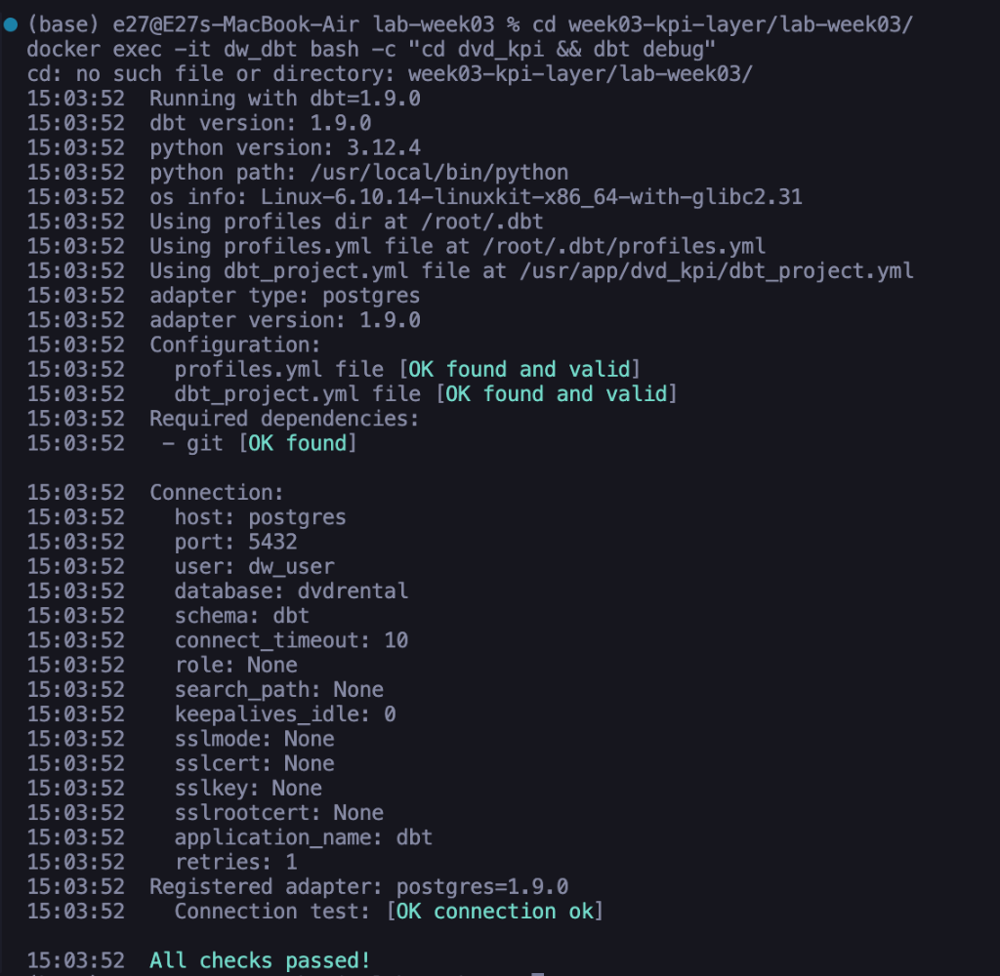

</details>

If it shows "All checks passed!", it means dbt has successfully connected to PostgreSQL!

---

## Part 3: Declare Source Tables

<details>
<summary><b>⚡ Fast Track: Click to generate files via Terminal</b></summary>

```bash
cd week03-kpi-layer/lab-week03/

cat << 'EOF' > dbt/dvd_kpi/models/sources.yml
version: 2

sources:
  - name: dvdrental
    database: dvdrental
    schema: public
    tables:
      - name: rental
      - name: payment
      - name: inventory
      - name: film
EOF
```

</details>

### 3.1 Create `dbt/dvd_kpi/models/sources.yml`
```yaml
version: 2

sources:
  - name: dvdrental
    database: dvdrental
    schema: public
    tables:
      - name: rental
      - name: payment
      - name: inventory
      - name: film
```

### 3.2 Verify dbt can parse the project
```bash
cd week03-kpi-layer/lab-week03/
docker exec -it dw_dbt bash -c "cd dvd_kpi && dbt parse"
```
<details>
<summary><b>Show Output</b></summary>

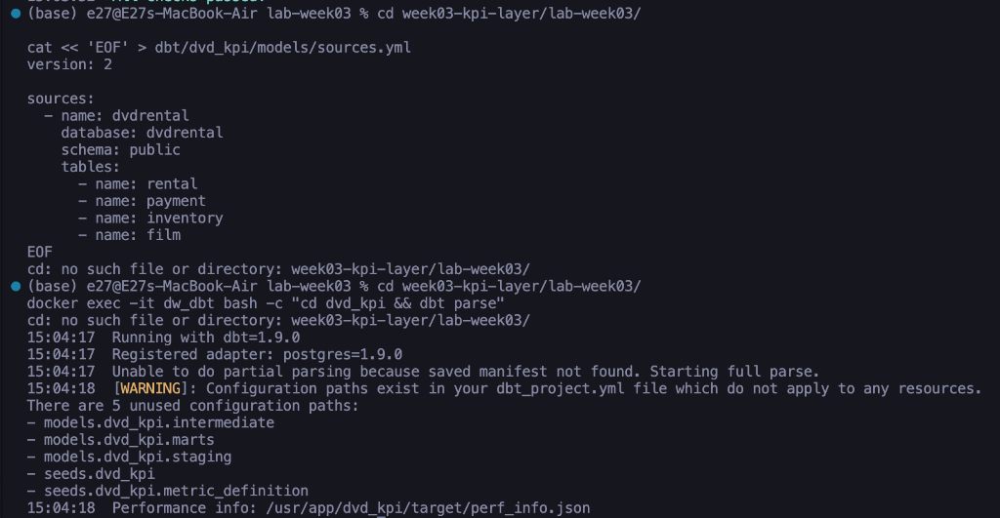

</details>

---

## Part 4: Create Staging Models

<details>
<summary><b>⚡ Fast Track: Click to generate files via Terminal</b></summary>

```bash
cd week03-kpi-layer/lab-week03/

cat << 'EOF' > dbt/dvd_kpi/models/staging/stg_rental.sql
select
    rental_id::integer as rental_id,
    rental_date::timestamp as rental_date,
    inventory_id::integer as inventory_id,
    customer_id::integer as customer_id,
    return_date::timestamp as return_date,
    staff_id::integer as staff_id
from {{ source('dvdrental', 'rental') }}
EOF

cat << 'EOF' > dbt/dvd_kpi/models/staging/stg_payment.sql
select
    payment_id::integer as payment_id,
    customer_id::integer as customer_id,
    staff_id::integer as staff_id,
    rental_id::integer as rental_id,
    amount::numeric(12, 2) as amount,
    payment_date::timestamp as payment_date
from {{ source('dvdrental', 'payment') }}
EOF

cat << 'EOF' > dbt/dvd_kpi/models/staging/stg_inventory.sql
select
    inventory_id::integer as inventory_id,
    film_id::integer as film_id,
    store_id::integer as store_id
from {{ source('dvdrental', 'inventory') }}
EOF

cat << 'EOF' > dbt/dvd_kpi/models/staging/stg_film.sql
select
    film_id::integer as film_id,
    title::varchar as film_title,
    rental_duration::integer as rental_duration,
    rating::varchar as rating
from {{ source('dvdrental', 'film') }}
EOF
```

</details>

Create the following SQL files in the `models/staging/` folder:

**`stg_rental.sql`**
```sql
select
    rental_id::integer as rental_id,
    rental_date::timestamp as rental_date,
    inventory_id::integer as inventory_id,
    customer_id::integer as customer_id,
    return_date::timestamp as return_date,
    staff_id::integer as staff_id
from {{ source('dvdrental', 'rental') }}
```

**`stg_payment.sql`**
```sql
select
    payment_id::integer as payment_id,
    customer_id::integer as customer_id,
    staff_id::integer as staff_id,
    rental_id::integer as rental_id,
    amount::numeric(12, 2) as amount,
    payment_date::timestamp as payment_date
from {{ source('dvdrental', 'payment') }}
```

**`stg_inventory.sql`**
```sql
select
    inventory_id::integer as inventory_id,
    film_id::integer as film_id,
    store_id::integer as store_id
from {{ source('dvdrental', 'inventory') }}
```

**`stg_film.sql`**
```sql
select
    film_id::integer as film_id,
    title::varchar as film_title,
    rental_duration::integer as rental_duration,
    rating::varchar as rating
from {{ source('dvdrental', 'film') }}
```

**Test creating Staging Views:**
```bash
cd week03-kpi-layer/lab-week03/
docker exec -it dw_dbt bash -c "cd dvd_kpi && dbt run --select stg_rental stg_payment stg_inventory stg_film"
```
<details>
<summary><b>Show Output</b></summary>

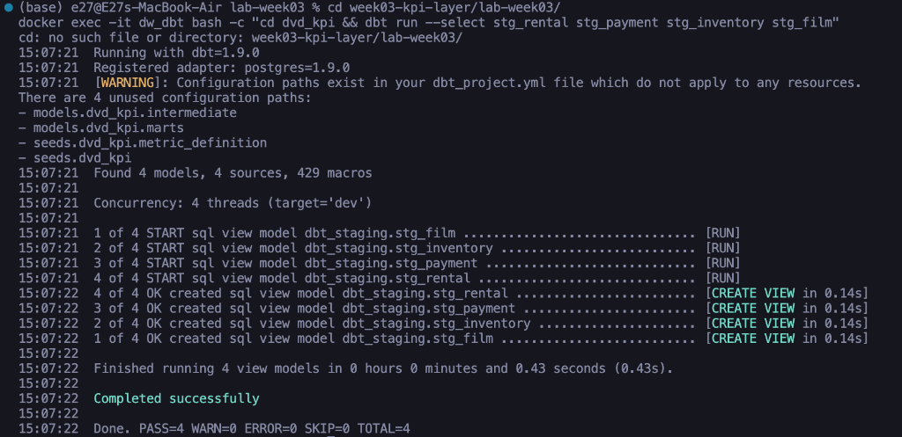

</details>

---

## Part 5: Aggregate Payment to Match Grain

<details>
<summary><b>⚡ Fast Track: Click to generate files via Terminal</b></summary>

```bash
cd week03-kpi-layer/lab-week03/

cat << 'EOF' > dbt/dvd_kpi/models/intermediate/int_payment_by_rental.sql
select
    rental_id,
    sum(amount)::numeric(12, 2) as revenue_amount,
    count(*)::integer as payment_record_count
from {{ ref('stg_payment') }}
where rental_id is not null
group by rental_id
EOF
```

</details>

### 5.1 Check for Double Counting Risk

Before joining `payment` with `rental`, you must check whether a single `rental_id` can have multiple payment rows. If so, joining directly would cause the Fact Model to have duplicate rows and inflate Rental Count.

Run the following query in **pgAdmin** (or Metabase SQL Editor):
```sql
SELECT rental_id, COUNT(*) AS payment_rows
FROM payment
WHERE rental_id IS NOT NULL
GROUP BY rental_id
HAVING COUNT(*) > 1
ORDER BY payment_rows DESC
LIMIT 10;
```

If this query returns results, it means some `rental_id` values have more than one payment row — so we **must** aggregate before joining. Even if the current dataset doesn't have duplicates, this design is safe for future data.

### 5.2 Create `models/intermediate/int_payment_by_rental.sql`
```sql
select
    rental_id,
    sum(amount)::numeric(12, 2) as revenue_amount,
    count(*)::integer as payment_record_count
from {{ ref('stg_payment') }}
where rental_id is not null
group by rental_id
```

---

## Part 6: Create Fact Model

<details>
<summary><b>⚡ Fast Track: Click to generate files via Terminal</b></summary>

```bash
cd week03-kpi-layer/lab-week03/

cat << 'EOF' > dbt/dvd_kpi/models/marts/fct_rental_activity.sql
with rental as (
    select * from {{ ref('stg_rental') }}
),
inventory as (
    select * from {{ ref('stg_inventory') }}
),
film as (
    select * from {{ ref('stg_film') }}
),
payment_by_rental as (
    select * from {{ ref('int_payment_by_rental') }}
)
select
    r.rental_id,
    r.rental_date,
    date_trunc('month', r.rental_date)::date as rental_month,
    r.return_date,
    r.customer_id,
    r.staff_id,
    i.store_id,
    i.film_id,
    f.film_title,
    f.rating,
    f.rental_duration,
    r.rental_date
        + (f.rental_duration * interval '1 day')
        as expected_return_datetime,
    coalesce(p.revenue_amount, 0)::numeric(12, 2)
        as revenue_amount,
    coalesce(p.payment_record_count, 0)::integer
        as payment_record_count,
    1::integer as rental_count,
    case
        when r.return_date is not null then 1
        else 0
    end::integer as returned_rental_count,
    case
        when r.return_date is not null
         and r.return_date >
             r.rental_date
             + (f.rental_duration * interval '1 day')
        then 1
        else 0
    end::integer as late_rental_count
from rental r
join inventory i
  on r.inventory_id = i.inventory_id
join film f
  on i.film_id = f.film_id
left join payment_by_rental p
  on r.rental_id = p.rental_id
EOF
```

</details>

### 6.1 Create `models/marts/fct_rental_activity.sql`
```sql
with rental as (
    select * from {{ ref('stg_rental') }}
),
inventory as (
    select * from {{ ref('stg_inventory') }}
),
film as (
    select * from {{ ref('stg_film') }}
),
payment_by_rental as (
    select * from {{ ref('int_payment_by_rental') }}
)
select
    r.rental_id,
    r.rental_date,
    date_trunc('month', r.rental_date)::date as rental_month,
    r.return_date,
    r.customer_id,
    r.staff_id,
    i.store_id,
    i.film_id,
    f.film_title,
    f.rating,
    f.rental_duration,
    r.rental_date
        + (f.rental_duration * interval '1 day')
        as expected_return_datetime,
    coalesce(p.revenue_amount, 0)::numeric(12, 2)
        as revenue_amount,
    coalesce(p.payment_record_count, 0)::integer
        as payment_record_count,
    1::integer as rental_count,
    case
        when r.return_date is not null then 1
        else 0
    end::integer as returned_rental_count,
    case
        when r.return_date is not null
         and r.return_date >
             r.rental_date
             + (f.rental_duration * interval '1 day')
        then 1
        else 0
    end::integer as late_rental_count
from rental r
join inventory i
  on r.inventory_id = i.inventory_id
join film f
  on i.film_id = f.film_id
left join payment_by_rental p
  on r.rental_id = p.rental_id
```

**Key Logic Explained:**
- **LEFT JOIN** `payment_by_rental` — ensures rentals without any payment are not dropped from the Fact Model.
- **COALESCE(..., 0)** — converts NULL to 0 for rentals that have no payment record.
- **`rental_count = 1`** — each row represents exactly one rental, so `SUM(rental_count)` gives the total number of rentals.
- **`returned_rental_count`** — equals 1 only when `return_date IS NOT NULL` (i.e., the item has been returned).
- **`late_rental_count`** — equals 1 only when the item was returned **and** `return_date` exceeds `expected_return_datetime`. Unreturned items are **not** counted as late because the requirement measures Late Return Rate from returned items only.

---

## Part 7: Create Metric Key Catalog using dbt Seed

<details>
<summary><b>⚡ Fast Track: Click to generate files via Terminal</b></summary>

```bash
cd week03-kpi-layer/lab-week03/

cat << 'EOF' > dbt/dvd_kpi/seeds/metric_definition.csv
metric_key,metric_name,metric_label,description,formula,unit
M001,total_revenue,Total Revenue,"รายได้รวมจาก payment ที่ aggregate ต่อ rental แล้ว",SUM(revenue_amount),currency
M002,rental_count,Rental Count,"จำนวนการเช่าภาพยนตร์",SUM(rental_count),count
M003,active_customer_count,Active Customer Count,"จำนวนลูกค้าที่มี rental แบบไม่ซ้ำ",COUNT_DISTINCT(customer_id),count
M004,average_revenue_per_rental,Average Revenue per Rental,"รายได้เฉลี่ยต่อการเช่าหนึ่งครั้ง",M001/M002,currency_per_rental
M005,late_return_rate,Late Return Rate,"สัดส่วนรายการคืนล่าช้าต่อรายการที่คืนแล้ว",late_rental_count/returned_rental_count,ratio
EOF
```

</details>

### 7.1 Create `seeds/metric_definition.csv`
```csv
metric_key,metric_name,metric_label,description,formula,unit
M001,total_revenue,Total Revenue,"รายได้รวมจาก payment ที่ aggregate ต่อ rental แล้ว",SUM(revenue_amount),currency
M002,rental_count,Rental Count,"จำนวนการเช่าภาพยนตร์",SUM(rental_count),count
M003,active_customer_count,Active Customer Count,"จำนวนลูกค้าที่มี rental แบบไม่ซ้ำ",COUNT_DISTINCT(customer_id),count
M004,average_revenue_per_rental,Average Revenue per Rental,"รายได้เฉลี่ยต่อการเช่าหนึ่งครั้ง",M001/M002,currency_per_rental
M005,late_return_rate,Late Return Rate,"สัดส่วนรายการคืนล่าช้าต่อรายการที่คืนแล้ว",late_rental_count/returned_rental_count,ratio
```

### 7.2 Load Seed into PostgreSQL
```bash
cd week03-kpi-layer/lab-week03/
docker exec -it dw_dbt bash -c "cd dvd_kpi && dbt seed --full-refresh"
```
<details>
<summary><b>Show Output</b></summary>

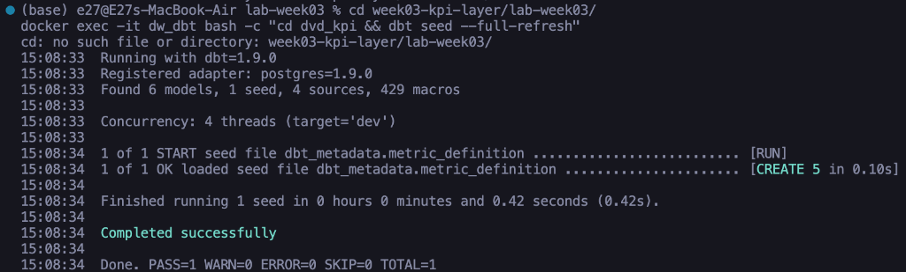

</details>

---

## Part 8: Create Company-Level Metric Model

<details>
<summary><b>⚡ Fast Track: Click to generate files via Terminal</b></summary>

```bash
cd week03-kpi-layer/lab-week03/

cat << 'EOF' > dbt/dvd_kpi/models/marts/metric_company_monthly.sql
with monthly_base as (
    select
        rental_month as metric_month,
        sum(revenue_amount) as total_revenue,
        sum(rental_count) as rental_count,
        count(distinct customer_id) as active_customer_count,
        sum(late_rental_count) as late_rental_count,
        sum(returned_rental_count) as returned_rental_count
    from {{ ref('fct_rental_activity') }}
    group by rental_month
),
metric_values as (
    select
        metric_month,
        'M001'::varchar as metric_key,
        total_revenue::numeric(18, 4) as metric_value
    from monthly_base
    union all
    select
        metric_month,
        'M002',
        rental_count::numeric(18, 4)
    from monthly_base
    union all
    select
        metric_month,
        'M003',
        active_customer_count::numeric(18, 4)
    from monthly_base
    union all
    select
        metric_month,
        'M004',
        (
            total_revenue
            / nullif(rental_count, 0)
        )::numeric(18, 4)
    from monthly_base
    union all
    select
        metric_month,
        'M005',
        (
            late_rental_count::numeric
            / nullif(returned_rental_count, 0)
        )::numeric(18, 4)
    from monthly_base
)
select
    v.metric_month,
    v.metric_key,
    d.metric_name,
    d.metric_label,
    d.description,
    d.formula,
    d.unit,
    v.metric_value
from metric_values v
join {{ ref('metric_definition') }} d
  on v.metric_key = d.metric_key
EOF
```

</details>

### 8.1 Create `models/marts/metric_company_monthly.sql`
```sql
with monthly_base as (
    select
        rental_month as metric_month,
        sum(revenue_amount) as total_revenue,
        sum(rental_count) as rental_count,
        count(distinct customer_id) as active_customer_count,
        sum(late_rental_count) as late_rental_count,
        sum(returned_rental_count) as returned_rental_count
    from {{ ref('fct_rental_activity') }}
    group by rental_month
),
metric_values as (
    select
        metric_month,
        'M001'::varchar as metric_key,
        total_revenue::numeric(18, 4) as metric_value
    from monthly_base
    union all
    select
        metric_month,
        'M002',
        rental_count::numeric(18, 4)
    from monthly_base
    union all
    select
        metric_month,
        'M003',
        active_customer_count::numeric(18, 4)
    from monthly_base
    union all
    select
        metric_month,
        'M004',
        (
            total_revenue
            / nullif(rental_count, 0)
        )::numeric(18, 4)
    from monthly_base
    union all
    select
        metric_month,
        'M005',
        (
            late_rental_count::numeric
            / nullif(returned_rental_count, 0)
        )::numeric(18, 4)
    from monthly_base
)
select
    v.metric_month,
    v.metric_key,
    d.metric_name,
    d.metric_label,
    d.description,
    d.formula,
    d.unit,
    v.metric_value
from metric_values v
join {{ ref('metric_definition') }} d
  on v.metric_key = d.metric_key
```

---

## Part 9: Create Store-Level Metric Model

<details>
<summary><b>⚡ Fast Track: Click to generate files via Terminal</b></summary>

```bash
cd week03-kpi-layer/lab-week03/

cat << 'EOF' > dbt/dvd_kpi/models/marts/metric_store_monthly.sql
with monthly_base as (
    select
        rental_month as metric_month,
        store_id,
        sum(revenue_amount) as total_revenue,
        sum(rental_count) as rental_count,
        count(distinct customer_id) as active_customer_count,
        sum(late_rental_count) as late_rental_count,
        sum(returned_rental_count) as returned_rental_count
    from {{ ref('fct_rental_activity') }}
    group by rental_month, store_id
),
metric_values as (
    select
        metric_month,
        store_id,
        'M001'::varchar as metric_key,
        total_revenue::numeric(18, 4) as metric_value
    from monthly_base
    union all
    select
        metric_month,
        store_id,
        'M002',
        rental_count::numeric(18, 4)
    from monthly_base
    union all
    select
        metric_month,
        store_id,
        'M003',
        active_customer_count::numeric(18, 4)
    from monthly_base
    union all
    select
        metric_month,
        store_id,
        'M004',
        (
            total_revenue
            / nullif(rental_count, 0)
        )::numeric(18, 4)
    from monthly_base
    union all
    select
        metric_month,
        store_id,
        'M005',
        (
            late_rental_count::numeric
            / nullif(returned_rental_count, 0)
        )::numeric(18, 4)
    from monthly_base
)
select
    v.metric_month,
    v.store_id,
    v.metric_key,
    d.metric_name,
    d.metric_label,
    d.description,
    d.formula,
    d.unit,
    v.metric_value
from metric_values v
join {{ ref('metric_definition') }} d
  on v.metric_key = d.metric_key
EOF
```

</details>

### 9.1 Create `models/marts/metric_store_monthly.sql`
*(Similar to `metric_company_monthly.sql`, but add `store_id` to the `group by` of `monthly_base` and select `store_id` in every union query).*

```sql
with monthly_base as (
    select
        rental_month as metric_month,
        store_id,
        sum(revenue_amount) as total_revenue,
        sum(rental_count) as rental_count,
        count(distinct customer_id) as active_customer_count,
        sum(late_rental_count) as late_rental_count,
        sum(returned_rental_count) as returned_rental_count
    from {{ ref('fct_rental_activity') }}
    group by rental_month, store_id
),
metric_values as (
    select
        metric_month,
        store_id,
        'M001'::varchar as metric_key,
        total_revenue::numeric(18, 4) as metric_value
    from monthly_base
    union all
    select
        metric_month,
        store_id,
        'M002',
        rental_count::numeric(18, 4)
    from monthly_base
    union all
    select
        metric_month,
        store_id,
        'M003',
        active_customer_count::numeric(18, 4)
    from monthly_base
    union all
    select
        metric_month,
        store_id,
        'M004',
        (
            total_revenue
            / nullif(rental_count, 0)
        )::numeric(18, 4)
    from monthly_base
    union all
    select
        metric_month,
        store_id,
        'M005',
        (
            late_rental_count::numeric
            / nullif(returned_rental_count, 0)
        )::numeric(18, 4)
    from monthly_base
)
select
    v.metric_month,
    v.store_id,
    v.metric_key,
    d.metric_name,
    d.metric_label,
    d.description,
    d.formula,
    d.unit,
    v.metric_value
from metric_values v
join {{ ref('metric_definition') }} d
  on v.metric_key = d.metric_key
```

---

## Part 10: Define Documentation & Data Tests

<details>
<summary><b>⚡ Fast Track: Click to generate files via Terminal</b></summary>

```bash
cd week03-kpi-layer/lab-week03/

cat << 'EOF' > dbt/dvd_kpi/models/schema.yml
version: 2

models:
  - name: fct_rental_activity
    description: >
      Fact model ที่มีหนึ่งแถวต่อหนึ่ง rental_id
    columns:
      - name: rental_id
        tests:
          - not_null
          - unique
      - name: rental_month
        tests:
          - not_null
      - name: store_id
        tests:
          - not_null
      - name: revenue_amount
        tests:
          - not_null
      - name: rental_count
        tests:
          - not_null
  - name: metric_company_monthly
    description: >
      KPI รายเดือนระดับบริษัทในรูป Long Format
    columns:
      - name: metric_month
        tests:
          - not_null
      - name: metric_key
        tests:
          - not_null
          - relationships:
              to: ref('metric_definition')
              field: metric_key
      - name: metric_value
        tests:
          - not_null:
              config:
                where: "metric_key NOT IN ('M004', 'M005')"
  - name: metric_store_monthly
    description: >
      KPI รายเดือนแยกตามสาขาในรูป Long Format
    columns:
      - name: metric_month
        tests:
          - not_null
      - name: store_id
        tests:
          - not_null
      - name: metric_key
        tests:
          - not_null
          - relationships:
              to: ref('metric_definition')
              field: metric_key
      - name: metric_value
        tests:
          - not_null:
              config:
                where: "metric_key NOT IN ('M004', 'M005')"

seeds:
  - name: metric_definition
    description: >
      Catalog กลางสำหรับรหัสและนิยาม KPI
    columns:
      - name: metric_key
        tests:
          - not_null
          - unique
      - name: metric_name
        tests:
          - not_null
EOF

cat << 'EOF' > dbt/dvd_kpi/tests/assert_metric_company_grain.sql
select
 metric_month,
 metric_key,
 count(*) as row_count
from {{ ref('metric_company_monthly') }}
group by metric_month, metric_key
having count(*) > 1
EOF

cat << 'EOF' > dbt/dvd_kpi/tests/assert_metric_store_grain.sql
select
 metric_month,
 store_id,
 metric_key,
 count(*) as row_count
from {{ ref('metric_store_monthly') }}
group by metric_month, store_id, metric_key
having count(*) > 1
EOF

cat << 'EOF' > dbt/dvd_kpi/tests/assert_late_return_rate_range.sql
select
 'company'::varchar as source_model,
 metric_month,
 null::integer as store_id,
 metric_value
from {{ ref('metric_company_monthly') }}
where metric_key = 'M005'
 and (metric_value < 0 or metric_value > 1)
union all
select
 'store'::varchar as source_model,
 metric_month,
 store_id,
 metric_value
from {{ ref('metric_store_monthly') }}
where metric_key = 'M005'
 and (metric_value < 0 or metric_value > 1)
EOF
```

</details>

Create `models/schema.yml` to configure tests like `not_null`, `unique`, and `relationships`. Also create custom Data Tests in the `tests/` folder.

### 10.1 Create `models/schema.yml`
```yaml
version: 2

models:
  - name: fct_rental_activity
    description: >
      Fact model ที่มีหนึ่งแถวต่อหนึ่ง rental_id
    columns:
      - name: rental_id
        tests:
          - not_null
          - unique
      - name: rental_month
        tests:
          - not_null
      - name: store_id
        tests:
          - not_null
      - name: revenue_amount
        tests:
          - not_null
      - name: rental_count
        tests:
          - not_null
  - name: metric_company_monthly
    description: >
      KPI รายเดือนระดับบริษัทในรูป Long Format
    columns:
      - name: metric_month
        tests:
          - not_null
      - name: metric_key
        tests:
          - not_null
          - relationships:
              to: ref('metric_definition')
              field: metric_key
      - name: metric_value
        tests:
          - not_null:
              config:
                where: "metric_key NOT IN ('M004', 'M005')"
  - name: metric_store_monthly
    description: >
      KPI รายเดือนแยกตามสาขาในรูป Long Format
    columns:
      - name: metric_month
        tests:
          - not_null
      - name: store_id
        tests:
          - not_null
      - name: metric_key
        tests:
          - not_null
          - relationships:
              to: ref('metric_definition')
              field: metric_key
      - name: metric_value
        tests:
          - not_null:
              config:
                where: "metric_key NOT IN ('M004', 'M005')"

seeds:
  - name: metric_definition
    description: >
      Catalog กลางสำหรับรหัสและนิยาม KPI
    columns:
      - name: metric_key
        tests:
          - not_null
          - unique
      - name: metric_name
        tests:
          - not_null
```

### 10.2 Create `tests/assert_metric_company_grain.sql`
```sql
select
 metric_month,
 metric_key,
 count(*) as row_count
from {{ ref('metric_company_monthly') }}
group by metric_month, metric_key
having count(*) > 1
```

### 10.3 Create `tests/assert_metric_store_grain.sql`
```sql
select
 metric_month,
 store_id,
 metric_key,
 count(*) as row_count
from {{ ref('metric_store_monthly') }}
group by metric_month, store_id, metric_key
having count(*) > 1
```

### 10.4 Create `tests/assert_late_return_rate_range.sql`
```sql
select
 'company'::varchar as source_model,
 metric_month,
 null::integer as store_id,
 metric_value
from {{ ref('metric_company_monthly') }}
where metric_key = 'M005'
 and (metric_value < 0 or metric_value > 1)
union all
select
 'store'::varchar as source_model,
 metric_month,
 store_id,
 metric_value
from {{ ref('metric_store_monthly') }}
where metric_key = 'M005'
 and (metric_value < 0 or metric_value > 1)
```

---

## Part 11: Build & Verify Results

### 11.1 Build all Models and run Tests

**Mac / Linux / Windows:**
```bash
cd week03-kpi-layer/lab-week03/
docker exec -it dw_dbt bash -c "cd dvd_kpi && dbt build"
```
<details>
<summary><b>Show Output</b></summary>

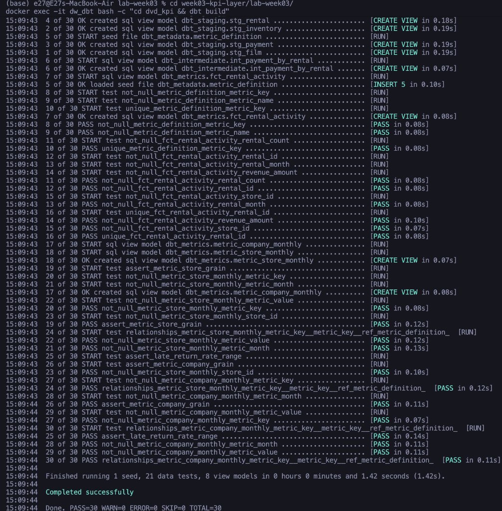

</details>

### 11.2 - 11.5 Verify data in pgAdmin or Metabase (SQL Editor)
```sql
-- Verify Metric Catalog
SELECT * FROM dbt_metadata.metric_definition ORDER BY metric_key;
```
<details>
<summary><b>Show Output</b></summary>

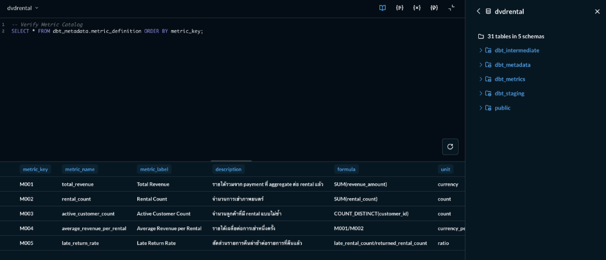

</details>

```sql
-- Verify Company-Level KPIs
SELECT * FROM dbt_metrics.metric_company_monthly LIMIT 20;
```
<details>
<summary><b>Show Output</b></summary>

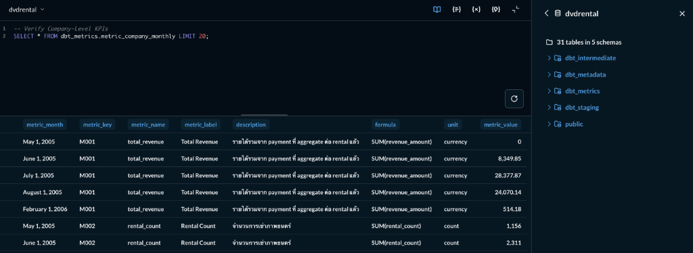

</details>

```sql
-- Verify Store-Level KPIs
SELECT * FROM dbt_metrics.metric_store_monthly LIMIT 30;
```
<details>
<summary><b>Show Output</b></summary>

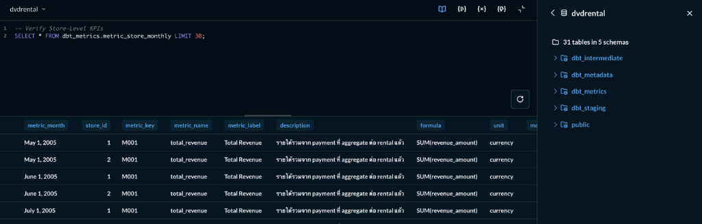

</details>

---

## Part 12: Use Metric Key in Metabase

In this final step, we will use Metabase to visualize the KPI data we built in dbt.

### 12.1 Open Metabase and Connect to Database

Open your browser and go to `http://localhost:23000`.

If you haven't connected the `dvdrental` database yet, go to **Admin Settings** > **Databases** > **Add database** with the following settings:

| Setting | Value |
|---|---|
| Database type | PostgreSQL |
| Display name | dvdrental |
| Host | postgres |
| Port | 5432 |
| Database name | dvdrental |
| Username | dw_user |
| Password | dw_pass |

> **Note:** When connecting from a tool running inside Docker (like Metabase), use Host = `postgres`. If connecting from a tool installed directly on your machine (e.g., a local pgAdmin), use Host = `localhost` and Port = `25432`.

### 12.2 Sync Schema

1. Go to **Admin Settings** > **Databases** > `dvdrental`.
2. Click **Sync database schema now**.
3. Verify that Metabase can see the `dbt_metrics` and `dbt_metadata` schemas.
4. If schemas are not visible, wait a moment and refresh your browser.

<details>
<summary><b>Show Metabase Schemas</b></summary>

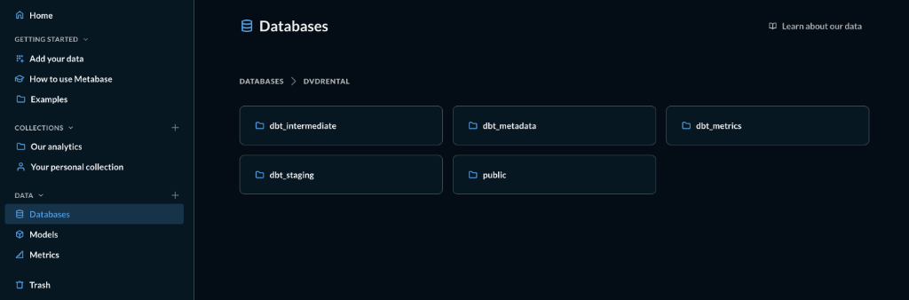

</details>

### 12.3 Create Question: KPI Trend by Metric Key
1. Click **+ New** > **Question** > `dvdrental` > `dbt_metrics` > `Metric Company Monthly`.
2. **Filter**: Click `Metric Key` and filter it to only show `M001` (Total Revenue).
3. **Visualize**: Change the visualization type to **Line Chart**.
4. Set **X-axis** = `Metric Month` and **Y-axis** = `Metric Value`.
5. **Save** the question as "KPI Trend by Metric Key".

> This question uses `metric_key` to select which KPI formula to display. Metabase doesn't need to rewrite SUM, COUNT DISTINCT, or division formulas — dbt has already calculated everything.

<details>
<summary><b>Show KPI Trend Question Setup & Visualization</b></summary>

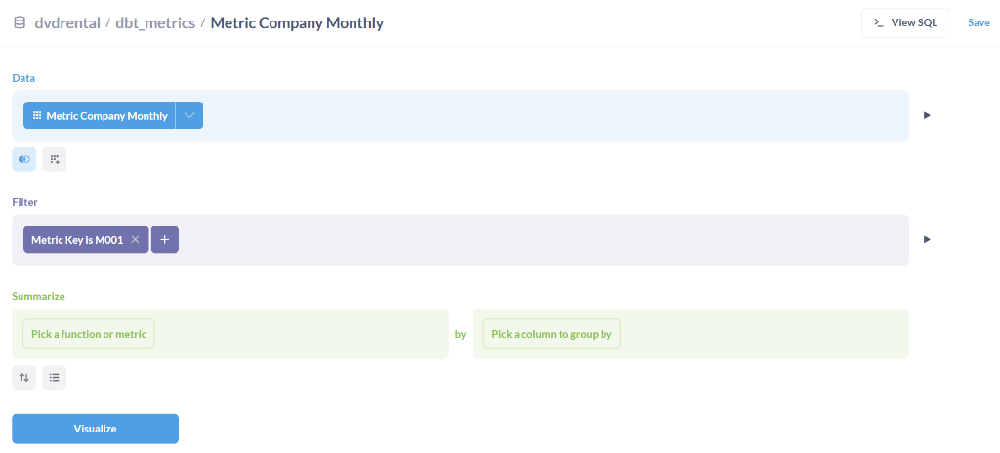

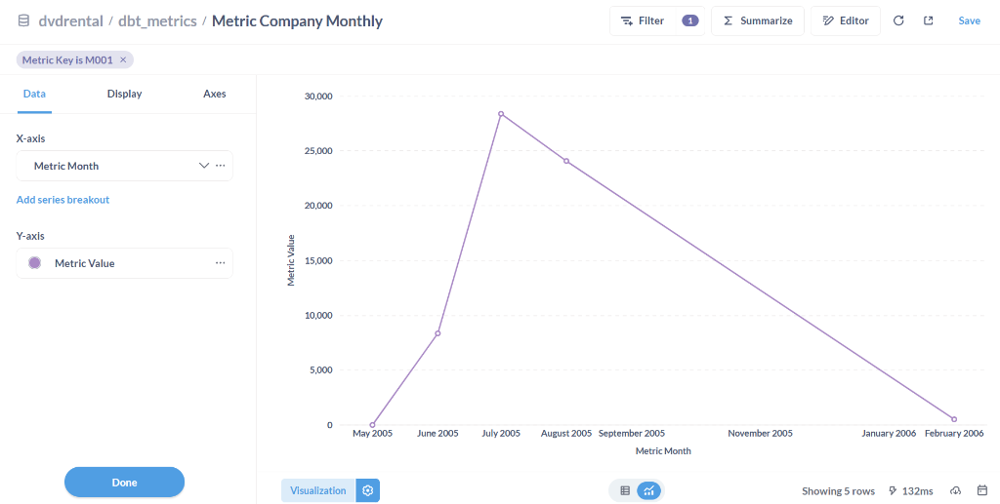

</details>

### 12.4 Create Question: KPI by Store
1. Click **+ New** > **Question** > `dvdrental` > `dbt_metrics` > `Metric Store Monthly`.
2. **Filter**: Set `Metric Key` = `M001`.
3. **Visualize**: Change to **Bar Chart**.
4. Set **X-axis** = `Store Id` and **Y-axis** = `Metric Value`.
5. **Save** as "KPI by Store".

<details>
<summary><b>Show KPI by Store Question Setup & Visualization</b></summary>

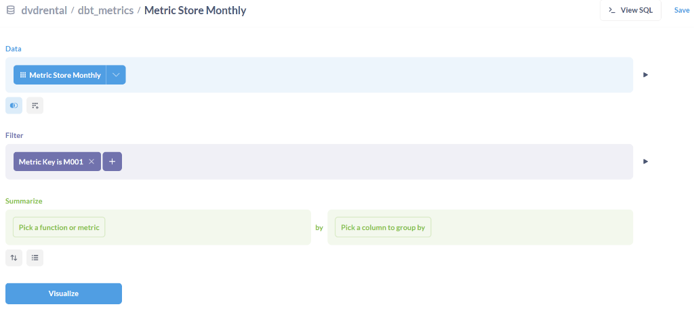

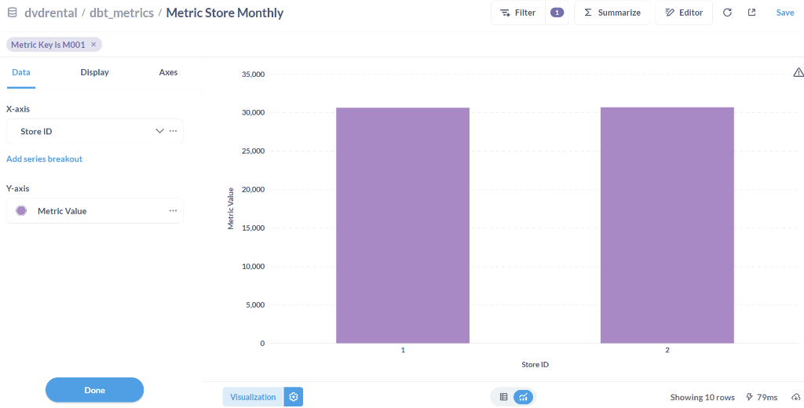

</details>

### 12.5 Create Question: Late Return Rate by Store
1. Duplicate the "KPI by Store" question.
2. Rename to "Late Return Rate by Store".
3. Change **Filter** `Metric Key` to `M005`.
4. In **Formatting**, set `Metric Value` display to **Percent**.
5. **Save** as "Late Return Rate by Store".

<details>
<summary><b>Show Late Return Rate by Store Steps</b></summary>

1. **Duplicate** the question:
   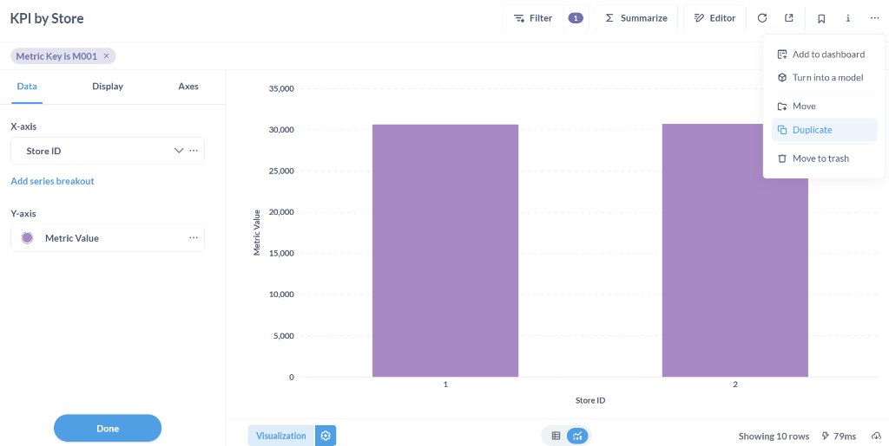

2. **Rename** the duplicate:
   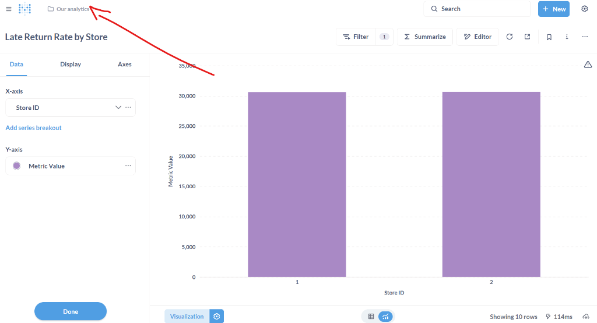

3. **Verify** new question is saved in "Our analytics":
   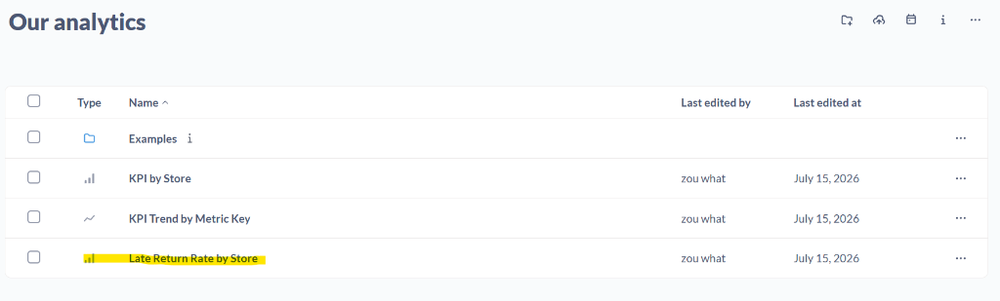

4. Click **Editor** to adjust:
   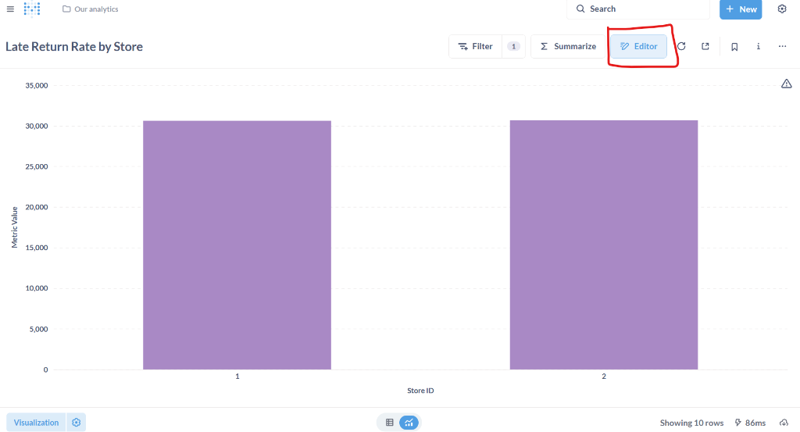

5. Change formatting to **Percent**:
   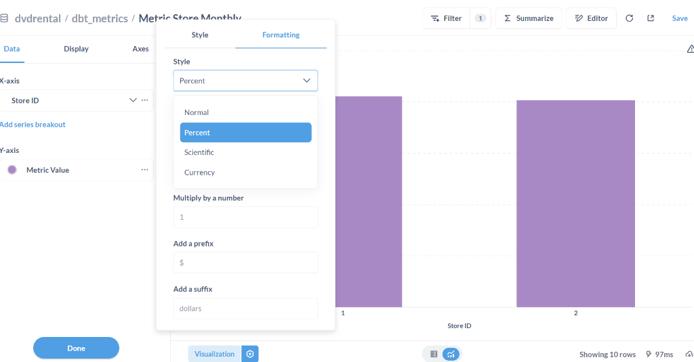

</details>

### 12.6 Create Question: Metric Catalog
1. Click **+ New** > **Question** > `dvdrental` > `dbt_metadata` > `Metric Definition`.
2. Show columns: `metric_key`, `metric_label`, `description`, `formula`, and `unit`.
3. **Visualize**: Keep it as a **Table**.
4. **Save** as "Metric Catalog".

<details>
<summary><b>Show Metric Catalog Question Setup & Table</b></summary>

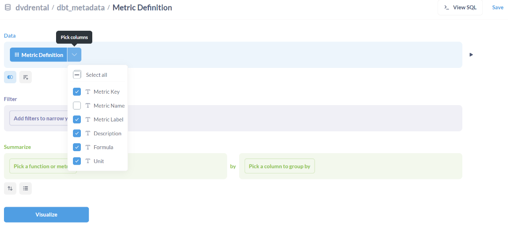

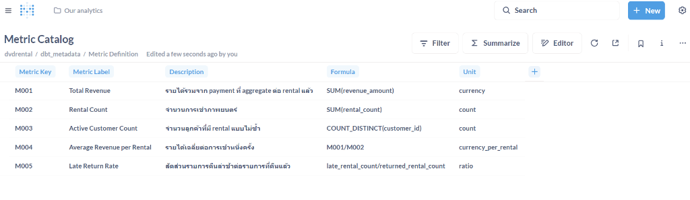

</details>

### 12.7 Create Dashboard
1. Click **+ New** > **Dashboard** and name it **DVD Rental KPI Dashboard - [Your Student ID]**.
2. Add the 4 questions you just created to the dashboard.
3. Add a **Dashboard Filter** (Dropdown) named "Metric Key" and link it to the `metric_key` column of KPI Trend and KPI by Store.
4. Add a **Date Filter** and link it to `metric_month`.
5. Arrange the charts so that KPI labels, units, and time ranges are clearly visible.
6. Click **Save**.

<details>
<summary><b>Show Dashboard Creation & Filter Setup Steps</b></summary>

1. **Arrange** the 4 questions on the dashboard layout:
   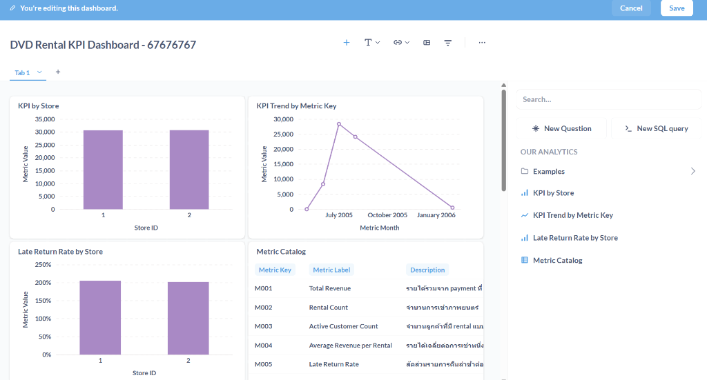

2. Add a new **Metric Key Filter** (Text or Category):
   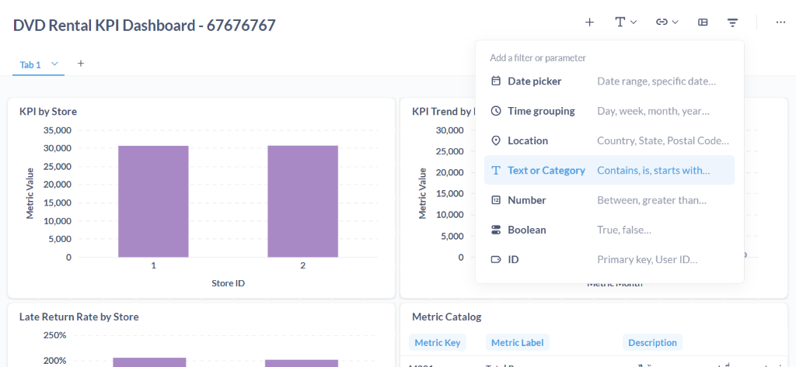

3. **Link** the Metric Key filter to the corresponding columns:
   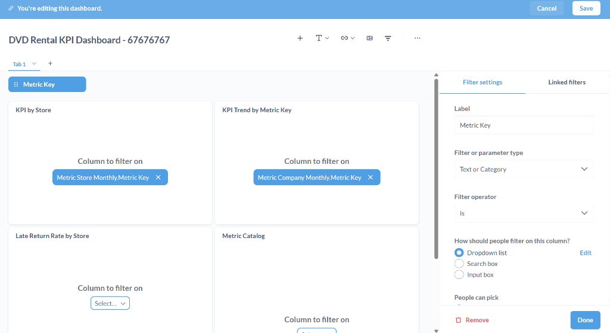

4. Add a new **Date Filter** (Date picker):
   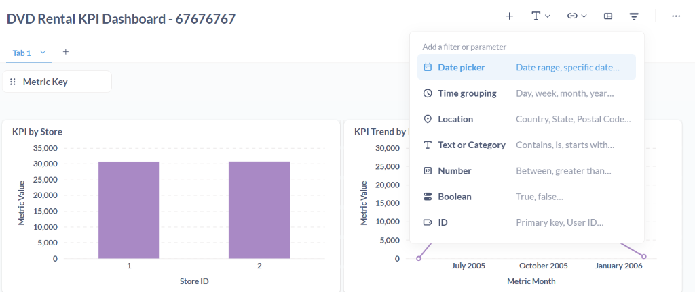

5. **Link** the Date filter to the corresponding columns:
   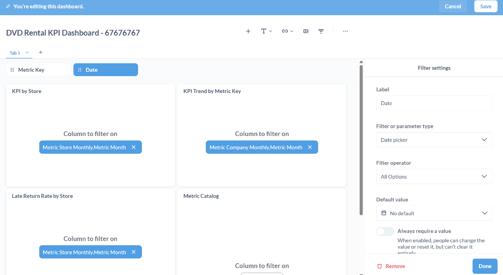

6. **Save** and view the completed dashboard:
   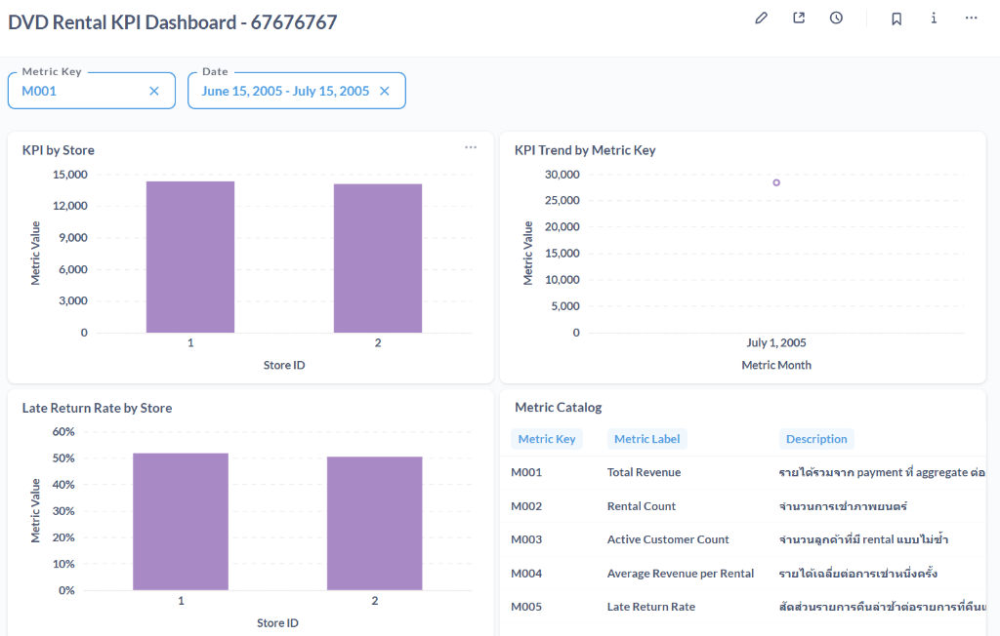

</details>

> **Caution:** Each Metric Key has a different unit (e.g., `currency`, `count`, `ratio`). Switching the metric_key filter on the same chart may cause the Y-axis format to be incorrect (e.g., showing a ratio as currency). Consider showing the `unit` column in the Metric Catalog table, or creating separate charts for KPIs that require percentage formatting.

---

## Part 13: Analysis Questions / Submission (สิ่งที่ต้องส่ง)

**1. Submission:** Submit a **Screenshot of your Metabase Dashboard** (PNG / JPG).

**2. Analysis Questions:** Answer the following 4 questions in the Google Form:
**ส่งงานที่ Form:** https://docs.google.com/forms/d/13TZkEsKmIF_g967mD0TutT9fgrVxaL71DSwsP5hK4Y8
1. เพราะเหตุใดจึงต้อง Aggregate payment ให้เหลือหนึ่งแถวต่อ `rental_id` ก่อน Join กับ `rental`?
2. เพราะเหตุใด Active Customer Count รายปีจึงไม่ควรคำนวณด้วยการบวก Active Customer Count ของแต่ละเดือน?
3. ถ้าเปลี่ยนนิยาม Late Return เป็น "คืนเกินกำหนดอย่างน้อย 2 วัน" ต้องแก้ไขไฟล์ใด และต้องรันคำสั่งใดอีกครั้ง?
4. หากให้ผู้ใช้เขียนสูตร M004 และ M005 เองทุก Dashboard จะเกิดความเสี่ยงอย่างไร?

**Lab Workflow Summary:**
The workflow of this lab follows the order: Requirement > Business Process > KPI > Grain > Fact Model > Metric Key Catalog > Metric Models > dbt Tests > Metabase Dashboard. **dbt** serves as the central point for all Business Logic. Metabase is only used for presentation. Students should **not** recreate KPI formulas in Metabase — editing a formula in dbt once will automatically update every Dashboard that uses the same View.

---

*Data Warehouse — DSBA8 | Week 3*

