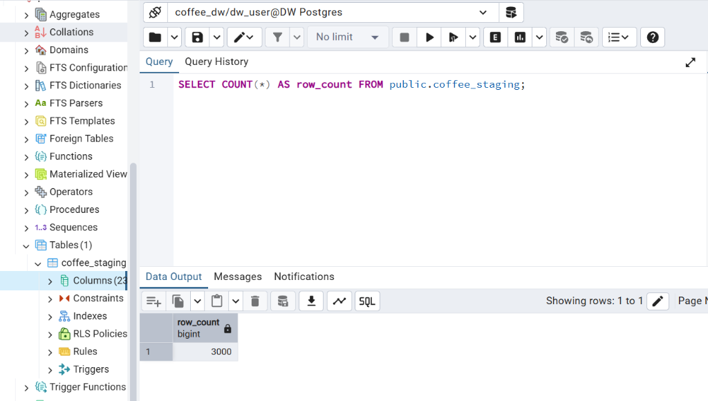
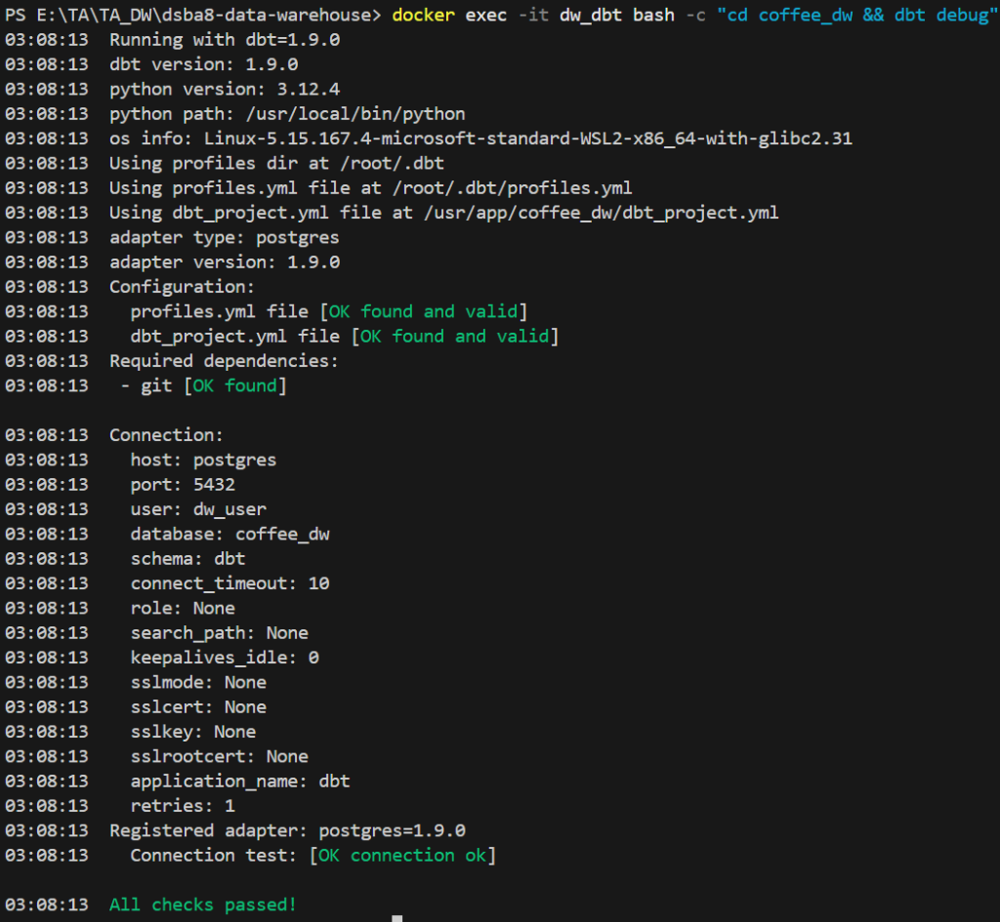
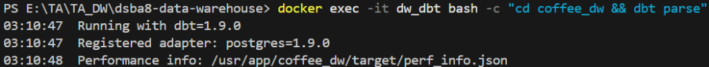
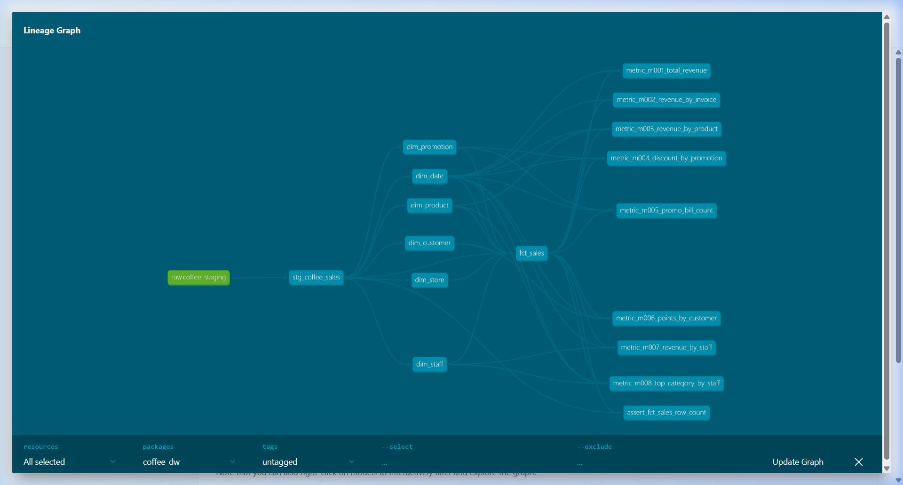

# 📦 Week 4: Star Schema & Metric Layer with dbt

> **Course:** Data Warehousing (การสร้างคลังข้อมูล)  
> **Topic:** Building a Star Schema & Metric Layer with dbt — Coffee Club Case Study  
> **Duration:** 2 Hours

> 💡 **Lab concept / แนวคิดของ Lab:** move away from building tables step-by-step in raw SQL, and
> instead manage the whole transformation with **dbt**. We extend a **Star Schema** into a
> **Metric Layer** that centralizes every KPI formula in one place, ready for Metabase.

> 📷 The screenshot blocks below point at `docs/screenshots/`. Capture each output as you run the
> lab and drop the PNGs there — filenames already match.

---

## 🎯 Learning Objectives / วัตถุประสงค์

1. Analyze a flat CSV file to design a **Star Schema**.
2. Separate **Fact** and **Dimension** data from the source and build them as **dbt models**.
3. Configure `source`, `staging`, `marts`, and **data-quality tests** in dbt.
4. Build a **Metric Layer** from the business KPIs (M001–M008).

---

## 🧰 Tools & Stack Overview / เครื่องมือที่ใช้

| Tool | What is it? | What is it used for in this lab? |
|---|---|---|
| **Docker Compose** | Containerization | Run PostgreSQL, dbt, pgAdmin, and Metabase together. |
| **PostgreSQL 16** | Relational Database (RDBMS) | Store the `coffee_dw` raw table and all dbt output tables/views. |
| **pgAdmin 4** | Database GUI Management Tool | Create `coffee_dw`, import `coffee_sales.csv`, inspect results. |
| **dbt Core** | Transformation Framework | Build staging, dimensions, fact, metric layer, tests, and docs. |
| **VS Code / Text Editor** | Editor | Create and edit `.sql` and `.yml` files in the dbt project. |
| **Metabase** *(optional)* | BI & Visualization | Reuse the Metric Layer to build KPI charts (carried from prior weeks). |

---

## 📁 Files in This Week / ไฟล์ในสัปดาห์นี้

| File / Folder | Description |
|---|---|
| 📂 [slides/](./slides/) | Lecture slides |
| └── 📄 [4 - Star Schema Design.pdf](./slides/4%20-%20Star%20Schema%20Design.pdf) | Lecture: Star Schema Design |
| 📂 [docs/](./docs/) | Lab instructions |
| ├── 📄 [Lab4 Star Schema.pdf](./docs/Lab4%20Star%20Schema.pdf) | Lab instruction (PDF) |
| └── 📝 [Lab4 Star Schema.docx](./docs/Lab4%20Star%20Schema.docx) | Lab instruction (Word) |
| 📂 [data/](./data/) | Dataset for the lab |
| └── 📊 [coffee_sales.csv](./data/coffee_sales.csv) | Coffee Club sales dataset (imported into `coffee_staging`) |
| 📂 [lab-week04/](./lab-week04/) | **Lab working directory** (dbt project) |
| └── 📂 dbt/ & dbt_root/ | dbt project (`coffee_dw`) and profile — created during the lab |

---

## ☕ Case Study: Coffee Club / กรณีศึกษา

**Coffee Club** is a multi-branch coffee shop across Thailand with a points-based membership
program, seasonal promotions, and per-branch staff. Each sale records the customer, product,
serving staff, promotion used (if any), and points redeemed. Everything is stored in one flat
file — `coffee_sales.csv` — with every attribute in a single row. The company wants to load this
into a Data Warehouse to analyze sales, promotion performance, and customer behavior.

<details>
<summary><b>📇 Data Dictionary — coffee_sales.csv (23 columns)</b></summary>

| column_name | Description |
|---|---|
| `sale_id` | รหัสประจำธุรกรรมการขายแต่ละรายการ (Primary Key) |
| `invoice_number` | หมายเลขใบเสร็จที่ใช้ในธุรกรรม |
| `sale_date` | วันที่ที่มีการขายสินค้าเกิดขึ้น |
| `customer_code` | รหัสลูกค้าที่ได้จากระบบต้นทาง |
| `customer_name` | ชื่อลูกค้า |
| `gender` | เพศของลูกค้า (M = ชาย, F = หญิง) |
| `birth_year` | ปีเกิดของลูกค้า |
| `product_code` | รหัสประจำสินค้าที่ขาย |
| `product_name` | ชื่อสินค้าที่ขาย |
| `category` | ประเภทของสินค้า เช่น กาแฟ ชา หรือเบเกอรี่ |
| `size` | ขนาดของสินค้า (S, M, L หรือ '-') |
| `unit_price` | ราคาต่อหน่วยของสินค้า |
| `quantity` | จำนวนสินค้าที่ขายในรายการนี้ |
| `revenue` | จำนวนเงินที่ลูกค้าชำระจริงหลังหักส่วนลดแล้ว |
| `store_code` | รหัสร้านค้าที่ขายสินค้า |
| `store_name` | ชื่อของร้านค้า |
| `province` | จังหวัดที่ตั้งของร้านค้า |
| `staff_code` | รหัสพนักงานที่ดูแลการขาย |
| `staff_name` | ชื่อของพนักงาน |
| `position` | ตำแหน่งของพนักงาน เช่น Barista หรือ Cashier |
| `promo_code` | รหัสโปรโมชันที่ใช้ (ถ้ามี) |
| `promo_desc` | คำอธิบายของโปรโมชันที่ใช้ |
| `points_redeemed` | จำนวนแต้มสะสมที่ลูกค้าใช้แลกในรายการนี้ |

</details>

**Business Processes / Business Processes ที่เกี่ยวข้อง**

| Business Process | Description |
|---|---|
| **Make a Sale** | ลูกค้าซื้อสินค้าในร้าน สะสมแต้ม หรือแลกแต้ม |
| **Apply Promotion** | ใช้โปรโมชันลดราคา ณ จุดขาย |
| **Serve by Staff** | พนักงานบริการลูกค้าแต่ละคนในแต่ละบิล |

---

## 🎯 Target KPIs (M001–M008) / KPI ที่ต้องการ

| metric_key | Business Process | KPI | Result Grain |
|:---:|---|---|---|
| **M001** | Make a Sale | Total revenue / ยอดขายรวม | month |
| **M002** | Make a Sale | Revenue per bill / ยอดขายต่อบิล | month + `invoice_number` |
| **M003** | Make a Sale | Revenue per product / ยอดขายต่อสินค้า | month + `product_code` |
| **M004** | Apply Promotion | Discount value from promotions / มูลค่าส่วนลด | month + `promo_code` |
| **M005** | Apply Promotion | Bills that used a promotion / จำนวนบิลที่ใช้โปรโมชัน | month + `promo_code` |
| **M006** | Apply Promotion | Points redeemed per customer / แต้มที่แลกใช้ | month + `customer_code` |
| **M007** | Serve by Staff | Revenue per staff / ยอดขายต่อพนักงาน | month + `staff_code` |
| **M008** | Serve by Staff | Top-selling category per staff / ประเภทที่ขายมากสุด | month + `staff_code` |

---

## 🏛️ Data Architecture / สถาปัตยกรรมข้อมูล

| # | Layer | Responsibility |
|:---:|---|---|
| 1 | **CSV / PostgreSQL raw table** | Source data → `coffee_staging` |
| 2 | **Staging Layer** | Rename columns, cast types, handle nulls & promotion data |
| 3 | **Core Data Warehouse** | Dimension tables + `fct_sales` following the Star Schema |
| 4 | **Metric Layer** | Compute M001–M008 from one shared definition |

---

## 🗂️ dbt Project Structure / โครงสร้าง dbt project

```text
coffee_dw/
├── dbt_project.yml
├── models/
│   ├── staging/
│   │   ├── _sources.yml
│   │   └── stg_coffee_sales.sql
│   ├── dimensions/
│   │   ├── dim_date.sql
│   │   ├── dim_customer.sql
│   │   ├── dim_product.sql
│   │   ├── dim_store.sql
│   │   ├── dim_staff.sql
│   │   └── dim_promotion.sql
│   ├── marts/
│   │   └── fct_sales.sql
│   ├── metrics/
│   │   ├── metric_m001_total_revenue.sql
│   │   ├── metric_m002_revenue_by_invoice.sql
│   │   └── ...  (metric_m003 … metric_m008)
│   └── schema.yml
└── tests/
    └── assert_fct_sales_row_count.sql
```

> ⚙️ **Cross-platform note:** every `docker`, `psql`, and `dbt` command below is **identical on
> macOS/Linux and Windows** — run it as-is. Only the environment-setup step in Part 0 and the
> `⚡ Fast Track` file-generation blocks differ by OS; both variants are provided.

---

## 🔧 Part 0: Start the Environment / เริ่มระบบ

Reuse the Docker stack from Week 1 (it already contains `dw_postgres`, `dw_dbt`, `pgAdmin`, and
`Metabase`). From your existing lab folder:

**Mac / Linux:**
```bash
cd week01-data-warehouse-setup/lab-week01
echo -e "AIRFLOW_UID=$(id -u)" > .env
docker compose up -d
docker compose ps
```

**Windows (PowerShell):**
```powershell
cd week01-data-warehouse-setup/lab-week01
Set-Content -Path .env -Value "AIRFLOW_UID=50000"
docker compose up -d
docker compose ps
```

> 💡 If you already have the stack running from a previous week, just confirm with
> `docker compose ps` — you don't need to restart it.

---

## 🧩 Part 1: Design the Star Schema / ออกแบบ Star Schema

Analyze the Coffee Club data to decide the **grain of the Fact table** and the **Dimension
tables** needed for the KPIs.

1. Define the Fact grain: **1 row = 1 sale (`sale_id`)**.
2. Draw an **ER diagram** of the Star Schema with every Primary Key, Foreign Key, and relationship.
3. Map each KPI to the fact/dimension it reads from, and note its result grain.

> 📝 Your schema should center on `fct_sales` (grain: one row per `sale_id`), joined to
> `dim_date`, `dim_customer`, `dim_product`, `dim_store`, `dim_staff`, and `dim_promotion`.

---

## 📥 Part 2: Prepare the Source Database / เตรียมฐานข้อมูลต้นทาง

dbt **transforms** data — it does **not** load the CSV. So we load `coffee_sales.csv` into a raw
table first.

### 2.1 Create the database
Open **pgAdmin** ([http://localhost:28880](http://localhost:28880), login `dw_user@mail.com` / `dw_pass`),
open the **Query Tool**, and run:
```sql
CREATE DATABASE coffee_dw;
```

### 2.2 Create the raw table
Select the `coffee_dw` database, open a new **Query Tool**, and run:
```sql
CREATE TABLE public.coffee_staging (
    sale_id INT,
    invoice_number VARCHAR,
    sale_date DATE,
    customer_code VARCHAR,
    customer_name VARCHAR,
    gender CHAR(1),
    birth_year INT,
    product_code VARCHAR,
    product_name VARCHAR,
    category VARCHAR,
    size VARCHAR,
    unit_price NUMERIC,
    quantity INT,
    revenue NUMERIC,
    store_code VARCHAR,
    store_name VARCHAR,
    province VARCHAR,
    staff_code VARCHAR,
    staff_name VARCHAR,
    position VARCHAR,
    promo_code VARCHAR,
    promo_desc VARCHAR,
    points_redeemed INT
);
```

### 2.3 Import the CSV and verify
1. Right-click `public.coffee_staging` ➡️ **Import/Export Data...** ➡️ **Import**.
2. **Filename:** select `coffee_sales.csv` (in `week04-star-schema/data/`). **Format:** `csv`. **Header:** `Yes`. **Delimiter:** `,`.
3. Click **OK**, then verify the row count:
```sql
SELECT COUNT(*) AS row_count FROM public.coffee_staging;
```

<details>
<summary><b>Show Output</b></summary>



</details>

---

## 🔌 Part 3: Verify the dbt Connection / ตรวจสอบการเชื่อมต่อ dbt

Create a dbt profile named **`coffee_dw`** pointing at the `coffee_dw` database, then run
`dbt debug`. This mirrors the `dbt_root/profiles.yml` setup from Week 3.

### 3.1 Create `dbt_root/profiles.yml`
```yaml
coffee_dw:
  target: dev
  outputs:
    dev:
      type: postgres
      host: postgres
      port: 5432
      user: dw_user
      password: dw_pass
      dbname: coffee_dw
      schema: dbt
      threads: 4
```

> 📝 dbt selects this profile via the `profile: 'coffee_dw'` key in `dbt_project.yml` (Part 4).

### 3.2 Run `dbt debug`
```bash
docker exec -it dw_dbt bash -c "cd coffee_dw && dbt debug"
```

<details>
<summary><b>Show Output</b></summary>



</details>

If it shows **"All checks passed!"**, dbt is connected to PostgreSQL.

---

## ⚙️ Part 4: Configure the dbt Project & Source / ตั้งค่า dbt project และ Source

<details>
<summary><b>⚡ Fast Track: create the folder skeleton via Terminal (Mac/Linux)</b></summary>

```bash
cd week04-star-schema/lab-week04/
mkdir -p dbt/coffee_dw/models/staging
mkdir -p dbt/coffee_dw/models/dimensions
mkdir -p dbt/coffee_dw/models/marts
mkdir -p dbt/coffee_dw/models/metrics
mkdir -p dbt/coffee_dw/tests
mkdir -p dbt_root
```

> 🪟 **Windows:** create the same folders in VS Code / File Explorer, or run the commands in
> Git Bash. PowerShell users can replace each line with `New-Item -ItemType Directory -Force <path>`.

</details>

### 4.1 Create `dbt/coffee_dw/dbt_project.yml`
```yaml
name: 'coffee_dw'
version: '1.0.0'
config-version: 2
profile: 'coffee_dw'

model-paths: ['models']

models:
  coffee_dw:
    staging:
      +materialized: view
    dimensions:
      +materialized: table
    marts:
      +materialized: table
    metrics:
      +materialized: view
```

Verify dbt can parse the project:
```bash
docker exec -it dw_dbt bash -c "cd coffee_dw && dbt parse"
```

<details>
<summary><b>Show Output</b></summary>



</details>

### 4.2 Create `dbt/coffee_dw/models/staging/_sources.yml`
```yaml
version: 2

sources:
  - name: raw
    schema: public
    tables:
      - name: coffee_staging
        columns:
          - name: sale_id
            data_tests:
              - not_null
              - unique
          - name: sale_date
            data_tests:
              - not_null
```

---

## 🧱 Part 5: Create the Staging Model / สร้าง Staging Model

Clean the raw data: cast types, trim strings, turn empty strings into `NULL`, and give promotions
a default. Create `dbt/coffee_dw/models/staging/stg_coffee_sales.sql`:

```sql
select
    sale_id::integer                                  as sale_id,
    nullif(trim(invoice_number), '')                  as invoice_number,
    sale_date::date                                   as sale_date,
    nullif(trim(customer_code), '')                   as customer_code,
    nullif(trim(customer_name), '')                   as customer_name,
    upper(nullif(trim(gender), ''))                   as gender,
    birth_year::integer                               as birth_year,
    nullif(trim(product_code), '')                    as product_code,
    nullif(trim(product_name), '')                    as product_name,
    nullif(trim(category), '')                        as category,
    nullif(trim(size), '')                            as size,
    unit_price::numeric                               as unit_price,
    quantity::integer                                 as quantity,
    revenue::numeric                                  as revenue,
    nullif(trim(store_code), '')                      as store_code,
    nullif(trim(store_name), '')                      as store_name,
    nullif(trim(province), '')                        as province,
    nullif(trim(staff_code), '')                      as staff_code,
    nullif(trim(staff_name), '')                      as staff_name,
    nullif(trim(position), '')                        as position,
    coalesce(nullif(trim(promo_code), ''), 'NO_PROMO') as promo_code,
    coalesce(nullif(trim(promo_desc), ''), 'ไม่ใช้โปรโมชัน') as promo_desc,
    coalesce(points_redeemed, 0)::integer             as points_redeemed
from {{ source('raw', 'coffee_staging') }}
```

> 💡 **Why `NO_PROMO`?** Sales without a promotion get a real key (`NO_PROMO`) so they still join to
> `dim_promotion` instead of dropping out of the fact table.

---

## 🧊 Part 6: Create the Dimension Models / สร้าง Dimension Models

Build one Dimension per business entity. Use the source **business key** and add a stable
**surrogate key** with `md5()`.

**`dim_date.sql`**
```sql
select distinct
    to_char(sale_date, 'YYYYMMDD')::integer as date_key,
    sale_date                              as full_date,
    extract(day from sale_date)::integer   as day,
    extract(month from sale_date)::integer as month,
    trim(to_char(sale_date, 'Month'))       as month_name,
    extract(quarter from sale_date)::integer as quarter,
    extract(year from sale_date)::integer  as year
from {{ ref('stg_coffee_sales') }}
```

**`dim_customer.sql`** *(pattern for every other dimension)*
```sql
select distinct
    md5(coalesce(customer_code, '__NULL__')) as customer_key,
    customer_code,
    customer_name,
    gender,
    birth_year
from {{ ref('stg_coffee_sales') }}
```

Build the remaining dimensions with the same `md5(business_key)` pattern and these attributes:

| Model | Business key | Attributes |
|---|---|---|
| `dim_date` | `sale_date` | `date_key, full_date, day, month, month_name, quarter, year` |
| `dim_customer` | `customer_code` | `customer_name, gender, birth_year` |
| `dim_product` | `product_code` | `product_name, category, size` |
| `dim_store` | `store_code` | `store_name, province` |
| `dim_staff` | `staff_code` | `staff_name, position` |
| `dim_promotion` | `promo_code` | `promo_desc`; **must include `NO_PROMO`** |

> 📝 Name each surrogate key `<entity>_key` (e.g. `product_key`, `store_key`, `staff_key`,
> `promotion_key`) — the Fact model and tests in Parts 7 & 9 rely on these names.

---

## ⭐ Part 7: Create the Fact Model / สร้าง Fact Model

Set the grain of `fct_sales` to **1 row = 1 sale (`sale_id`)**, then join staging to every
dimension to replace business keys with surrogate keys. Create
`dbt/coffee_dw/models/marts/fct_sales.sql`:

```sql
select
    s.sale_id,
    s.invoice_number,
    d.date_key,
    c.customer_key,
    p.product_key,
    st.store_key,
    sf.staff_key,
    pr.promotion_key,
    s.unit_price,
    s.quantity,
    s.revenue,
    (s.unit_price * s.quantity) - s.revenue as discount_amount,
    s.points_redeemed
from {{ ref('stg_coffee_sales') }} s
join {{ ref('dim_date') }} d
  on s.sale_date = d.full_date
join {{ ref('dim_customer') }} c
  on s.customer_code = c.customer_code
join {{ ref('dim_product') }} p
  on s.product_code = p.product_code
join {{ ref('dim_store') }} st
  on s.store_code = st.store_code
join {{ ref('dim_staff') }} sf
  on s.staff_code = sf.staff_code
join {{ ref('dim_promotion') }} pr
  on s.promo_code = pr.promo_code
```

> ⚠️ **Caution / ข้อควรระวัง:** every business key in a Dimension **must be unique**. If not, the
> join will multiply rows and make `fct_sales` larger than staging. This is caught by the `unique`
> and singular tests in Part 9.

---

## 📐 Part 8: Build the Metric Layer / สร้าง Metric Layer

Create one dbt model per `metric_key` so each KPI's formula and grain are explicit. Share these
output columns where possible: `metric_key`, `metric_month`, `dimension_key`, `dimension_name`,
`metric_value`.

### 8.1 Example — `metric_m001_total_revenue.sql`
```sql
select
    'M001'::varchar              as metric_key,
    date_trunc('month', d.full_date)::date as metric_month,
    'ALL'::varchar               as dimension_key,
    'Coffee Club'::varchar       as dimension_name,
    sum(f.revenue)::numeric      as metric_value
from {{ ref('fct_sales') }} f
join {{ ref('dim_date') }} d using (date_key)
group by 1, 2, 3, 4
```

### 8.2 Template for M002–M007 *(fill in the `<...>` parts yourself)*
```sql
select
    '<metric_key>'::varchar      as metric_key,
    date_trunc('month', d.full_date)::date as metric_month,
    <dimension_key>              as dimension_key,
    <dimension_name>             as dimension_name,
    <aggregate_expression>       as metric_value
from {{ ref('fct_sales') }} f
join {{ ref('dim_date') }} d using (date_key)
-- add the dimension join, filter, and group by that match each KPI's grain
```

Calculation reference for every metric:

| Key | Calculation | Dimension / Condition | Model file |
|:---:|---|---|---|
| M001 | `SUM(revenue)` | Company-wide | `metric_m001_total_revenue.sql` |
| M002 | `SUM(revenue)` | `invoice_number` | `metric_m002_revenue_by_invoice.sql` |
| M003 | `SUM(revenue)` | `product_code` | `metric_m003_revenue_by_product.sql` |
| M004 | `SUM(discount_amount)` | `promo_code`; exclude `NO_PROMO` | `metric_m004_discount_by_promotion.sql` |
| M005 | `COUNT(DISTINCT invoice_number)` | `promo_code`; exclude `NO_PROMO` | `metric_m005_promo_bill_count.sql` |
| M006 | `SUM(points_redeemed)` | `customer_code` | `metric_m006_points_by_customer.sql` |
| M007 | `SUM(revenue)` | `staff_code` | `metric_m007_revenue_by_staff.sql` |
| M008 | `SUM(quantity)` then rank | `staff_code` + `category`; pick rank 1 | `metric_m008_top_category_by_staff.sql` |

### 8.3 M008 — Top Category per Staff `metric_m008_top_category_by_staff.sql`
```sql
with category_sales as (

    select
        date_trunc('month', d.full_date)::date as metric_month,
        sf.staff_code,
        sf.staff_name,
        p.category,
        sum(f.quantity)::numeric as quantity_sold
    from {{ ref('fct_sales') }} f
    join {{ ref('dim_date') }} d using (date_key)
    join {{ ref('dim_staff') }} sf using (staff_key)
    join {{ ref('dim_product') }} p using (product_key)
    group by 1, 2, 3, 4

), ranked as (

    select
        *,
        row_number() over (
            partition by metric_month, staff_code
            order by quantity_sold desc, category
        ) as category_rank
    from category_sales

)

select
    'M008'::varchar         as metric_key,
    metric_month,
    staff_code::varchar     as dimension_key,
    staff_name::varchar     as dimension_name,
    category::varchar       as result_label,
    quantity_sold           as metric_value
from ranked
where category_rank = 1
```

> 📝 For M008, `dimension_key`/`dimension_name` identify the **staff**, `result_label` is the
> **top-ranked category**, and `metric_value` is the quantity sold in that category.

---

## ✅ Part 9: Define Data Tests / กำหนด Data Tests

Add `dbt/coffee_dw/models/schema.yml` with `not_null`, `unique`, `relationships`, and
`accepted_values` tests, plus a singular test that guards the Fact grain.

<details>
<summary><b>📄 Full <code>models/schema.yml</code> (click to expand)</b></summary>

```yaml
version: 2

models:
  - name: stg_coffee_sales
    description: "ข้อมูลการขายที่ปรับชนิดข้อมูลและจัดการค่าว่างแล้ว"
    columns:
      - name: sale_id
        description: "รหัสรายการขาย"
        data_tests: [not_null, unique]
      - name: invoice_number
        description: "หมายเลขใบเสร็จ"
        data_tests: [not_null]
      - name: sale_date
        description: "วันที่ขาย"
        data_tests: [not_null]
      - name: customer_code
        description: "รหัสลูกค้า"
        data_tests: [not_null]
      - name: product_code
        description: "รหัสสินค้า"
        data_tests: [not_null]
      - name: store_code
        description: "รหัสสาขา"
        data_tests: [not_null]
      - name: staff_code
        description: "รหัสพนักงาน"
        data_tests: [not_null]
      - name: promo_code
        description: "รหัสโปรโมชัน หรือ NO_PROMO"
        data_tests: [not_null]

  - name: dim_date
    description: "มิติวันที่"
    columns:
      - name: date_key
        description: "Surrogate key ของวันที่ รูปแบบ YYYYMMDD"
        data_tests: [not_null, unique]
      - name: full_date
        description: "วันที่ปฏิทิน"
        data_tests: [not_null, unique]

  - name: dim_customer
    description: "มิติลูกค้า"
    columns:
      - name: customer_key
        description: "Surrogate key ของลูกค้า"
        data_tests: [not_null, unique]
      - name: customer_code
        description: "Business key ของลูกค้า"
        data_tests: [not_null, unique]

  - name: dim_product
    description: "มิติสินค้า"
    columns:
      - name: product_key
        description: "Surrogate key ของสินค้า"
        data_tests: [not_null, unique]
      - name: product_code
        description: "Business key ของสินค้า"
        data_tests: [not_null, unique]

  - name: dim_store
    description: "มิติสาขา"
    columns:
      - name: store_key
        description: "Surrogate key ของสาขา"
        data_tests: [not_null, unique]
      - name: store_code
        description: "Business key ของสาขา"
        data_tests: [not_null, unique]

  - name: dim_staff
    description: "มิติพนักงาน"
    columns:
      - name: staff_key
        description: "Surrogate key ของพนักงาน"
        data_tests: [not_null, unique]
      - name: staff_code
        description: "Business key ของพนักงาน"
        data_tests: [not_null, unique]

  - name: dim_promotion
    description: "มิติโปรโมชัน รวมสมาชิก NO_PROMO"
    columns:
      - name: promotion_key
        description: "Surrogate key ของโปรโมชัน"
        data_tests: [not_null, unique]
      - name: promo_code
        description: "Business key ของโปรโมชัน"
        data_tests: [not_null, unique]

  - name: fct_sales
    description: "Fact การขาย โดย 1 แถวแทน 1 รายการขาย"
    columns:
      - name: sale_id
        description: "รหัสรายการขายและ degenerate key ของ Fact"
        data_tests: [not_null, unique]
      - name: invoice_number
        description: "หมายเลขใบเสร็จ"
        data_tests: [not_null]
      - name: date_key
        data_tests:
          - not_null
          - relationships:
              to: ref('dim_date')
              field: date_key
      - name: customer_key
        data_tests:
          - not_null
          - relationships:
              to: ref('dim_customer')
              field: customer_key
      - name: product_key
        data_tests:
          - not_null
          - relationships:
              to: ref('dim_product')
              field: product_key
      - name: store_key
        data_tests:
          - not_null
          - relationships:
              to: ref('dim_store')
              field: store_key
      - name: staff_key
        data_tests:
          - not_null
          - relationships:
              to: ref('dim_staff')
              field: staff_key
      - name: promotion_key
        data_tests:
          - not_null
          - relationships:
              to: ref('dim_promotion')
              field: promotion_key
      - name: quantity
        data_tests: [not_null]
      - name: revenue
        data_tests: [not_null]
      - name: discount_amount
        data_tests: [not_null]
      - name: points_redeemed
        data_tests: [not_null]

  - name: metric_m001_total_revenue
    description: "M001 ยอดขายรวมรายเดือน"
    columns:
      - name: metric_key
        data_tests:
          - not_null
          - accepted_values:
              values: ['M001']
      - name: metric_month
        data_tests: [not_null]
      - name: dimension_key
        data_tests: [not_null]
      - name: dimension_name
        data_tests: [not_null]
      - name: metric_value
        data_tests: [not_null]

  # Repeat the same block for metric_m002 … metric_m008,
  # changing the model name and the accepted_values list (e.g. ['M002']).
  # metric_m008_top_category_by_staff also has a result_label column (not_null).
```

</details>

Create the singular test `dbt/coffee_dw/tests/assert_fct_sales_row_count.sql`:
```sql
with staging as (
    select count(*) as row_count
    from {{ ref('stg_coffee_sales') }}
),
fact as (
    select count(*) as row_count
    from {{ ref('fct_sales') }}
)
select staging.row_count as staging_rows,
       fact.row_count as fact_rows
from staging cross join fact
where staging.row_count <> fact.row_count
```

> 💡 This test returns rows **only when** `fct_sales` and `stg_coffee_sales` disagree on row count —
> i.e. only when a bad join fanned out the fact. Zero rows = pass.

---

## 🚀 Part 10: Run dbt & Verify Results / รัน dbt และตรวจผล

### 10.1 Build and test
```bash
docker exec -it dw_dbt bash -c "cd coffee_dw && dbt build --select +fct_sales+"
docker exec -it dw_dbt bash -c "cd coffee_dw && dbt test"
```

<details>
<summary><b>Show Output</b></summary>


</details>

### 10.2 Generate & serve the dbt docs
```bash
docker exec -it dw_dbt bash -c "cd coffee_dw && dbt docs generate"
docker exec -it dw_dbt bash -c "cd coffee_dw && dbt docs serve --host 0.0.0.0 --port 8080"
```

> 📝 `dbt docs generate` writes `manifest.json`, `catalog.json`, and `index.html` into `target/`
> (it only builds the docs — it does not open a site). `dbt docs serve` starts the web UI and runs
> until you press **Ctrl+C**. To reach it from your browser, map the port on the `dbt` service in
> `docker-compose` — `ports: ["28088:8080"]` — then open **[http://localhost:28088](http://localhost:28088)**.
> Check that the lineage flows `coffee_staging → staging → dimensions / fct_sales → metric models`.

<details>
<summary><b>Show Output</b></summary>



</details>

### 10.3 Verification checkpoints / จุดตรวจ

| Checkpoint | Expected result |
|---|---|
| **Source tests** | `sale_id` is not null and not duplicated |
| **Dimension tests** | every business key **and** surrogate key is unique |
| **Fact row count** | `fct_sales` row count **equals** `stg_coffee_sales` |
| **Relationship tests** | every foreign key resolves to its Dimension |
| **Metric values** | KPI values match a manual SQL check (verify **at least 2**) |

---

## 📤 Submission / สิ่งที่ต้องส่ง

ส่งคำตอบผ่าน **[Google Form — Lab 4: การวิเคราะห์ ออกแบบ และสร้าง Star Schema](https://docs.google.com/forms/d/1kk_YHIwPoRR0W3LxNorf2l-Dmfq-grHcS3e58DsMSJY/viewform)**

Include:
1. Your **Star Schema ER diagram** from Part 1 (PK / FK / relationships).
2. Proof that **`dbt build`** and **`dbt test`** pass (screenshot / log).
3. A screenshot of the **dbt docs lineage graph**.
4. Manual verification of **at least 2 KPI values** against the metric models.

---

## 🛠️ dbt Cheat Sheet

> ⚠️ Run these from your dbt working folder; the container name is `dw_dbt` and the project is `coffee_dw`.

| Command | Description |
|---|---|
| `docker exec -it dw_dbt bash -c "cd coffee_dw && dbt debug"` | Test the database connection |
| `docker exec -it dw_dbt bash -c "cd coffee_dw && dbt parse"` | Validate project config parses |
| `docker exec -it dw_dbt bash -c "cd coffee_dw && dbt run"` | Build all models |
| `docker exec -it dw_dbt bash -c "cd coffee_dw && dbt build --select +fct_sales+"` | Build `fct_sales` and everything up/downstream of it |
| `docker exec -it dw_dbt bash -c "cd coffee_dw && dbt test"` | Run all data tests |
| `docker exec -it dw_dbt bash -c "cd coffee_dw && dbt seed"` | Load CSV seeds (if any) |
| `docker exec -it dw_dbt bash -c "cd coffee_dw && dbt docs generate"` | Build the documentation site |

---

*Data Warehouse — DSBA8 | Week 4*
