 

# 📦 Week 5: Snowflake Schema with dbt

> **Course:** Data Warehousing (การสร้างคลังข้อมูล)
> **Topic:** วิเคราะห์ ออกแบบ และสร้าง Snowflake Schema ด้วย dbt — Coffee Club Case Study
> **Duration:** 2 Hours

> 💡 **Lab concept / แนวคิดของ Lab:** Week 4 flattened every attribute into one level of Dimensions
> (**Star Schema**). This week we **normalize the dimensions into hierarchies** — `dim_region → dim_province → dim_store`, `dim_category → dim_product`, `dim_position → dim_staff` — which is a
> **Snowflake Schema**. We then drive the reporting layer from a `hierarchy_def` **metadata table**
> so Metabase can switch between hierarchy levels without rewriting SQL.

> 📷 The screenshot blocks below point at `docs/screenshots/`. Capture each output as you run the
> lab and drop the PNGs there — filenames already match.

---

## 🎯 Learning Objectives / วัตถุประสงค์

1. Analyze and design a **Snowflake Schema** from `coffee_sales.csv`.
2. Use **`dbt seed`** to load `coffee_sales.csv` and `province_region_mapping.csv` into PostgreSQL.
3. Build **staging models**, **dimension tables**, a **fact table**, and a **reporting view** with `ref()`.
4. Use **`hierarchy_def`** as metadata that controls the `region → province` level order.
5. Verify model quality and lineage with **`dbt test`** and **`dbt docs`**.
6. Build a **Metabase dashboard** that switches revenue between hierarchy levels.

---

## 🧰 Tools & Stack Overview / เครื่องมือที่ใช้

| Tool                            | What is it?                  | What is it used for in this lab?                                       |
| ------------------------------- | ---------------------------- | ---------------------------------------------------------------------- |
| **Docker Compose**        | Containerization             | Run PostgreSQL, dbt, pgAdmin, and Metabase together.                   |
| **PostgreSQL 16**         | Relational Database (RDBMS)  | Store`coffee_dw_snowflake` — every seed, dimension, fact, and view. |
| **dbt-postgres**          | Transformation Framework     | Load seeds, transform data, run tests, and generate documentation.     |
| **pgAdmin 4**             | Database GUI Management Tool | Create the database and inspect row counts / results.                  |
| **Metabase**              | BI & Visualization           | Build questions and a dashboard on top of the reporting view.          |
| **VS Code / Text Editor** | Editor                       | Create and edit the`.sql` and `.yml` files of the dbt project.     |

**Datasets / ชุดข้อมูล**

| Dataset                         | Rows  | Description                                                                                     |
| ------------------------------- | ----- | ----------------------------------------------------------------------------------------------- |
| `coffee_sales.csv`            | 3,000 | รายการขาย ใช้ชุดเดียวกับ Lab 4                                           |
| `province_region_mapping.csv` | 3     | 3 จังหวัด พร้อม region สำหรับสร้างลำดับชั้นภูมิศาสตร์ |

---

## 📁 Files in This Week / ไฟล์ในสัปดาห์นี้

| File / Folder                                                                                                                                                  | Description                                          |
| -------------------------------------------------------------------------------------------------------------------------------------------------------------- | ---------------------------------------------------- |
| 📂[docs/](./docs/)                                                                                                                                              | Lab instructions                                     |
| ├── 📄[Lab5 Snowflake Schema with dbt.pdf](<./docs/Lab5%20Snowflake%20Schema%20with%20dbt.pdf>)                                                              | Lab instruction (PDF)                                |
| ├── 📝[Lab5 Snowflake Schema with dbt.docx](<./docs/Lab5%20Snowflake%20Schema%20with%20dbt.docx>)                                                            | Lab instruction (Word)                               |
| └── 📂[screenshots/](./docs/screenshots/)                                                                                                                    | Images referenced by this README                     |
| 📂[lab-week05/](./lab-week05/)                                                                                                                                  | **Lab working directory**                      |
| ├── 📂[dbt_root/](./lab-week05/dbt_root/)                                                                                                                    | Holds`profiles.yml` — created during the lab      |
| └── 📂[dbt/coffee_dw_snowflake/](./lab-week05/dbt/coffee_dw_snowflake/)                                                                                      | dbt project — models & tests created during the lab |
| &nbsp;&nbsp;&nbsp;&nbsp;└── 📂 [seeds/](./lab-week05/dbt/coffee_dw_snowflake/seeds/)                                                                         | Seed CSVs, already in place                          |
| &nbsp;&nbsp;&nbsp;&nbsp;&nbsp;&nbsp;&nbsp;&nbsp;├── 📊 [coffee_sales.csv](./lab-week05/dbt/coffee_dw_snowflake/seeds/coffee_sales.csv)                       | 3,000 sales rows                                     |
| &nbsp;&nbsp;&nbsp;&nbsp;&nbsp;&nbsp;&nbsp;&nbsp;└── 📊 [province_region_mapping.csv](./lab-week05/dbt/coffee_dw_snowflake/seeds/province_region_mapping.csv) | Province → region mapping                           |

---

## ❄️ Star vs Snowflake / Star กับ Snowflake ต่างกันอย่างไร

|                 | Star Schema (Week 4)                                       | Snowflake Schema (Week 5)                      |
| --------------- | ---------------------------------------------------------- | ---------------------------------------------- |
| Dimension depth | 1 level — every attribute in one table                    | Multiple levels — parent dimensions split out |
| Redundancy      | `region`, `category`, `position` repeat in every row | Stored once in the parent dimension            |
| Query cost      | Fewer joins                                                | More joins to reach the top of a hierarchy     |
| Best for        | Fast, simple BI reads                                      | Controlled redundancy + explicit hierarchy     |

> 📝 **สังเกต:** Snowflake Schema ทำให้ข้อมูลระดับบน เช่น `region`, `category` และ `position` ไม่ถูกเก็บซ้ำ
> ในมิติระดับล่าง แต่ query จะต้อง join หลายตารางขึ้น

---

## 🔧 Part 0: Start the Environment & Connect Tools / เริ่มระบบและเชื่อมต่อเครื่องมือ

> 💡 **Note:** If your Docker stack from Week 1 is already running, confirm with `docker compose ps` and proceed to connect pgAdmin.

### 0.1 Start Docker Containers / สตาร์ทระบบด้วย Docker

Reuse the Week 1 stack (it contains `dw_postgres`, `dw_dbt`, `pgAdmin`, and `Metabase`):

**Mac / Linux:**

```bash
cd week01-data-warehouse-setup/lab-week01
echo -e "AIRFLOW_UID=$(id -u)" > .env
docker compose up -d
docker compose ps
```

**Windows (PowerShell):**

```powershell
cd week01-data-warehouse-setup/lab-week01
Set-Content -Path .env -Value "AIRFLOW_UID=50000"
docker compose up -d
docker compose ps
```

---

### 0.2 Connect pgAdmin to PostgreSQL / เชื่อมต่อ pgAdmin กับ PostgreSQL

1. Open your browser and go to **pgAdmin**: [http://localhost:28880](http://localhost:28880)
2. Log in with the default credentials:
   - **Email:** `dw_user@mail.com`
   - **Password:** `dw_pass`
3. Register the PostgreSQL Server (if not already connected):
   - Right-click **Servers** ➡️ **Register** ➡️ **Server...**
   - Under the **General** tab:
     - **Name:** `DW Postgres`
   - Under the **Connection** tab:
     - **Host name/address:** `dw_postgres` *(Internal Docker container name)*
     - **Port:** `5432`
     - **Maintenance database:** `postgres` (or `airflow`)
     - **Username:** `dw_user`
     - **Password:** `dw_pass`
   - Click **Save**.

---

## 🧩 Part 1: Analyze & Design the Snowflake Schema / วิเคราะห์และออกแบบ

### 1.1 Identify the grain and the hierarchies / ระบุ grain และ hierarchy

**Fact grain:** หนึ่งแถวใน `fct_sales` แทนหนึ่งรายการขาย โดยใช้ `sale_id` เป็นตัวระบุรายการ

| Hierarchy                     | Levels (top → bottom)                              |
| ----------------------------- | --------------------------------------------------- |
| **Geography**           | `dim_region` → `dim_province` → `dim_store` |
| **Product**             | `dim_category` → `dim_product`                 |
| **Staff**               | `dim_position` → `dim_staff`                   |
| **Flat (no branching)** | `dim_customer`, `dim_date`, `dim_promotion`   |

### 1.2 Target ER-Diagram / ER-Diagram เป้าหมาย

<details>
<summary><b>📷 ภาพที่ 1 — โครงสร้าง Snowflake Schema ที่ dbt จะสร้าง</b></summary>

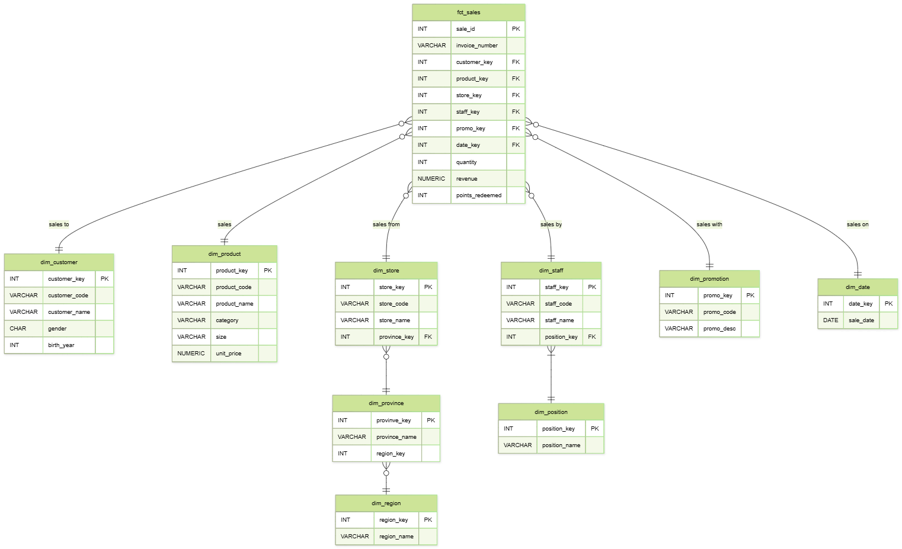

</details>

> 📝 **dbt กับ Foreign Key:** Lab นี้ใช้ **relationship tests** ตรวจความสมบูรณ์ของคีย์อ้างอิง แทนการสร้าง
> physical `FOREIGN KEY` constraint โดยตรง จึงตรวจจับ orphan records ได้ และยังคง transformation
> แบบ declarative

---

## 📥 Part 2: Prepare the Lab Environment / เตรียม Lab Environment

### 2.1 Create the database / สร้างฐานข้อมูลผ่าน pgAdmin

Open **pgAdmin** ([http://localhost:28880](http://localhost:28880), login `dw_user@mail.com` / `dw_pass`),
open the **Query Tool**, and run:

```sql
CREATE DATABASE coffee_dw_snowflake;
```

<details>
<summary><b>Show Output</b></summary>

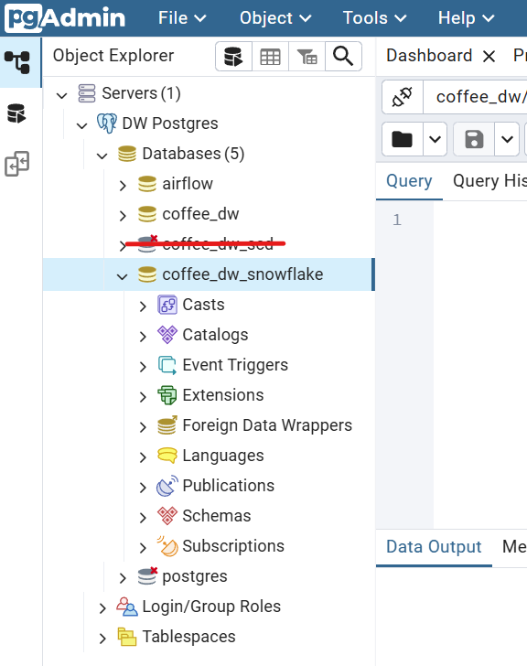

</details>

### 2.2 Create the project skeleton / สร้างโครงสร้างโครงการ

Target layout inside `week05-snowflake-schema-with-dbt/lab-week05/`:

```text
dbt_root/
└── profiles.yml
dbt/
└── coffee_dw_snowflake/
    ├── dbt_project.yml
    ├── seeds/
    │   ├── coffee_sales.csv
    │   └── province_region_mapping.csv
    ├── models/
    │   ├── staging/
    │   ├── marts/
    │   ├── metadata/
    │   ├── reporting/
    │   └── schema.yml
    └── tests/
```

<details>
<summary><b>⚡ Fast Track: create the folder skeleton via Terminal</b></summary>

**Mac / Linux:**

```bash
cd week05-snowflake-schema-with-dbt/lab-week05/
mkdir -p dbt/coffee_dw_snowflake/models/staging
mkdir -p dbt/coffee_dw_snowflake/models/marts
mkdir -p dbt/coffee_dw_snowflake/models/metadata
mkdir -p dbt/coffee_dw_snowflake/models/reporting
mkdir -p dbt/coffee_dw_snowflake/tests
mkdir -p dbt_root
```

**Windows (PowerShell):**

```powershell
cd week05-snowflake-schema-with-dbt/lab-week05/
New-Item -ItemType Directory -Force dbt/coffee_dw_snowflake/models/staging
New-Item -ItemType Directory -Force dbt/coffee_dw_snowflake/models/marts
New-Item -ItemType Directory -Force dbt/coffee_dw_snowflake/models/metadata
New-Item -ItemType Directory -Force dbt/coffee_dw_snowflake/models/reporting
New-Item -ItemType Directory -Force dbt/coffee_dw_snowflake/tests
New-Item -ItemType Directory -Force dbt_root
```

</details>

> 💡 `seeds/coffee_sales.csv` และ `seeds/province_region_mapping.csv` **อยู่ในโฟลเดอร์ให้แล้ว** —
> ไม่ต้องคัดลอกเพิ่ม ถ้าคุณสร้างโครงการเองที่อื่น ให้คัดลอกทั้งสองไฟล์ไปที่ `seeds/` โดยคงชื่อไฟล์เดิม

### 2.3 Create `dbt_root/profiles.yml`

```yaml
coffee_dw_snowflake:
  target: dev
  outputs:
    dev:
      type: postgres
      host: postgres
      port: 5432
      user: dw_user
      password: dw_pass
      dbname: coffee_dw_snowflake
      schema: dbt
      threads: 4
```

> ⚠️ **ชื่อ host:** ภายใน Docker network ต้องใช้ชื่อ **service** คือ `postgres` ไม่ใช่ `localhost`
> ส่วน `dw_postgres` เป็น `container_name` ซึ่งใช้ได้ในบางกรณี พอร์ตภายในคือ `5432` — ไม่ใช่ `25432`

### 2.4 Create `dbt/coffee_dw_snowflake/dbt_project.yml`

```yaml
name: coffee_dw_snowflake
version: '1.0.0'
config-version: 2

profile: coffee_dw_snowflake

model-paths: ["models"]
seed-paths: ["seeds"]
test-paths: ["tests"]

target-path: "target"
clean-targets:
  - "target"
  - "dbt_packages"

models:
  coffee_dw_snowflake:          # project name
    staging:
      +materialized: view
      +schema: staging
    marts:
      +materialized: table
      +schema: marts
    metadata:
      +materialized: table
      +schema: metadata
    reporting:
      +materialized: view
      +schema: reporting

seeds:
  coffee_dw_snowflake:
    +schema: raw
    coffee_sales:
      +column_types:
        sale_id: integer
        sale_date: date
        birth_year: integer
        unit_price: numeric(10,2)
        quantity: integer
        revenue: numeric(12,2)
        points_redeemed: integer
    province_region_mapping:
      +column_types:
        province_name: varchar(100)
        region_name: varchar(100)
```

> 📝 **ชื่อ schema จริงใน PostgreSQL:** dbt ต่อ `+schema:` เข้ากับ `schema:` ใน `profiles.yml`
> ดังนั้นผลลัพธ์คือ `dbt_raw`, `dbt_staging`, `dbt_marts`, `dbt_metadata` และ `dbt_reporting` —
> ใช้ชื่อเหล่านี้เวลา query ผ่าน pgAdmin หรือ Metabase

### 2.5 Verify the connection / ตรวจสอบการเชื่อมต่อ

```bash
docker exec -it dw_dbt bash -c "cd coffee_dw_snowflake && dbt debug"
```

<details>
<summary><b>Show Output</b></summary>

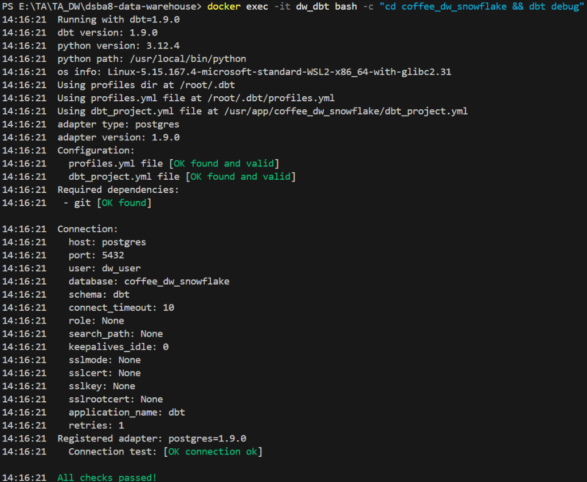

</details>

ผลที่ต้องได้: **`Connection test: OK`** และ **`All checks passed!`**

---

## 🌱 Part 3: Load the Data with `dbt seed` / โหลดข้อมูลด้วย dbt seed

`dbt seed` อ่าน CSV ในโฟลเดอร์ `seeds/` แล้วสร้างตารางตามชนิดข้อมูลที่กำหนดใน `dbt_project.yml`

```bash
docker exec -it dw_dbt bash -c "cd coffee_dw_snowflake && dbt seed"
```

| Seed                        | จำนวนแถวที่คาดหวัง | Schema      |
| --------------------------- | -----------------------------------: | ----------- |
| `coffee_sales`            |                                3,000 | `dbt_raw` |
| `province_region_mapping` |                                    3 | `dbt_raw` |

<details>
<summary><b>Show Output</b></summary>

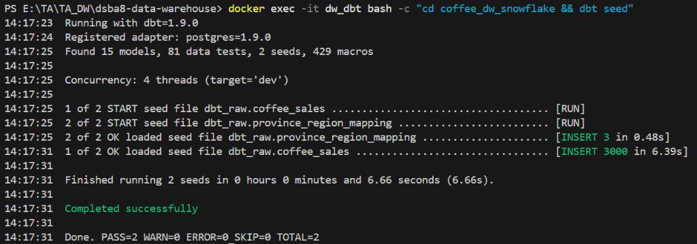

</details>

> 💡 **รันซ้ำหลังแก้ CSV:** ใช้ `dbt seed --full-refresh` เพื่อสร้าง seed table ใหม่จากไฟล์ล่าสุด

---

## 🧱 Part 4: Create the Staging Models / สร้าง Staging Models

Staging layer ทำหน้าที่ cast ชนิดข้อมูล, `trim` ช่องว่าง, ปรับ `category` เป็นตัวพิมพ์เล็ก และเปลี่ยนค่าว่างของ
promotion ให้เป็น `NULL`

### 4.1 `dbt/models/staging/stg_coffee_sales.sql`

```sql
select
    cast(sale_id as integer) as sale_id,
    trim(invoice_number) as invoice_number,
    cast(sale_date as date) as sale_date,
    trim(customer_code) as customer_code,
    trim(customer_name) as customer_name,
    trim(gender) as gender,
    cast(birth_year as integer) as birth_year,
    trim(product_code) as product_code,
    trim(product_name) as product_name,
    lower(trim(category)) as category,
    trim(size) as size,
    cast(unit_price as numeric(10,2)) as unit_price,
    cast(quantity as integer) as quantity,
    cast(revenue as numeric(12,2)) as revenue,
    trim(store_code) as store_code,
    trim(store_name) as store_name,
    trim(province) as province,
    trim(staff_code) as staff_code,
    trim(staff_name) as staff_name,
    trim(position) as position,
    nullif(trim(promo_code), '') as promo_code,
    nullif(trim(promo_desc), '') as promo_desc,
    cast(points_redeemed as integer) as points_redeemed
from {{ ref('coffee_sales') }}
```

### 4.2 `dbt/models/staging/stg_province_region_mapping.sql`

```sql
select
    trim(province_name) as province_name,
    trim(region_name) as region_name
from {{ ref('province_region_mapping') }}
```

> 📝 **`ref()`:** `{{ ref('coffee_sales') }}` ไม่ได้เป็นเพียงการแทนชื่อตาราง แต่สร้าง **dependency** ใน
> lineage ทำให้ dbt รู้ว่า seed ต้องพร้อมก่อน staging model

### 4.3 Run and inspect / รันและตรวจผล

```bash
docker exec -it dw_dbt bash -c "cd coffee_dw_snowflake && dbt run --select path:models/staging"
docker exec -it dw_dbt bash -c "cd coffee_dw_snowflake && dbt show --select stg_coffee_sales --limit 5"
```

<details>
<summary><b>Show Output</b></summary>

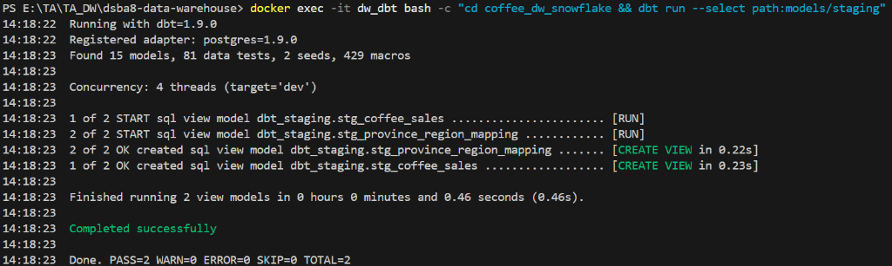

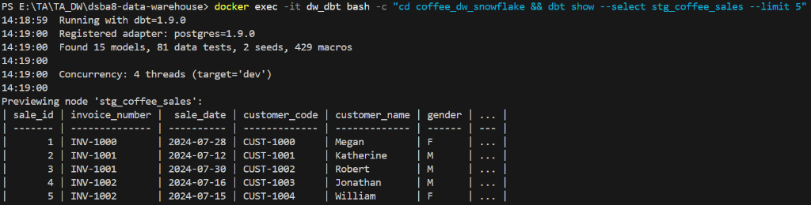

</details>

---

## 🧊 Part 5: Create the Dimension Tables / สร้าง Dimension Tables

โมเดลใน `marts` ถูกกำหนดให้ materialized เป็น **table** แต่ละ dimension ใช้ **deterministic surrogate key**
จาก `md5(natural_key)` จึงได้ค่าเดิมเมื่อรันใหม่กับ natural key เดิม และไม่ต้องติดตั้ง `dbt_utils`

### 5.1 Flat dimensions / มิติที่ไม่แตกแขนง

**`dbt/models/marts/dim_customer.sql`**

```sql
select distinct
    md5(customer_code) as customer_key,
    customer_code,
    customer_name,
    gender,
    birth_year
from {{ ref('stg_coffee_sales') }}
```

**`dbt/models/marts/dim_promotion.sql`**

```sql
select distinct
    md5(promo_code) as promo_key,
    promo_code,
    promo_desc
from {{ ref('stg_coffee_sales') }}
where promo_code is not null
```

**`dbt/models/marts/dim_date.sql`**

```sql
select distinct
    cast(to_char(sale_date, 'YYYYMMDD') as integer) as date_key,
    sale_date,
    extract(year from sale_date)::integer as year,
    extract(month from sale_date)::integer as month_number,
    trim(to_char(sale_date, 'Month')) as month_name,
    extract(quarter from sale_date)::integer as quarter,
    extract(day from sale_date)::integer as day_of_month
from {{ ref('stg_coffee_sales') }}
```

### 5.2 Product hierarchy — `dim_category` → `dim_product`

**`dbt/models/marts/dim_category.sql`**

```sql
select distinct
    md5(category) as category_key,
    category as category_name
from {{ ref('stg_coffee_sales') }}
```

**`dbt/models/marts/dim_product.sql`**

```sql
select distinct
    md5(s.product_code) as product_key,
    s.product_code,
    s.product_name,
    c.category_key,
    s.size,
    s.unit_price
from {{ ref('stg_coffee_sales') }} s
join {{ ref('dim_category') }} c
  on s.category = c.category_name
```

### 5.3 Geography hierarchy — `dim_region` → `dim_province` → `dim_store`

**`dbt/models/marts/dim_region.sql`**

```sql
select distinct
    md5(region_name) as region_key,
    region_name
from {{ ref('stg_province_region_mapping') }}
```

**`dbt/models/marts/dim_province.sql`**

```sql
select distinct
    md5(m.province_name) as province_key,
    m.province_name,
    r.region_key
from {{ ref('stg_province_region_mapping') }} m
join {{ ref('dim_region') }} r
  on m.region_name = r.region_name
```

**`dbt/models/marts/dim_store.sql`**

```sql
select distinct
    md5(s.store_code) as store_key,
    s.store_code,
    s.store_name,
    p.province_key
from {{ ref('stg_coffee_sales') }} s
join {{ ref('dim_province') }} p
  on s.province = p.province_name
```

### 5.4 Staff hierarchy — `dim_position` → `dim_staff`

**`dbt/models/marts/dim_position.sql`**

```sql
select distinct
    md5(position) as position_key,
    position as position_name
from {{ ref('stg_coffee_sales') }}
```

**`dbt/models/marts/dim_staff.sql`**

```sql
select distinct
    md5(s.staff_code) as staff_key,
    s.staff_code,
    s.staff_name,
    p.position_key
from {{ ref('stg_coffee_sales') }} s
join {{ ref('dim_position') }} p
  on s.position = p.position_name
```

> 📝 **ลำดับการสร้าง:** `dim_product` อ้าง `ref('dim_category')`, `dim_province` อ้าง `ref('dim_region')`,
> `dim_store` อ้าง `ref('dim_province')` และ `dim_staff` อ้าง `ref('dim_position')` — dbt จึงสร้าง
> **parent dimension ก่อน child dimension** โดยอัตโนมัติ

### 5.5 Run the dimensions only / รันเฉพาะ dimensions

```bash
docker exec -it dw_dbt bash -c 'cd coffee_dw_snowflake && dbt run --select "dim_*.sql"'
```

<details>
<summary><b>Show Output</b></summary>

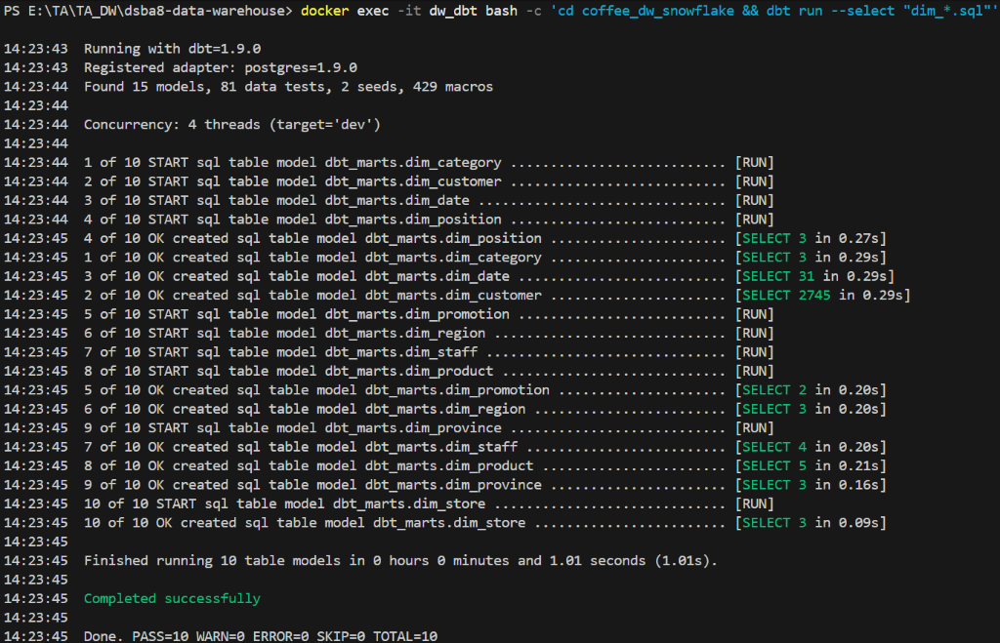

</details>

---

## ⭐ Part 6: Create the Fact Table / สร้าง Fact Table

**`dbt/models/marts/fct_sales.sql`**

```sql
select
    s.sale_id,
    s.invoice_number,
    d.date_key,
    c.customer_key,
    p.product_key,
    st.store_key,
    sf.staff_key,
    pr.promo_key,
    s.quantity,
    s.revenue,
    s.points_redeemed
from {{ ref('stg_coffee_sales') }} s
join {{ ref('dim_date') }} d
  on s.sale_date = d.sale_date
join {{ ref('dim_customer') }} c
  on s.customer_code = c.customer_code
join {{ ref('dim_product') }} p
  on s.product_code = p.product_code
join {{ ref('dim_store') }} st
  on s.store_code = st.store_code
join {{ ref('dim_staff') }} sf
  on s.staff_code = sf.staff_code
left join {{ ref('dim_promotion') }} pr
  on s.promo_code = pr.promo_code
```

> ⚠️ **Promotion ที่เป็น NULL:** ใช้ `LEFT JOIN` กับ `dim_promotion` เพื่อรักษารายการขายที่ไม่มีโปรโมชั่นไว้ใน
> fact table โดย `promo_key` จะเป็น `NULL`

```bash
docker exec -it dw_dbt bash -c "cd coffee_dw_snowflake && dbt run --select fct_sales"
docker exec -it dw_dbt bash -c "cd coffee_dw_snowflake && dbt show --select fct_sales --limit 10"
```

<details>
<summary><b>Show Output</b></summary>

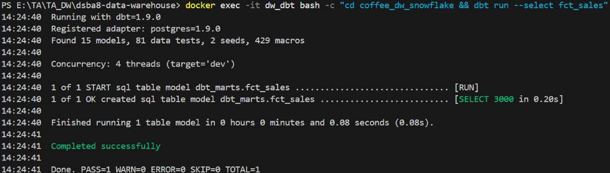

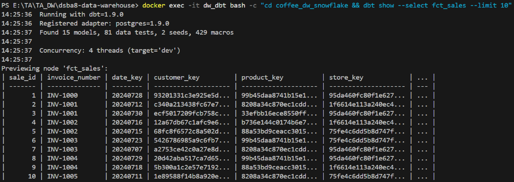

</details>

---

## 🪜 Part 7: Build `hierarchy_def` and the Reporting View / สร้าง hierarchy_def และ Reporting View

### 7.1 Metadata model — `dbt/models/metadata/hierarchy_def.sql`

```sql
with hierarchy as (
    select *
    from (values
        ('geo', 1, 'region', 'dim_region',
         'region_key', 'region_name'),
        ('geo', 2, 'province', 'dim_province',
         'province_key', 'province_name')
    ) as h(
        hierarchy_name,
        level_num,
        level_name,
        table_name,
        key_field,
        name_field
    )
)
select * from hierarchy
```

> 📝 `level_num` กำหนดลำดับจากระดับบนลงล่าง คือ `region` (1) → `province` (2) ส่วน `table_name`,
> `key_field` และ `name_field` บอกตำแหน่งของข้อมูลใน schema

### 7.2 Flattened view for Metabase — `dbt/models/reporting/v_sales_geo_flat.sql`

```sql
select
    d.sale_date,
    f.invoice_number,
    p.province_name,
    r.region_name,
    f.revenue
from {{ ref('fct_sales') }} f
join {{ ref('dim_date') }} d
  on f.date_key = d.date_key
join {{ ref('dim_store') }} s
  on f.store_key = s.store_key
join {{ ref('dim_province') }} p
  on s.province_key = p.province_key
join {{ ref('dim_region') }} r
  on p.region_key = r.region_key
```

> 💡 **เหตุผลที่ยังต้องมี flat view:** Snowflake Schema เหมาะกับการจัดเก็บและควบคุมความซ้ำซ้อน แต่ BI tool
> ใช้งานง่ายขึ้นเมื่อมี reporting view ที่ join hierarchy ให้แล้ว

```bash
docker exec -it dw_dbt bash -c "cd coffee_dw_snowflake && dbt run --select hierarchy_def v_sales_geo_flat"
docker exec -it dw_dbt bash -c "cd coffee_dw_snowflake && dbt show --select hierarchy_def"
```

<details>
<summary><b>Show Output</b></summary>

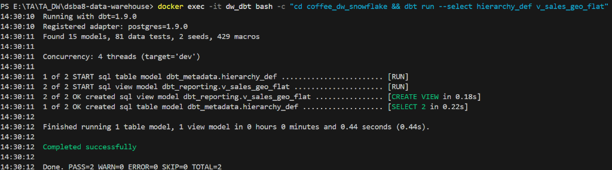

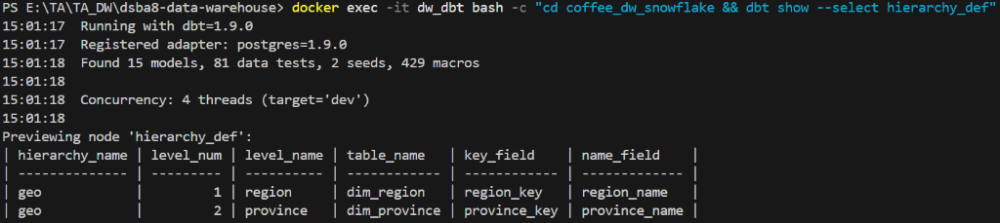

</details>

---

## ✅ Part 8: Define Data Tests / กำหนด Data Tests

ไฟล์ `schema.yml` ระบุ `unique`, `not_null` และ `relationships` tests สำหรับคีย์หลักและคีย์อ้างอิง ส่วน
**singular tests** ตรวจเงื่อนไขทางธุรกิจที่ต้องคืนค่า **0 แถว** จึงจะผ่าน

### 8.1 `dbt/models/schema.yml`

<details>
<summary><b>📄 Full <code>models/schema.yml</code> (click to expand)</b></summary>

```yaml
version: 2

models:
  - name: stg_coffee_sales
    description: Cleaned sales rows; grain is one sale_id.
    columns:
      - name: sale_id  
        tests: [not_null, unique]
      - name: customer_code
        tests: [not_null]
      - name: product_code
        tests: [not_null]
      - name: store_code
        tests: [not_null]
      - name: staff_code
        tests: [not_null]
      - name: sale_date
        tests: [not_null]

  - name: stg_province_region_mapping
    description: Province-to-region mapping used by the geography hierarchy.
    columns:
      - name: province_name
        tests: [not_null, unique]
      - name: region_name
        tests: [not_null]

  - name: dim_customer
    description: Customer dimension.
    columns:
      - name: customer_key
        tests: [not_null, unique]
      - name: customer_code
        tests: [not_null, unique]

  - name: dim_category
    description: Top level of the product hierarchy.
    columns:
      - name: category_key
        tests: [not_null, unique]
      - name: category_name
        tests: [not_null, unique]

  - name: dim_product
    description: Product dimension linked to dim_category.
    columns:
      - name: product_key
        tests: [not_null, unique]
      - name: product_code
        tests: [not_null, unique]
      - name: category_key
        tests:
          - not_null
          - relationships:
              to: ref('dim_category')
              field: category_key

  - name: dim_region
    description: Top level of the geography hierarchy.
    columns:
      - name: region_key
        tests: [not_null, unique]
      - name: region_name
        tests: [not_null, unique]

  - name: dim_province
    description: Province level linked to dim_region.
    columns:
      - name: province_key
        tests: [not_null, unique]
      - name: province_name
        tests: [not_null, unique]
      - name: region_key
        tests:
          - not_null
          - relationships:
              to: ref('dim_region')
              field: region_key

  - name: dim_store
    description: Store dimension linked to dim_province.
    columns:
      - name: store_key
        tests: [not_null, unique]
      - name: store_code
        tests: [not_null, unique]
      - name: province_key
        tests:
          - not_null
          - relationships:
              to: ref('dim_province')
              field: province_key

  - name: dim_position
    description: Top level of the staff hierarchy.
    columns:
      - name: position_key
        tests: [not_null, unique]
      - name: position_name
        tests: [not_null, unique]

  - name: dim_staff
    description: Staff dimension linked to dim_position.
    columns:
      - name: staff_key
        tests: [not_null, unique]
      - name: staff_code
        tests: [not_null, unique]
      - name: position_key
        tests:
          - not_null
          - relationships:
              to: ref('dim_position')
              field: position_key

  - name: dim_promotion
    description: Promotion dimension; non-promotion facts keep a null promo_key.
    columns:
      - name: promo_key
        tests: [not_null, unique]
      - name: promo_code
        tests: [not_null, unique]

  - name: dim_date
    description: Calendar date dimension.
    columns:
      - name: date_key
        tests: [not_null, unique]
      - name: sale_date
        tests: [not_null, unique]

  - name: fct_sales
    description: Sales fact; grain is one sale_id.
    columns:
      - name: sale_id
        tests: [not_null, unique]
      - name: date_key
        tests:
          - not_null
          - relationships:
              to: ref('dim_date')
              field: date_key
      - name: customer_key
        tests:
          - not_null
          - relationships:
              to: ref('dim_customer')
              field: customer_key
      - name: product_key
        tests:
          - not_null
          - relationships:
              to: ref('dim_product')
              field: product_key
      - name: store_key
        tests:
          - not_null
          - relationships:
              to: ref('dim_store')
              field: store_key
      - name: staff_key
        tests:
          - not_null
          - relationships:
              to: ref('dim_staff')
              field: staff_key
      - name: promo_key
        tests:
          - relationships:
              to: ref('dim_promotion')
              field: promo_key
      - name: revenue
        tests: [not_null]

  - name: hierarchy_def
    description: Metadata that defines the order and fields of hierarchies.
    columns:
      - name: hierarchy_name
        tests: [not_null]
      - name: level_num
        tests: [not_null]
      - name: level_name
        tests: [not_null]

  - name: v_sales_geo_flat
    description: Flattened geography view for Metabase.
    columns:
      - name: sale_date
        tests: [not_null]
      - name: province_name
        tests: [not_null]
      - name: region_name
        tests: [not_null]
      - name: revenue
        tests: [not_null]
```

</details>

### 8.2 Singular tests

**`dbt/coffee_dw_snowflake/tests/assert_all_provinces_mapped.sql`**

```sql
select s.*
from {{ ref('stg_coffee_sales') }} s
left join {{ ref('dim_province') }} p
  on s.province = p.province_name
where p.province_key is null
```

**`tests/assert_revenue_nonnegative.sql`**

```sql
select *
from {{ ref('fct_sales') }}
where revenue < 0
```

> 📝 **dbt เรียก singular test เมื่อใด:** เมื่อรัน `dbt test` หรือ `dbt build` dbt จะค้นหาไฟล์ `.sql` ใน
> `test-paths` (กำหนดเป็น `tests`) แล้วนำ query ไปตรวจ — ถ้า query คืน **อย่างน้อย 1 แถว** test จะ **fail**

```bash
docker exec -it dw_dbt bash -c "cd coffee_dw_snowflake && dbt test"
```

<details>
<summary><b>Show Output</b></summary>

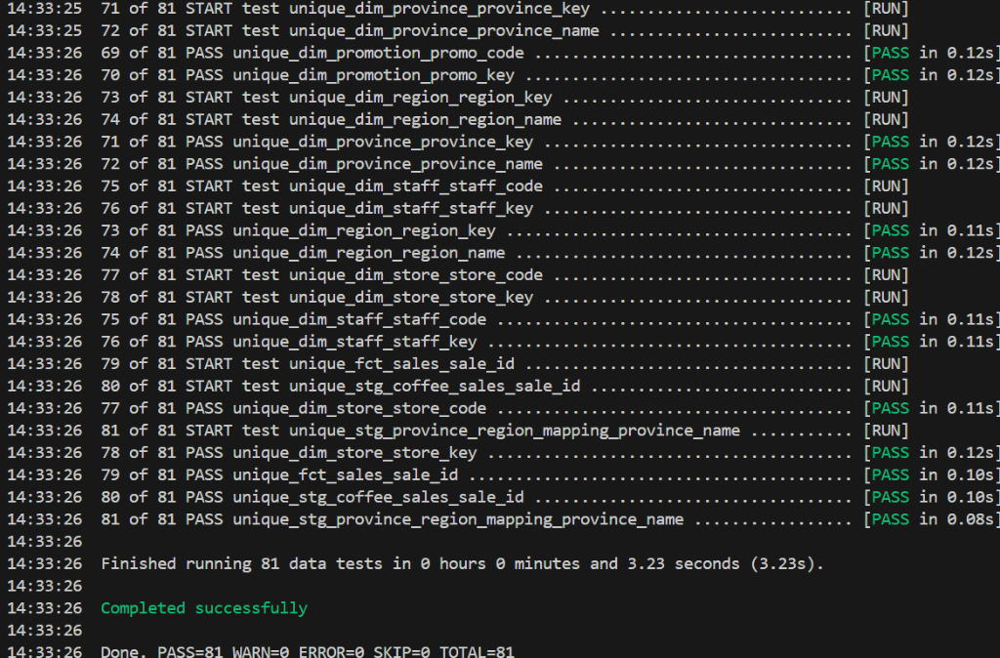

</details>

### 8.3 Run the whole pipeline in one command / รันทั้ง pipeline ด้วยคำสั่งเดียว

```bash
docker exec -it dw_dbt bash -c "cd coffee_dw_snowflake && dbt build"
```

> 💡 `dbt build` จะจัดลำดับ **seed → model → test** ตาม dependency graph ที่เกิดจาก `ref()` โดยอัตโนมัติ

<details>
<summary><b>Show Output</b></summary>

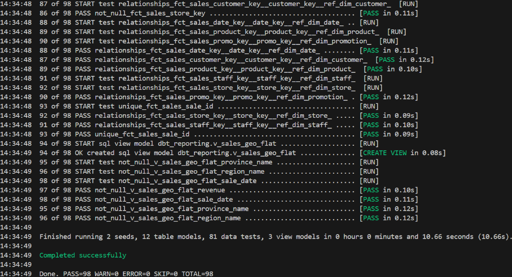

</details>

### 8.4 Verify row counts / ตรวจจำนวนแถว

Run in pgAdmin against `coffee_dw_snowflake`:

```sql
select 'dim_customer' as model, count(*) from dbt_marts.dim_customer
union all select 'dim_category', count(*) from dbt_marts.dim_category
union all select 'dim_product', count(*) from dbt_marts.dim_product
union all select 'dim_region', count(*) from dbt_marts.dim_region
union all select 'dim_province', count(*) from dbt_marts.dim_province
union all select 'dim_store', count(*) from dbt_marts.dim_store
union all select 'dim_position', count(*) from dbt_marts.dim_position
union all select 'dim_staff', count(*) from dbt_marts.dim_staff
union all select 'dim_promotion', count(*) from dbt_marts.dim_promotion
union all select 'dim_date', count(*) from dbt_marts.dim_date
union all select 'fct_sales', count(*) from dbt_marts.fct_sales
order by model;
```

| Model             | จำนวนแถว | Model            | จำนวนแถว |
| ----------------- | ---------------: | ---------------- | ---------------: |
| `dim_customer`  |            2,745 | `dim_category` |                3 |
| `dim_product`   |                5 | `dim_region`   |                3 |
| `dim_province`  |                3 | `dim_store`    |                3 |
| `dim_position`  |                3 | `dim_staff`    |                4 |
| `dim_promotion` |                2 | `dim_date`     |               31 |
| `fct_sales`     |            3,000 |                  |                  |

<details>
<summary><b>Show Output</b></summary>

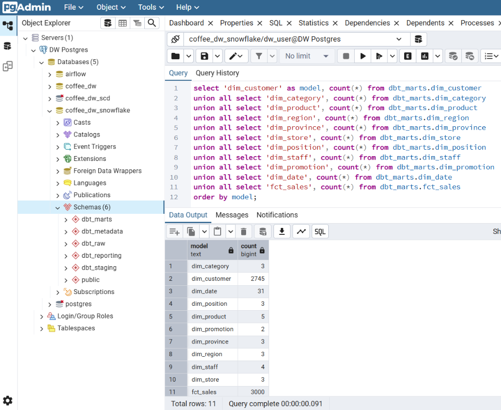

</details>

---

## 📚 Part 9: Generate dbt Documentation & Check Lineage / สร้าง dbt Documentation

```bash
docker exec -it dw_dbt bash -c "cd coffee_dw_snowflake && dbt docs generate"
docker exec -it dw_dbt bash -c "cd coffee_dw_snowflake && dbt docs serve --host 0.0.0.0 --port 8080 --no-browser"
```

เปิด **[http://localhost:28088](http://localhost:28088)** แล้วเลือก `fct_sales`, `dim_store` หรือ
`v_sales_geo_flat` จากนั้นดู **Lineage Graph**

> 📝 To reach the docs site from your browser, the `dbt` service in `docker-compose` must map the port
> — `ports: ["28088:8080"]`. `dbt docs serve` runs until you press **Ctrl+C**.

- `dbt docs generate` อ่าน `manifest`, `catalog` และคำอธิบายใน `schema.yml` แล้วสร้างเว็บไซต์เอกสารแบบ static
- Lineage แสดง dependency จาก **seed → staging → dimensions/fact → reporting view**
- Column tests และคำอธิบายโมเดลช่วยให้ตรวจสอบ **data contract** ในระดับพื้นฐานได้

> ⚠️ **เมื่อแก้โมเดล:** ให้รัน `dbt docs generate` ใหม่เพื่ออัปเดต catalog และ lineage ก่อน refresh หน้าเว็บ

<details>
<summary><b>📷 dbt docs — Lineage Graph</b></summary>

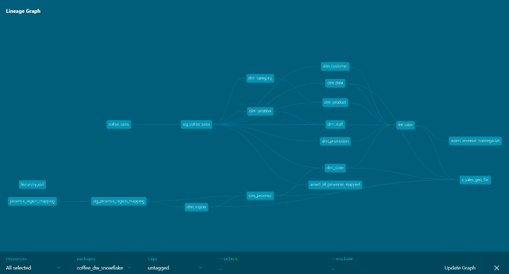

</details>

---

## 📊 Part 10: Build the Metabase Dashboard / สร้าง Dashboard บน Metabase

### 10.1 Connect PostgreSQL / เชื่อมต่อ PostgreSQL

เปิด **[http://localhost:23000](http://localhost:23000)** แล้วเพิ่ม PostgreSQL database ด้วยค่าต่อไปนี้

| รายการ  | ค่า                  |
| ------------- | ----------------------- |
| Display name  | `coffee_dw_snowflake` |
| Host          | `dw_postgres`         |
| Port          | `5432`                |
| Database name | `coffee_dw_snowflake` |
| Username      | `dw_user`             |
| Password      | `dw_pass`             |

> ⚠️ **พอร์ต:** `localhost:23000` ใช้เปิดหน้า Metabase จากเครื่องผู้เรียน แต่ Metabase เชื่อม PostgreSQL
> **ภายใน Docker network** ที่ port `5432`

</details>

### 10.2 Question: Revenue by Hierarchy Level

เลือก **New → SQL query → database `coffee_dw_snowflake`** แล้ววาง SQL ต่อไปนี้

```sql
with selected_level as (
    select level_name
    from dbt_metadata.hierarchy_def
    where hierarchy_name = 'geo'
      [[and {{level_name}}]]
    order by level_num
    limit 1
)
select
    case sl.level_name
        when 'province' then f.province_name
        when 'region' then f.region_name
    end as selected_level,
    sum(f.revenue) as total_revenue
from dbt_reporting.v_sales_geo_flat f
cross join selected_level sl
group by 1
order by 2 desc
```

1. ตั้งค่า variable **`level_name`** เป็น **Field Filter**
2. Map ไปที่ **`dbt_metadata.hierarchy_def.level_name`**
3. เลือก widget เป็น **Dropdown list**

> 💡 เมื่อยังไม่เลือก filter query จะใช้ **`region`** ซึ่งเป็น `level_num` ต่ำสุด เมื่อเลือก **`province`**
> จะแสดงรายได้แยกจังหวัด

<details>
<summary><b>📷 Metabase — Revenue by Hierarchy Level</b></summary>

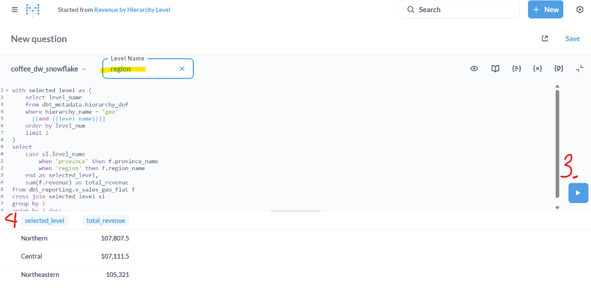

</details>

---

## 📤 Submission / สิ่งที่ต้องส่ง

ส่งคำตอบผ่าน **Google Form — Lab 5: Snowflake Schema with dbt** *(ลิงก์จากผู้สอน)*

| รายการ                                                                                              | รูปแบบ |
| --------------------------------------------------------------------------------------------------------- | ------------ |
| Screenshot หน้า dbt Lineage ของ`v_sales_geo_flat`                                                | PNG          |
| Screenshot ผล`dbt test` ที่ผ่านทั้งหมด                                                  | PNG          |
| Screenshot ผลของ**Revenue by Hierarchy Level** ที่สลับ `region` / `province` ได้ | PNG          |

---

## 🛠️ dbt Cheat Sheet

> ⚠️ The dbt container is `dw_dbt` and the project folder is `coffee_dw_snowflake`.

| Command                                                                                                     | Description                                   |
| ----------------------------------------------------------------------------------------------------------- | --------------------------------------------- |
| `docker exec -it dw_dbt bash`                                                                             | Open a shell inside the dbt container         |
| `docker exec -it dw_dbt bash -c "cd coffee_dw_snowflake && dbt debug"`                                    | Test the database connection                  |
| `docker exec -it dw_dbt bash -c "cd coffee_dw_snowflake && dbt seed"`                                     | Load the seed CSVs                            |
| `docker exec -it dw_dbt bash -c "cd coffee_dw_snowflake && dbt seed --full-refresh"`                      | Rebuild seed tables from the latest CSVs      |
| `docker exec -it dw_dbt bash -c "cd coffee_dw_snowflake && dbt run --select path:models/staging"`         | Build only the staging models                 |
| `docker exec -it dw_dbt bash -c "cd coffee_dw_snowflake && dbt show --select stg_coffee_sales --limit 5"` | Preview a model's rows                        |
| `docker exec -it dw_dbt bash -c "cd coffee_dw_snowflake && dbt test"`                                     | Run all data tests                            |
| `docker exec -it dw_dbt bash -c "cd coffee_dw_snowflake && dbt build"`                                    | Run seed + models + tests in dependency order |
| `docker exec -it dw_dbt bash -c "cd coffee_dw_snowflake && dbt docs generate"`                            | Build the documentation site                  |

---

*Data Warehouse — DSBA8 | Week 5*
