# 📦 Week 6: Slowly Changing Dimensions (SCD) with dbt

> **Course:** Data Warehousing (การสร้างคลังข้อมูล)  
> **Topic:** การจัดการ Slowly Changing Dimensions — SCD Types 0, 1, 2 และ 3 ด้วย dbt  
> **Duration:** 2 Hours

> 💡 **Lab concept / แนวคิดหลัก:** ใช้ **dbt model** สำหรับ Types 0, 1 และ 3 และใช้ **dbt snapshot**
> สำหรับ Type 2 เพื่อเก็บประวัติการเปลี่ยนจังหวัดของลูกค้า พร้อมทดสอบความถูกต้องของช่วงเวลาและคีย์อ้างอิง

> 📷 The screenshot blocks below point at `docs/screenshots/`. Capture each output as you run the
> lab and drop the PNGs there — filenames already match.

---

## 🎯 Learning Objectives / วัตถุประสงค์

1. อธิบายความแตกต่างของ **SCD Types 0, 1, 2 และ 3** ได้
2. เลือกวิธีสร้าง dimension ด้วย **dbt model** หรือ **dbt snapshot** ให้เหมาะกับ SCD Type ได้
3. จำลองการโหลดข้อมูลต่างช่วงเวลา และสร้างประวัติ **Type 2** ด้วย `dbt snapshot` ได้
4. สร้าง dimension และ fact table ด้วย `ref()` และ **surrogate key** ได้
5. ใช้ `dbt test` ตรวจ **uniqueness, relationships, row count** และช่วงเวลาที่ **ซ้อนทับกัน** ได้
6. วิเคราะห์ยอดขายย้อนหลังตามสถานะ dimension **ณ วันที่เกิดรายการ** ได้

---

## 🧰 Tools & Stack Overview / เครื่องมือที่ใช้

| Tool                            | What is it?                  | What is it used for in this lab?                                           |
| ------------------------------- | ---------------------------- | -------------------------------------------------------------------------- |
| **Docker Compose**        | Containerization             | Run the `postgres`, `dbt`, and `pgadmin` services.                    |
| **PostgreSQL 16**         | Relational Database (RDBMS)  | Store `coffee_dw_scd` — seeds, snapshots, dimensions, fact, reports.     |
| **dbt-postgres**          | Transformation Framework     | `seed`, transformation, **snapshot**, `test`, and documentation. |
| **pgAdmin 4**             | Database GUI Management Tool | Create the database and inspect Checkpoint query results.                  |
| **VS Code / Text Editor** | Editor                       | Create the `.sql` and `.yml` files of the dbt project.                  |

**Dataset / ชุดข้อมูล**

| Dataset                  |  Rows | Date range                       |
| ------------------------ | ----: | -------------------------------- |
| `coffee_sales_scd.csv` | 7,470 | `2023-01-01` → `2031-03-19` |

---

## 📁 Files in This Week / ไฟล์ในสัปดาห์นี้

| File / Folder                                                                                                                              | Description                                                     |
| ------------------------------------------------------------------------------------------------------------------------------------------ | --------------------------------------------------------------- |
| 📂 [docs/](./docs/)                                                                                                                          | Lab instructions                                                |
| ├── 📄 [Lab6 SCD with dbt.pdf](<./docs/Lab6%20SCD%20with%20dbt.pdf>)                                                                      | Lab instruction (PDF)                                           |
| 📂 [lab-week06/](./lab-week06/)                                                                                                              | **Lab working directory**                                 |
| ├── 📂 [dbt_root/](./lab-week06/dbt_root/)                                                                                                | Holds `profiles.yml` — created during the lab                 |
| └── 📂 [dbt/coffee_dw_scd/](./lab-week06/dbt/coffee_dw_scd/)                                                                              | dbt project — models, snapshots & tests created during the lab |
| &nbsp;&nbsp;&nbsp;&nbsp;└── 📂 [seeds/](./lab-week06/dbt/coffee_dw_scd/seeds/)                                                           | Seed CSV, already in place                                      |
| &nbsp;&nbsp;&nbsp;&nbsp;&nbsp;&nbsp;&nbsp;&nbsp;└── 📊 [coffee_sales_scd.csv](./lab-week06/dbt/coffee_dw_scd/seeds/coffee_sales_scd.csv) | 7,470 sales rows spanning two load windows                      |

---

## 🔧 Part 0: Start the Environment & Connect Tools / เริ่มระบบและเชื่อมต่อเครื่องมือ

> 💡 **Note:** If your Docker stack from Week 1 is already running, confirm with `docker compose ps` and proceed to connect pgAdmin.

### 0.1 Start Docker Containers / สตาร์ทระบบด้วย Docker

Reuse the Week 1 stack (it contains `dw_postgres`, `dw_dbt`, `pgAdmin`, and `Metabase`):

**Mac / Linux:**

```bash
cd week01-data-warehouse-setup/lab-week01
echo -e "AIRFLOW_UID=$(id -u)" > .env
docker compose up -d
docker compose ps
```

**Windows (PowerShell):**

```powershell
cd week01-data-warehouse-setup/lab-week01
Set-Content -Path .env -Value "AIRFLOW_UID=50000"
docker compose up -d
docker compose ps
```

---

### 0.2 Connect pgAdmin to PostgreSQL / เชื่อมต่อ pgAdmin กับ PostgreSQL

1. Open your browser and go to **pgAdmin**: [http://localhost:28880](http://localhost:28880)
2. Log in with the default credentials:
   - **Email:** `dw_user@mail.com`
   - **Password:** `dw_pass`
3. Register the PostgreSQL Server (if not already connected):
   - Right-click **Servers** ➡️ **Register** ➡️ **Server...**
   - Under the **General** tab:
     - **Name:** `DW Postgres`
   - Under the **Connection** tab:
     - **Host name/address:** `dw_postgres` *(Internal Docker container name)*
     - **Port:** `5432`
     - **Maintenance database:** `postgres` (or `airflow`)
     - **Username:** `dw_user`
     - **Password:** `dw_pass`
   - Click **Save**.

---

## 🧩 Part 1: Choose the Right SCD Type per Dimension / วิเคราะห์ SCD ที่เหมาะสม

พิจารณาการเปลี่ยนแปลงต่อไปนี้ แล้วอธิบายผลลัพธ์ที่ได้ใน **Google Classroom**

| Dimension / Field            |       SCD       | ผลลัพธ์ที่ต้องสังเกต                                 |
| ---------------------------- | :--------------: | ------------------------------------------------------------------------ |
| `dim_customer.province`    | **Type 2** | มีหลายเวอร์ชัน พร้อมช่วงวันที่มีผล      |
| `dim_product.product_name` | **Type 1** | แก้ชื่อเดิมโดยไม่เก็บประวัติชื่อเก่า |
| `dim_product.category`     | **Type 3** | เก็บ`current_category` และ `previous_category`                |
| `dim_staff.position`       | **Type 0** | คงค่าแรก ไม่รับการเปลี่ยนแปลงภายหลัง  |

> 📝 **ข้อมูลจริงในไฟล์:** `CUST1001` ย้าย **Bangkok → Chiang Mai** วันที่ `2025-01-01` และ `P004`
> เปลี่ยน **Bakery → Dessert** วันที่ `2027-02-11`

<details>
<summary><b>📷 ภาพที่ 1 — การเกิดประวัติ Type 2 ของ CUST1001</b></summary>

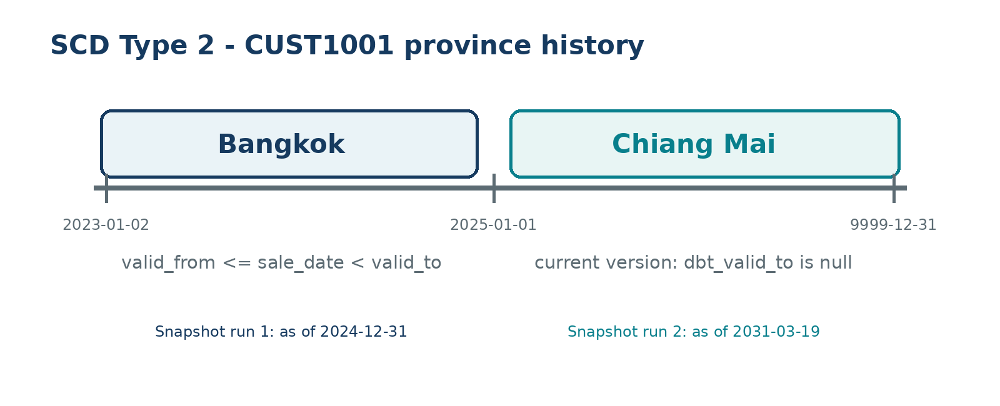

</details>

---

## 📥 Part 2: Prepare the Lab Environment / เตรียม Lab Environment

### 2.1 Create the database / สร้างฐานข้อมูล

Open **pgAdmin** ([http://localhost:28880](http://localhost:28880), login `dw_user@mail.com` / `dw_pass`),
open the **Query Tool**, and run:

```sql
CREATE DATABASE coffee_dw_scd;
```

> ⚠️ **กรณี database มีอยู่แล้ว:** ถ้าแจ้งว่า `database already exists` ให้ใช้ฐานเดิมได้ แต่ผล **snapshot
> อาจไม่ตรงกับรอบแรก** หากต้องการเริ่มใหม่ให้ลบเฉพาะฐาน `coffee_dw_scd` เดิมก่อน

<details>
<summary><b>Show Output</b></summary>

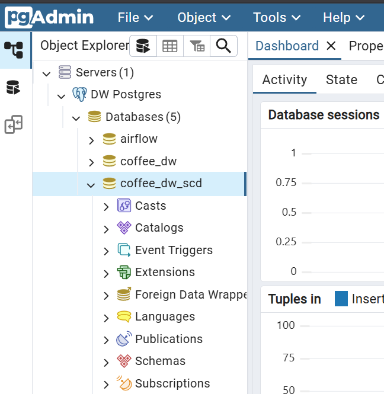

</details>

### 2.2 Create the project skeleton / สร้างโครงสร้างโครงการ dbt

Target layout inside `week06-scd-with-dbt/lab-week06/`:

```text
dbt_root/
└── profiles.yml
dbt/
└── coffee_dw_scd/
    ├── dbt_project.yml
    ├── seeds/
    │   └── coffee_sales_scd.csv
    ├── snapshots/
    │   └── dim_customer_snapshot.sql
    ├── models/
    │   ├── staging/
    │   │   └── stg_coffee_sales.sql
    │   ├── marts/
    │   │   ├── dim_customer.sql
    │   │   ├── dim_product.sql
    │   │   ├── dim_store.sql
    │   │   ├── dim_staff.sql
    │   │   ├── dim_promotion.sql
    │   │   ├── dim_date.sql
    │   │   └── fct_sales.sql
    │   ├── reporting/
    │   │   ├── rpt_bangkok_revenue_2024.sql
    │   │   └── rpt_changed_products_latest_year.sql
    │   └── schema.yml
    └── tests/
```

<details>
<summary><b>⚡ Fast Track: create the folder skeleton via Terminal</b></summary>

**Mac / Linux:**

```bash
cd week06-scd-with-dbt/lab-week06/
mkdir -p dbt/coffee_dw_scd/models/staging
mkdir -p dbt/coffee_dw_scd/models/marts
mkdir -p dbt/coffee_dw_scd/models/reporting
mkdir -p dbt/coffee_dw_scd/snapshots
mkdir -p dbt/coffee_dw_scd/tests
mkdir -p dbt_root
```

**Windows (PowerShell):**

```powershell
cd week06-scd-with-dbt/lab-week06/
New-Item -ItemType Directory -Force dbt/coffee_dw_scd/models/staging
New-Item -ItemType Directory -Force dbt/coffee_dw_scd/models/marts
New-Item -ItemType Directory -Force dbt/coffee_dw_scd/models/reporting
New-Item -ItemType Directory -Force dbt/coffee_dw_scd/snapshots
New-Item -ItemType Directory -Force dbt/coffee_dw_scd/tests
New-Item -ItemType Directory -Force dbt_root
```

</details>

> 💡 `seeds/coffee_sales_scd.csv` **อยู่ในโฟลเดอร์ให้แล้ว** — ไม่ต้องคัดลอกเพิ่ม ถ้าคุณสร้างโครงการเองที่อื่น
> ให้คัดลอกไฟล์ไปที่ `seeds/` โดยคงชื่อไฟล์เดิม

### 2.3 Create `dbt_root/profiles.yml`

```yaml
coffee_dw_scd:
  target: dev
  outputs:
    dev:
      type: postgres
      host: postgres
      port: 5432
      user: dw_user
      password: dw_pass
      dbname: coffee_dw_scd
      schema: dbt
      threads: 4
```

> ⚠️ **ชื่อ host:** dbt ทำงานใน Docker network จึงเชื่อม PostgreSQL ด้วยชื่อ service `postgres` และพอร์ต
> ภายใน `5432` — **ไม่ใช้** `localhost` หรือพอร์ต `25432`

### 2.4 Create `dbt/coffee_dw_scd/dbt_project.yml`

```yaml
name: coffee_dw_scd
version: '1.0.0'
config-version: 2

profile: coffee_dw_scd

model-paths: ["models"]
seed-paths: ["seeds"]
snapshot-paths: ["snapshots"]
test-paths: ["tests"]

target-path: "target"
clean-targets:
  - "target"
  - "dbt_packages"

models:
  coffee_dw_scd:                 # ต้องตรงกับ name ของ project
    staging:
      +materialized: view
      +schema: staging
    marts:
      +materialized: table
      +schema: marts
    reporting:
      +materialized: view
      +schema: reporting

seeds:
  +schema: raw
  coffee_sales_scd:
    +column_types:
      sale_id: integer
      sale_date: date
      birth_year: integer
      unit_price: numeric(10,2)
      quantity: integer
      revenue: numeric(12,2)
      points_redeemed: integer
```

> 📝 **ชื่อ schema:** dbt จะสร้าง `dbt_raw`, `dbt_staging`, `dbt_marts` และ `dbt_reporting`
> ส่วน snapshot กำหนดเป็น `dbt_snapshots` โดยตรง (ใน `dbt/coffee_dw_scd/snapshots/dim_customer_snapshot.sql`)

### 2.5 Verify the connection / ตรวจสอบการเชื่อมต่อ

```bash
docker exec -it dw_dbt bash
```

Then, inside the container:

```bash
cd coffee_dw_scd
dbt debug
```

<details>
<summary><b>Show Output</b></summary>

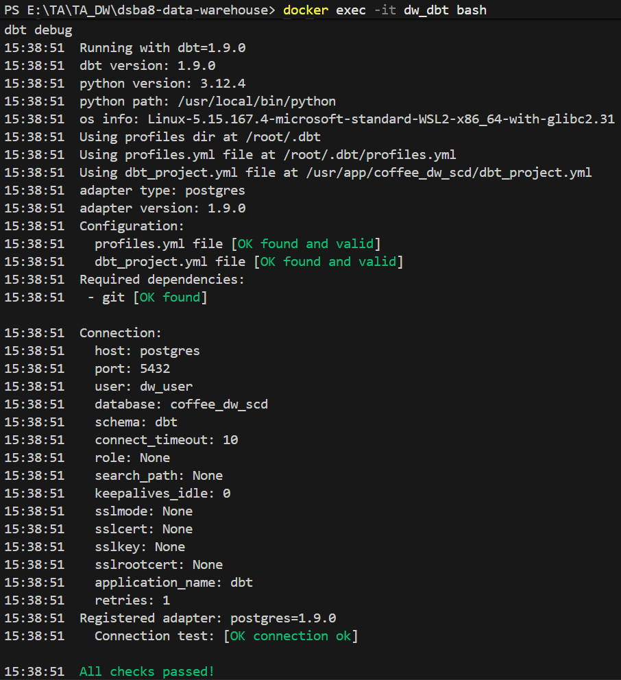

</details>

## 🧱 Part 3: Define the Dimensions & Transformations / สร้างนิยาม Dimensions

> 📝 **แยกการสร้างโมเดลออกจากการโหลดข้อมูล:** ในส่วนนี้ผู้เรียนสร้าง **เฉพาะไฟล์ SQL และ YAML** ยังไม่รัน
> `dbt seed`, `dbt snapshot` หรือ models — ตารางจริงจะเกิดขึ้นใน **Initial Load (Part 4)**

### 3.1 Staging model — `dbt/coffee_dw_scd/models/staging/stg_coffee_sales.sql`

```sql
select
    cast(sale_id as integer) as sale_id,
    trim(invoice_number) as invoice_number,
    cast(sale_date as date) as sale_date,
    trim(customer_code) as customer_code,
    trim(customer_name) as customer_name,
    trim(gender) as gender,
    cast(birth_year as integer) as birth_year,
    trim(province) as province,
    trim(product_code) as product_code,
    trim(product_name) as product_name,
    trim(category) as category,
    trim(size) as size,
    cast(unit_price as numeric(10,2)) as unit_price,
    cast(quantity as integer) as quantity,
    cast(revenue as numeric(12,2)) as revenue,
    trim(store_code) as store_code,
    trim(store_name) as store_name,
    trim(staff_code) as staff_code,
    trim(staff_name) as staff_name,
    trim(position) as position,
    nullif(trim(promo_code), '') as promo_code,
    nullif(trim(promo_desc), '') as promo_desc,
    cast(points_redeemed as integer) as points_redeemed
from {{ ref('coffee_sales_scd') }}
where cast(sale_date as date) <= cast(
    '{{ var("load_as_of", "2031-03-19") }}' as date
)
```

> 💡 **ตัวแปร `load_as_of`:** กำหนดวันที่ล่าสุดที่ระบบต้นทางเปิดให้เห็น — รอบแรกใช้ `2024-12-31` และรอบ
> Update ใช้ `2031-03-19` ทำให้เห็นข้อมูลเพิ่มขึ้นเป็นสองช่วงเวลา

### 3.2 Snapshot for SCD Type 2 — `dbt/coffee_dw_scd/snapshots/dim_customer_snapshot.sql`

Snapshot อ่านข้อมูลจาก `stg_coffee_sales` ซึ่งถูกจำกัดตาม `load_as_of` แล้วเลือก **สถานะล่าสุดของลูกค้า
แต่ละคนในรอบนั้น**

```sql


{{
  config(
    target_database=target.database,
    target_schema='dbt_snapshots',
    unique_key='customer_code',
    strategy='timestamp',
    updated_at='state_start_date'
  )
}}

with one_row_per_day as (
    select
        *,
        row_number() over (
            partition by customer_code, sale_date
            order by sale_id desc
        ) as row_num
    from {{ ref('stg_coffee_sales') }}
),

ordered as (
    select
        customer_code,
        customer_name,
        gender,
        birth_year,
        province,
        sale_date,
        lag(province) over (
            partition by customer_code
            order by sale_date
        ) as previous_province
    from one_row_per_day
    where row_num = 1
),

change_events as (
    select
        customer_code,
        customer_name,
        gender,
        birth_year,
        province,
        sale_date as state_start_date
    from ordered
    where previous_province is null
       or province is distinct from previous_province
),

current_state as (
    select
        *,
        row_number() over (
            partition by customer_code
            order by state_start_date desc
        ) as state_rank
    from change_events
)

select
    customer_code,
    customer_name,
    gender,
    birth_year,
    province,
    state_start_date
from current_state
where state_rank = 1


```

> 📝 **`updated_at: state_start_date`** คือวันที่สถานะจังหวัดเริ่มมีผล dbt จึงใช้วันที่ธุรกิจนี้กำหนด
> `dbt_valid_from` และปิดเวอร์ชันเดิมเมื่อพบสถานะใหม่

> 📝 **`dbt_scd_id`:** dbt สร้างค่านี้ให้แต่ละเวอร์ชันจาก `unique_key` และเวลาที่มีผล จึงนำมาใช้เป็น
> **surrogate key** ของ `dim_customer` ได้โดยไม่ต้องสร้าง `SERIAL`

### 3.3 `dim_customer` from the snapshot — `dbt/coffee_dw_scd/models/marts/dim_customer.sql`

```sql
select
    dbt_scd_id as customer_key,
    customer_code,
    customer_name,
    gender,
    birth_year,
    province,
    dbt_valid_from::date as start_date,
    coalesce(
        dbt_valid_to::date,
        '9999-12-31'::date
    ) as end_date,
    (dbt_valid_to is null) as is_current
from {{ ref('dim_customer_snapshot') }}
```

> ⚠️ **การ join ช่วงเวลา:** ใช้เงื่อนไขแบบ **ครึ่งเปิด** `start_date <= sale_date < end_date` เพราะ
> `dbt_valid_to` เป็นวันที่ **เวอร์ชันถัดไป** เริ่มมีผล

### 3.4 `dim_product` — SCD Types 1 and 3 — `dbt/coffee_dw_scd/models/marts/dim_product.sql`

```sql
with latest_product as (
    select
        product_code,
        product_name,
        size,
        unit_price,
        row_number() over (
            partition by product_code, size
            order by sale_date desc, sale_id desc
        ) as product_rank
    from {{ ref('stg_coffee_sales') }}
),

product_daily as (
    select distinct
        product_code,
        sale_date,
        category
    from {{ ref('stg_coffee_sales') }}
),

category_ordered as (
    select
        product_code,
        sale_date,
        category,
        lag(category) over (
            partition by product_code
            order by sale_date
        ) as previous_category_in_source
    from product_daily
),

category_changes as (
    select
        product_code,
        sale_date as category_start_date,
        category
    from category_ordered
    where previous_category_in_source is null
       or category is distinct from previous_category_in_source
),

category_ranked as (
    select
        *,
        row_number() over (
            partition by product_code
            order by category_start_date desc
        ) as category_rank
    from category_changes
),

category_type3 as (
    select
        product_code,
        max(case when category_rank = 1 then category end)
            as current_category,
        max(case when category_rank = 2 then category end)
            as previous_category
    from category_ranked
    group by product_code
)

select
    md5(concat_ws('|', p.product_code, p.size))
        as product_key,
    p.product_code,
    p.product_name,
    c.current_category,
    c.previous_category,
    p.size,
    p.unit_price
from latest_product p
join category_type3 c using (product_code)
where p.product_rank = 1
```

| Concept                            | อธิบาย                                                                                                                                                                                                                                                                                                                                                            |
| ---------------------------------- | ----------------------------------------------------------------------------------------------------------------------------------------------------------------------------------------------------------------------------------------------------------------------------------------------------------------------------------------------------------------------- |
| **Type 1**                   | โมเดลเลือก`product_name` จากรายการล่าสุดของแต่ละ `product_code` + `size` ภายในช่วง `load_as_of` — รอบ Initial จึงได้ `Latte Coffe` จากข้อมูลก่อนปี 2025 ส่วนรอบ Update ได้ `Latte Coffee` และ **เขียนทับ** ค่าเดิมโดยไม่เก็บชื่อเก่า |
| **Type 3**                   | `category_rank = 1` คือ category ปัจจุบัน ส่วน `rank = 2` คือค่าก่อนหน้า จึงเก็บประวัติได้ **หนึ่งระดับในแถวเดียว**                                                                                                                                                                         |
| **Grain ของสินค้า** | หนึ่งแถวต่อ`product_code` + `size` จึงสร้าง `product_key` จากทั้งสองคอลัมน์ — ได้ **15 แถว** ไม่ใช่ 5 แถว                                                                                                                                                                                               |

### 3.5 SCD Type 0 dimensions / Dimensions แบบ Type 0

Type 0 เลือก **แถวแรก** ด้วย `row_number()` และไม่รับค่าที่พบภายหลัง เหมาะกับข้อมูลที่ต้องคงเดิม

**`dbt/coffee_dw_scd/models/marts/dim_store.sql`**

```sql
with first_known as (
    select
        store_code,
        store_name,
        province,
        row_number() over (
            partition by store_code
            order by sale_date, sale_id
        ) as row_num
    from {{ ref('stg_coffee_sales') }}
)

select
    md5(store_code) as store_key,
    store_code,
    store_name,
    province
from first_known
where row_num = 1
```

**`dbt/coffee_dw_scd/models/marts/dim_staff.sql`**

```sql
with first_known as (
    select
        staff_code,
        staff_name,
        position,
        row_number() over (
            partition by staff_code
            order by sale_date, sale_id
        ) as row_num
    from {{ ref('stg_coffee_sales') }}
)

select
    md5(staff_code) as staff_key,
    staff_code,
    staff_name,
    position
from first_known
where row_num = 1
```

**`dbt/coffee_dw_scd/models/marts/dim_promotion.sql`**

```sql
with first_known as (
    select
        promo_code,
        promo_desc,
        row_number() over (
            partition by promo_code
            order by sale_date, sale_id
        ) as row_num
    from {{ ref('stg_coffee_sales') }}
    where promo_code is not null
)

select
    md5(promo_code) as promo_key,
    promo_code,
    promo_desc
from first_known
where row_num = 1
```

**`dbt/coffee_dw_scd/models/marts/dim_date.sql`**

```sql
select distinct
    cast(to_char(sale_date, 'YYYYMMDD') as integer) as date_key,
    sale_date,
    extract(year from sale_date)::integer as year,
    extract(month from sale_date)::integer as month_number,
    trim(to_char(sale_date, 'Month')) as month_name,
    extract(quarter from sale_date)::integer as quarter,
    extract(day from sale_date)::integer as day_of_month
from {{ ref('stg_coffee_sales') }}
```

### 3.6 Fact table — `dbt/coffee_dw_scd/models/marts/fct_sales.sql`

```sql
select
    s.sale_id,
    s.invoice_number,
    d.date_key,
    c.customer_key,
    p.product_key,
    st.store_key,
    sf.staff_key,
    pr.promo_key,
    s.quantity,
    s.revenue,
    s.points_redeemed
from {{ ref('stg_coffee_sales') }} s
join {{ ref('dim_date') }} d
  on s.sale_date = d.sale_date
join {{ ref('dim_customer') }} c
  on s.customer_code = c.customer_code
 and s.sale_date >= c.start_date
 and s.sale_date < c.end_date
join {{ ref('dim_product') }} p
  on s.product_code = p.product_code
 and s.size = p.size
join {{ ref('dim_store') }} st
  on s.store_code = st.store_code
join {{ ref('dim_staff') }} sf
  on s.staff_code = sf.staff_code
left join {{ ref('dim_promotion') }} pr
  on s.promo_code = pr.promo_code
```

> ⚠️ **จุดสำคัญ:** `customer_key` ต้องหาโดย `customer_code` **และช่วงวันที่ของ Type 2** ส่วน `product_key`
> ต้องหาโดย `product_code` **และ `size`** เพื่อรักษา grain ให้ถูกต้อง

### 3.7 Tests & documentation

<details>
<summary><b>📄 Full <code>dbt/coffee_dw_scd/models/schema.yml</code> (click to expand)</b></summary>

```yaml
version: 2

seeds:
  - name: coffee_sales_scd
    description: ข้อมูลยอดขายทั้งหมดที่ใช้จำลองการโหลดสองรอบ
    columns:
      - name: sale_id
        tests: [not_null, unique]

snapshots:
  - name: dim_customer_snapshot
    description: ประวัติจังหวัดของลูกค้าแบบ SCD Type 2
    columns:
      - name: dbt_scd_id
        tests: [not_null, unique]
      - name: customer_code
        tests: [not_null]
      - name: dbt_valid_from
        tests: [not_null]

models:
  - name: stg_coffee_sales
    description: ข้อมูลขายหลังจัดชนิดข้อมูล หนึ่งแถวต่อ sale_id
    columns:
      - name: sale_id
        tests: [not_null, unique]
      - name: sale_date
        tests: [not_null]
      - name: customer_code
        tests: [not_null]
      - name: product_code
        tests: [not_null]
      - name: store_code
        tests: [not_null]
      - name: staff_code
        tests: [not_null]

  - name: dim_customer
    description: Customer dimension แบบ SCD Type 2
    columns:
      - name: customer_key
        tests: [not_null, unique]
      - name: customer_code
        tests: [not_null]
      - name: start_date
        tests: [not_null]
      - name: end_date
        tests: [not_null]
      - name: is_current
        tests: [not_null]

  - name: dim_product
    description: ชื่อสินค้าแบบ Type 1 และ category แบบ Type 3
    columns:
      - name: product_key
        tests: [not_null, unique]
      - name: product_code
        tests: [not_null]
      - name: product_name
        tests: [not_null]
      - name: current_category
        tests: [not_null]
      - name: size
        tests: [not_null]

  - name: dim_store
    description: Store dimension ที่คงค่าแรกแบบ Type 0
    columns:
      - name: store_key
        tests: [not_null, unique]
      - name: store_code
        tests: [not_null, unique]

  - name: dim_staff
    description: Staff dimension ที่คง position แรกแบบ Type 0
    columns:
      - name: staff_key
        tests: [not_null, unique]
      - name: staff_code
        tests: [not_null, unique]

  - name: dim_promotion
    description: Promotion dimension ที่คงค่าแรกแบบ Type 0
    columns:
      - name: promo_key
        tests: [not_null, unique]
      - name: promo_code
        tests: [not_null, unique]

  - name: dim_date
    description: Date dimension
    columns:
      - name: date_key
        tests: [not_null, unique]
      - name: sale_date
        tests: [not_null, unique]

  - name: fct_sales
    description: Fact table หนึ่งแถวต่อ sale_id
    columns:
      - name: sale_id
        tests: [not_null, unique]
      - name: date_key
        tests:
          - not_null
          - relationships:
              to: ref('dim_date')
              field: date_key
      - name: customer_key
        tests:
          - not_null
          - relationships:
              to: ref('dim_customer')
              field: customer_key
      - name: product_key
        tests:
          - not_null
          - relationships:
              to: ref('dim_product')
              field: product_key
      - name: store_key
        tests:
          - not_null
          - relationships:
              to: ref('dim_store')
              field: store_key
      - name: staff_key
        tests:
          - not_null
          - relationships:
              to: ref('dim_staff')
              field: staff_key
      - name: promo_key
        tests:
          - relationships:
              to: ref('dim_promotion')
              field: promo_key
      - name: revenue
        tests: [not_null]

  - name: rpt_bangkok_revenue_2024
    description: รายได้จากลูกค้า Bangkok ในปี 2024

  - name: rpt_changed_products_latest_year
    description: ยอดขายปีล่าสุดของสินค้าที่เคยเปลี่ยน category
```

</details>

**`dbt/coffee_dw_scd/tests/assert_customer_scd2_no_overlap.sql`** — ช่วงเวลาของ Type 2 ต้องไม่ซ้อนทับกัน

```sql
select
    a.customer_code,
    a.start_date,
    a.end_date,
    b.start_date as next_start_date
from {{ ref('dim_customer') }} a
join {{ ref('dim_customer') }} b
  on a.customer_code = b.customer_code
 and a.start_date < b.start_date
where a.end_date > b.start_date
```

**`dbt/coffee_dw_scd/tests/assert_fact_sales_row_count.sql`** — fact ต้องมีจำนวนแถวเท่า staging

```sql
with row_counts as (
    select
        (select count(*) from {{ ref('stg_coffee_sales') }})
            as staging_rows,
        (select count(*) from {{ ref('fct_sales') }})
            as fact_rows
)

select *
from row_counts
where staging_rows <> fact_rows
```

**`dbt/coffee_dw_scd/tests/assert_product_type1.sql`** — ชื่อ P002 ต้องตรงกับรอบโหลด

```sql
select *
from {{ ref('dim_product') }}
where product_code = 'P002'
  and product_name <> case
      when cast('{{ var("load_as_of", "2031-03-19") }}' as date)
           >= date '2025-01-01'
        then 'Latte Coffee'
      else 'Latte Coffe'
  end
```

**`dbt/coffee_dw_scd/tests/assert_product_type3.sql`** — current/previous category ของ P004 ต้องตรงกับรอบโหลด

```sql
select *
from {{ ref('dim_product') }}
where product_code = 'P004'
  and not (
      (
        cast('{{ var("load_as_of", "2031-03-19") }}' as date)
          < date '2027-02-11'
        and current_category = 'Bakery'
        and previous_category is null
      )
      or
      (
        cast('{{ var("load_as_of", "2031-03-19") }}' as date)
          >= date '2027-02-11'
        and current_category = 'Dessert'
        and previous_category = 'Bakery'
      )
  )
```

---

## 1️⃣ Part 4: Initial Load — ข้อมูลตั้งต้น ณ `2024-12-31`

> 🎯 **เป้าหมายของรอบแรก:** ทำให้ physical dimensions เกิดขึ้นครั้งแรก และหยุดตรวจค่าตั้งต้นก่อนรับ
> การเปลี่ยนแปลง ได้แก่ `CUST1001 = Bangkok`, `P002 = Latte Coffe` และ `P004 = Bakery / NULL`

> 💡 รันทุกคำสั่งด้านล่างจาก shell ภายใน container: `docker exec -it dw_dbt bash` แล้ว `cd coffee_dw_scd`

### 4.1 Load the seed / โหลด Seed

```bash
dbt seed --full-refresh
```

dbt โหลดยอดขาย **7,470 แถว** ไว้ใน raw layer แต่ staging จะเปิดให้รอบ Initial Load เห็นเฉพาะข้อมูลถึง
`2024-12-31` จึงยังพบชื่อ `P002` เป็น `Latte Coffe`

<details>
<summary><b>Show Output</b></summary>

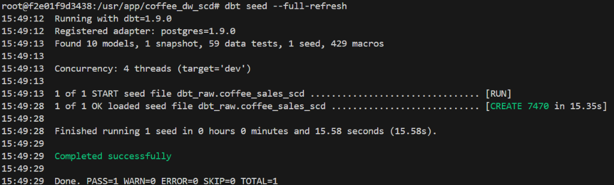

</details>

### 4.2 Build the staging view for round 1 / สร้าง Staging View รอบแรก

```bash
dbt run --select stg_coffee_sales --vars '{"load_as_of": "2024-12-31"}'
```

ตรวจ `count(*)` จาก `dbt_staging.stg_coffee_sales` ต้องได้ **1,812 แถว**

<details>
<summary><b>Show Output</b></summary>

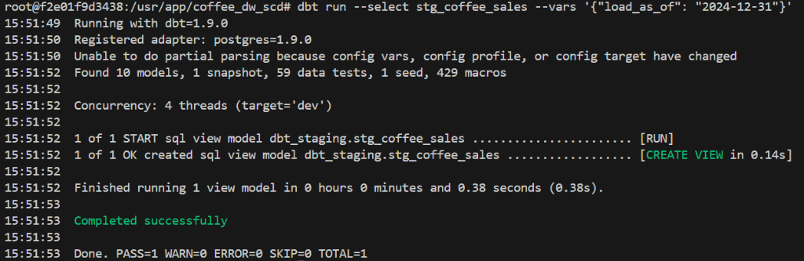

</details>

### 4.3 Run the snapshot for the first time / รัน Snapshot ครั้งแรก

```bash
dbt snapshot --vars '{"load_as_of": "2024-12-31"}'
```

Snapshot สร้างข้อมูลลูกค้า **5 แถว** ลูกค้าแต่ละคนมีเพียงหนึ่งเวอร์ชัน และ `CUST1001` ยังอยู่ **Bangkok**

<details>
<summary><b>Show Output</b></summary>

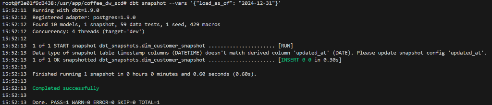

</details>

### 4.4 Build dimensions and fact / สร้าง Dimensions และ Fact ครั้งแรก

```bash
dbt run --select path:models/marts --vars '{"load_as_of": "2024-12-31"}'
dbt test --vars '{"load_as_of": "2024-12-31"}'
```

dbt สร้าง Dimensions **ก่อน** `fct_sales` ตาม dependency จาก `ref()` แล้วรัน tests โดยใช้ความคาดหวังของ
รอบ Initial Load

<details>
<summary><b>Show Output</b></summary>

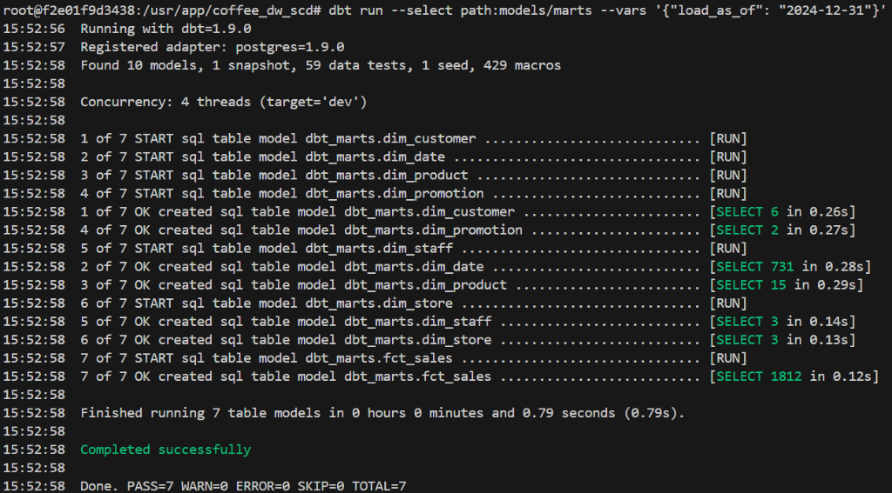

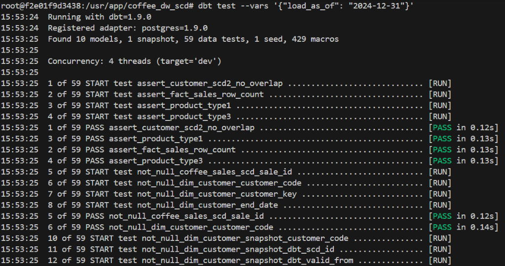

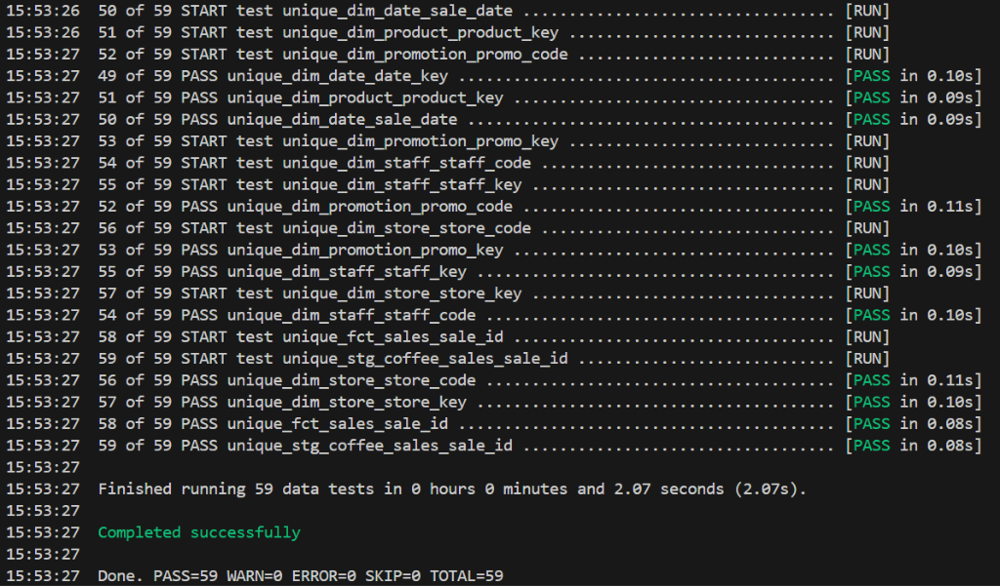

</details>

### 4.5 Checkpoint 1 — หยุดตรวจผล Initial Load

Run in pgAdmin against `coffee_dw_scd`:

```sql
select customer_code, province, start_date, end_date, is_current
from dbt_marts.dim_customer
where customer_code = 'CUST1001'
order by start_date;

select product_code, product_name,
       current_category, previous_category
from dbt_marts.dim_product
where product_code in ('P002', 'P004')
order by product_code, size;
```

| สิ่งที่ตรวจ             | ผล Initial Load ที่ต้องได้                                                                                      |
| ---------------------------------- | --------------------------------------------------------------------------------------------------------------------------- |
| **SCD Type 1:** `P002`     | `product_name = Latte Coffe` — ข้อมูลที่เปิดให้เห็นยังอยู่ก่อนวันที่ `2025-01-01` |
| **SCD Type 2:** `CUST1001` | `Bangkok` เพียง **1 เวอร์ชัน** และ `is_current = true`                                            |
| **SCD Type 3:** `P004`     | `current_category = Bakery`; `previous_category = NULL`                                                                 |
| **`fct_sales`**            | **1,812 แถว** เฉพาะรายการถึง `2024-12-31`                                                          |

> 📌 **Checkpoint 1:** บันทึกผล query ก่อนทำ Part 5 — ภาพนี้เป็นหลักฐาน **before** สำหรับเปรียบเทียบกับ
> Update Load

<details>
<summary><b>Show Output</b></summary>

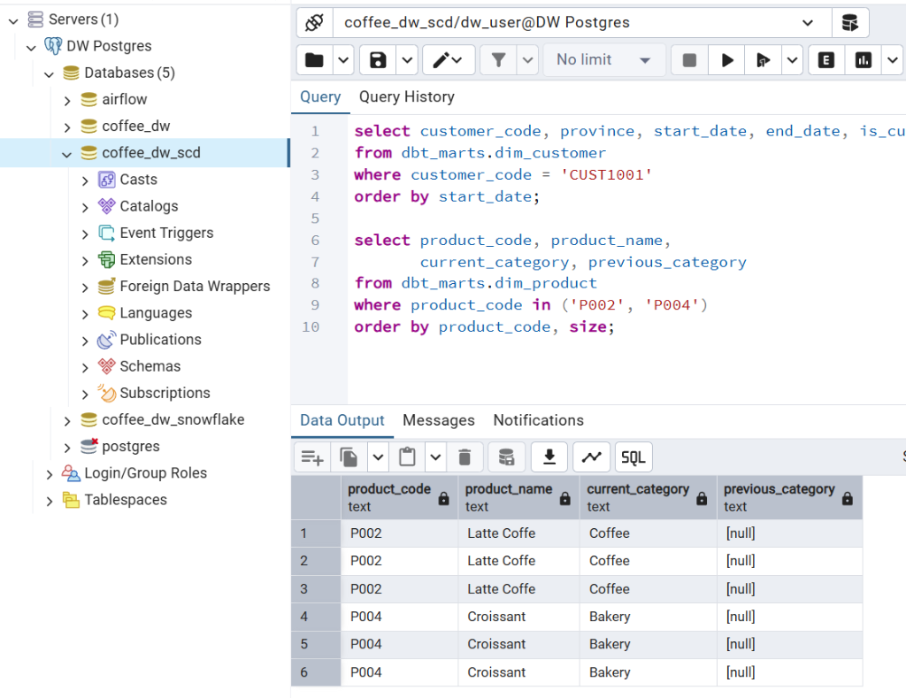

</details>

---

## 2️⃣ Part 5: Update Load — รับข้อมูลถึง `2031-03-19`

รอบนี้จำลองว่าระบบต้นทางส่งข้อมูลใหม่เข้ามาแล้ว โดยเปลี่ยน `load_as_of` จาก `2024-12-31` เป็น `2031-03-19`
จากนั้นต้องทำตามลำดับ **staging → snapshot → dimensions/fact**

### 5.1 Open the update window in staging / เปิดข้อมูลรอบ Update

```bash
dbt run --select stg_coffee_sales --vars '{"load_as_of": "2031-03-19"}'
```

`stg_coffee_sales` เปลี่ยนจาก **1,812** เป็น **7,470 แถว** — ขั้นนี้ยังไม่เปลี่ยน Dimension จนกว่าจะรัน
snapshot และ marts ในขั้นถัดไป

<details>
<summary><b>Show Output</b></summary>

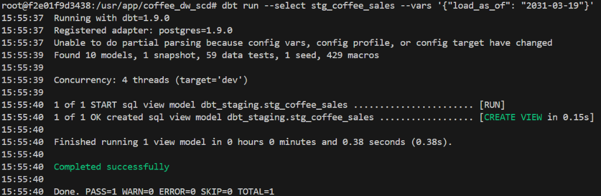

</details>

### 5.2 Update SCD Type 2 with the snapshot / Update ด้วย Snapshot

```bash
dbt snapshot --vars '{"load_as_of": "2031-03-19"}'
```

dbt พบสถานะใหม่ของ `CUST1001` จึง **ปิดเวอร์ชัน Bangkok** ที่ `2025-01-01` และ **เพิ่มเวอร์ชัน Chiang Mai**
ที่เริ่มวันเดียวกัน — Snapshot มีทั้งหมด **6 แถว**

```sql
select customer_code, province,
       dbt_valid_from::date, dbt_valid_to::date
from dbt_snapshots.dim_customer_snapshot
where customer_code = 'CUST1001'
order by dbt_valid_from;
```

<details>
<summary><b>Show Output</b></summary>

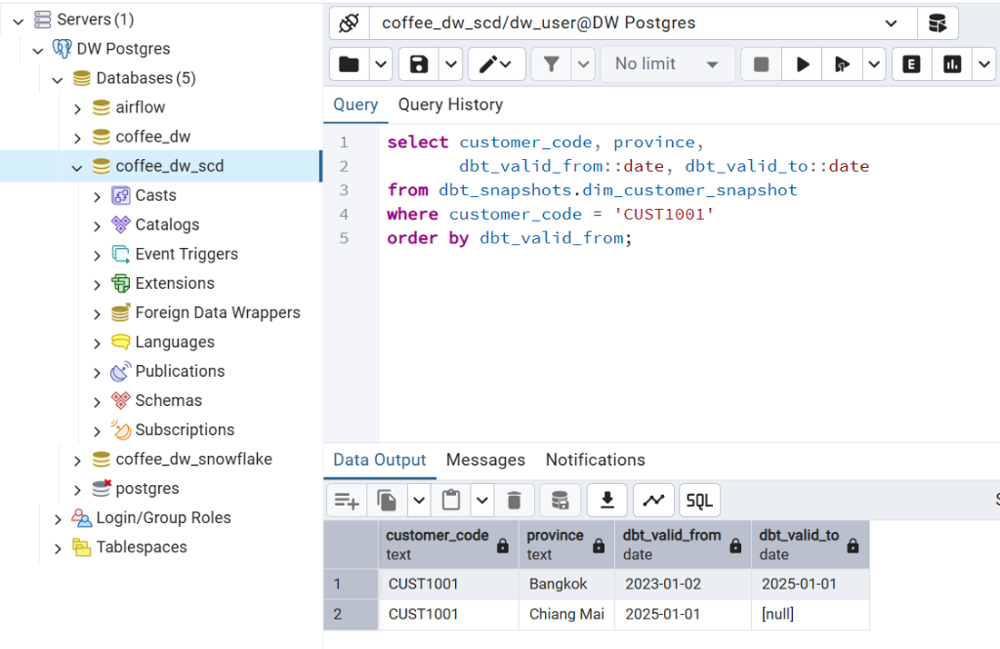

</details>

### 5.3 Update dimensions and fact / Update Dimensions และ Fact

```bash
dbt run --select path:models/marts --vars '{"load_as_of": "2031-03-19"}'
dbt test --vars '{"load_as_of": "2031-03-19"}'
```

รอบนี้ `dim_product` เลือกชื่อ `P002` ล่าสุดจากข้อมูลขายที่เพิ่มขึ้น จึงได้ `Latte Coffee` และเขียนทับชื่อเดิม
แบบ **Type 1** พร้อมคำนวณ `P004` แบบ **Type 3** ส่วน `dim_customer` อ่านประวัติใหม่จาก snapshot

<details>
<summary><b>Show Output</b></summary>

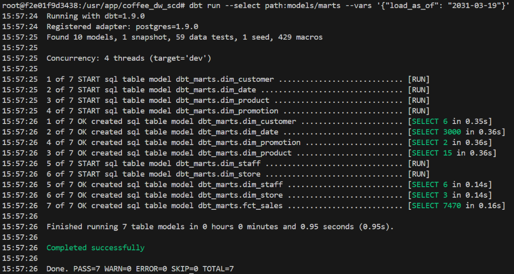

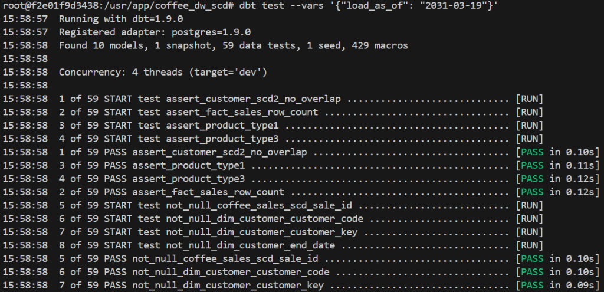

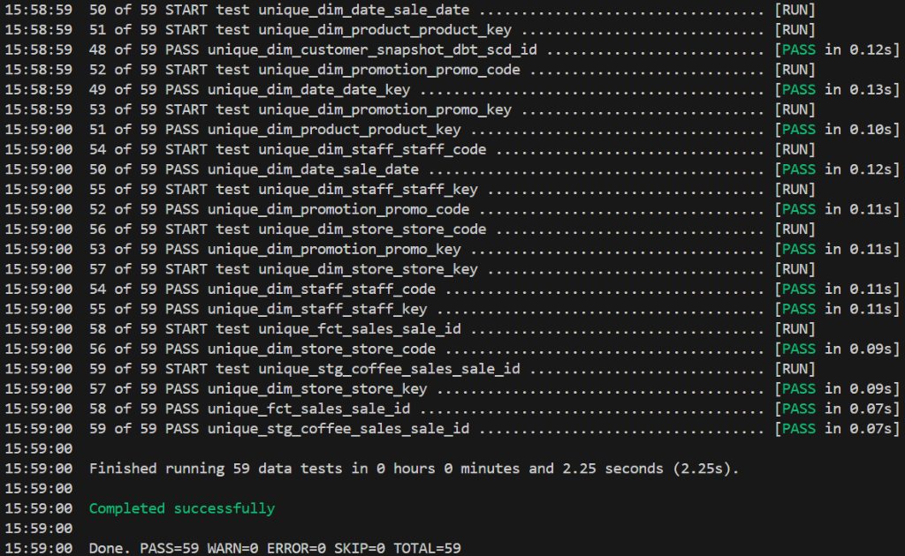

</details>

### 5.4 Checkpoint 2 — หยุดตรวจผลหลัง Update

```sql
select customer_code, province, start_date, end_date, is_current
from dbt_marts.dim_customer
where customer_code = 'CUST1001'
order by start_date;

select product_code, product_name,
       current_category, previous_category
from dbt_marts.dim_product
where product_code in ('P002', 'P004')
order by product_code, size;
```

| สิ่งที่ตรวจ             | ผลหลัง Update ที่ต้องได้                              | สิ่งที่เปลี่ยนจากรอบแรก                                   |
| ---------------------------------- | --------------------------------------------------------------------- | -------------------------------------------------------------------------------- |
| **SCD Type 1:** `P002`     | `product_name = Latte Coffee`                                       | เขียนทับชื่อเดิม ไม่มีคอลัมน์เก็บ`Latte Coffe` |
| **SCD Type 2:** `CUST1001` | `Bangkok` และ `Chiang Mai` รวม **2 เวอร์ชัน** | ปิดแถวเดิมและเพิ่มแถวใหม่                               |
| **SCD Type 3:** `P004`     | `current = Dessert`; `previous = Bakery`                          | เก็บค่าก่อนหน้าไว้ในแถวเดียว                         |
| **`fct_sales`**            | **7,470 แถว**                                                | เพิ่มรายการขายหลัง`2024-12-31`                               |

> 📌 **Checkpoint 2:** บันทึกผลหลัง Update แล้วเทียบกับ **Checkpoint 1** เพื่ออธิบายว่าจำนวนแถวและค่าของ
> แต่ละ SCD Type เปลี่ยนต่างกันอย่างไร

<details>
<summary><b>Show Output</b></summary>

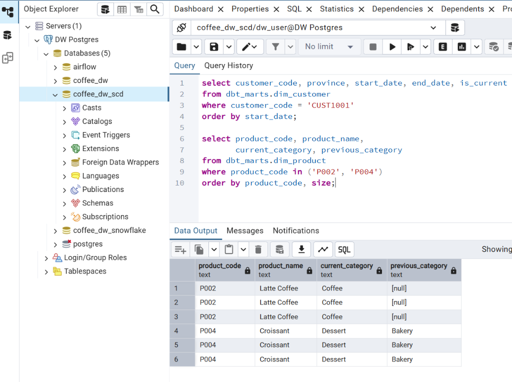

</details>

### 5.5 Verify row counts / ตรวจจำนวนแถวหลัง Update

```sql
select 'dim_customer' as model, count(*) as row_count
from dbt_marts.dim_customer
union all
select 'dim_product', count(*)
from dbt_marts.dim_product
union all
select 'dim_store', count(*)
from dbt_marts.dim_store
union all
select 'dim_staff', count(*)
from dbt_marts.dim_staff
union all
select 'dim_promotion', count(*)
from dbt_marts.dim_promotion
union all
select 'dim_date', count(*)
from dbt_marts.dim_date
union all
select 'fct_sales', count(*)
from dbt_marts.fct_sales
order by model;
```

| Model             | จำนวนแถวที่คาดหวัง |
| ----------------- | -----------------------------------: |
| `dim_customer`  |                                    6 |
| `dim_product`   |                                   15 |
| `dim_store`     |                                    3 |
| `dim_staff`     |                                    6 |
| `dim_promotion` |                                    2 |
| `dim_date`      |                                3,000 |
| `fct_sales`     |                                7,470 |

<details>
<summary><b>Show Output</b></summary>

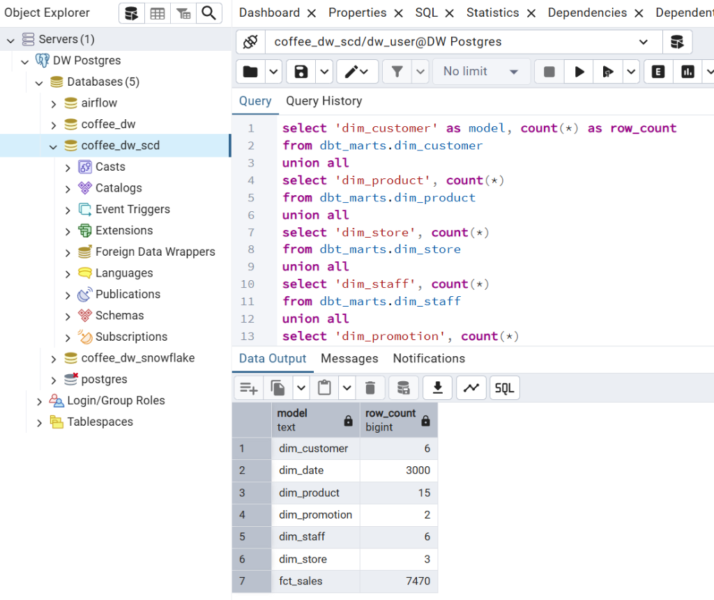

</details>

---

## 📈 Part 6: Analyze the Results per SCD Type / วิเคราะห์ผลตาม SCD Type

### 6.1 2024 revenue from Bangkok customers (Type 2)

**`dbt/coffee_dw_scd/models/reporting/rpt_bangkok_revenue_2024.sql`**

```sql
select
    d.year,
    c.province,
    sum(f.revenue) as total_revenue
from {{ ref('fct_sales') }} f
join {{ ref('dim_date') }} d
  on f.date_key = d.date_key
join {{ ref('dim_customer') }} c
  on f.customer_key = c.customer_key
where d.year = 2024
  and c.province = 'Bangkok'
group by d.year, c.province
```

> ✅ **ผลที่คาดหวัง:** `2024 | Bangkok | 42,313.39`

### 6.2 Latest-year sales of products that changed category (Type 3)

**`dbt/coffee_dw_scd/models/reporting/rpt_changed_products_latest_year.sql`**

```sql
with latest_year as (
    select max(year) as year
    from {{ ref('dim_date') }}
),

changed_products as (
    select
        product_key,
        product_code,
        product_name
    from {{ ref('dim_product') }}
    where previous_category is not null
)

select
    d.year,
    p.product_code,
    p.product_name,
    sum(f.revenue) as total_revenue_latest_year
from {{ ref('fct_sales') }} f
join {{ ref('dim_date') }} d
  on f.date_key = d.date_key
join changed_products p
  on f.product_key = p.product_key
join latest_year y
  on d.year = y.year
group by d.year, p.product_code, p.product_name
```

> ✅ **ผลที่คาดหวัง:** `2031 | P004 | Croissant | 4,038.10` (ข้อมูลถึง `2031-03-19`)

Build both reporting models:

```bash
dbt run --select path:models/reporting
```

### 6.3 Check Type 1 and Type 0 / ตรวจ Type 1 และ Type 0

```sql
select distinct product_code, product_name
from dbt_marts.dim_product
where product_code = 'P002';

select staff_code, staff_name, position
from dbt_marts.dim_staff
order by staff_code;
```

`P002` ต้องเหลือชื่อ **`Latte Coffee`** เท่านั้น ส่วน `dim_staff` แสดง **ตำแหน่งแรก** ของพนักงานแต่ละคน

---

## 📚 Part 7: Generate dbt Documentation & Check Lineage / สร้าง dbt Documentation

```bash
dbt docs generate
dbt docs serve --host 0.0.0.0 --port 8080 --no-browser
```

เปิด **[http://localhost:28088](http://localhost:28088)** แล้วค้นหา `fct_sales` จากนั้นเปิด **Lineage
Graph** เพื่อดูเส้นทาง `coffee_sales_scd → stg_coffee_sales → dimensions → fct_sales → reporting`

> 📝 **สิ่งที่ dbt docs สร้าง:** รวมคำอธิบายจาก `schema.yml`, คอลัมน์, tests, dependencies จาก `ref()`,
> compiled SQL และ lineage ไว้ในเว็บไซต์เดียว

> 📝 To reach the docs site from your browser, the `dbt` service in `docker-compose` must map the port
> — `ports: ["28088:8080"]`. `dbt docs serve` runs until you press **Ctrl+C**.

<details>
<summary><b>Show Output & Lineage Graph</b></summary>

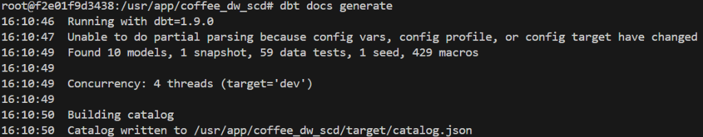

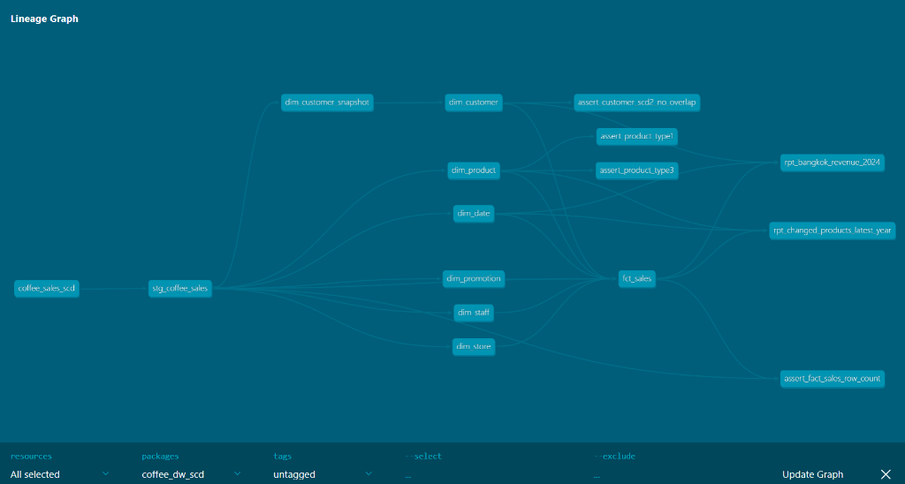

</details>

---

## 📤 Submission / สิ่งที่ต้องส่ง

ส่งคำตอบผ่าน **Google Form — Lab 6: SCD with dbt** *(ลิงก์จากผู้สอน)*

| รายการ                                                                              | รูปแบบ |
| ----------------------------------------------------------------------------------------- | ------------ |
| **Checkpoint 1:** ผล Initial Load ของ `P002`, `CUST1001` และ `P004`   | CSV          |
| **Checkpoint 2:** ผลหลัง Update ของ `P002`, `CUST1001` และ `P004` | CSV          |

พร้อมคำอธิบายจาก **Part 1** ใน Google Classroom ว่าแต่ละ dimension ควรใช้ SCD Type ใด และเพราะเหตุใด

---

## 🛠️ dbt Cheat Sheet

> ⚠️ Open a shell first — `docker exec -it dw_dbt bash` then `cd coffee_dw_scd` — so the `--vars` JSON
> is not mangled by the host shell.

| Command                                                                      | Description                                    |
| ---------------------------------------------------------------------------- | ---------------------------------------------- |
| `docker exec -it dw_dbt bash`                                              | Open a shell inside the dbt container          |
| `dbt debug`                                                                | Test the database connection                   |
| `dbt seed --full-refresh`                                                  | Rebuild the seed table from the CSV            |
| `dbt run --select stg_coffee_sales --vars '{"load_as_of": "2024-12-31"}'`  | Build staging for one load window              |
| `dbt snapshot --vars '{"load_as_of": "2024-12-31"}'`                       | Capture the SCD Type 2 history for that window |
| `dbt run --select path:models/marts --vars '{"load_as_of": "2024-12-31"}'` | Build all dimensions + fact                    |
| `dbt run --select path:models/reporting`                                   | Build the two reporting views                  |
| `dbt test --vars '{"load_as_of": "2024-12-31"}'`                           | Run all data tests for that window             |
| `dbt docs generate`                                                        | Build the documentation site                   |
| `dbt docs serve --host 0.0.0.0 --port 8080 --no-browser`                   | Serve the docs on port 8080                    |

---

## 🧠 SCD Type Quick Reference

|    Type    | Behavior                                                                     | dbt mechanism                                                      | Example in this lab          |
| :---------: | ---------------------------------------------------------------------------- | ------------------------------------------------------------------ | ---------------------------- |
| **0** | คงค่าแรกไว้เสมอ                                               | model +`row_number()` ordered ascending                          | `dim_staff.position`       |
| **1** | เขียนทับด้วยค่าล่าสุด ไม่เก็บประวัติ      | model +`row_number()` ordered descending                         | `dim_product.product_name` |
| **2** | เพิ่มแถวใหม่ พร้อมช่วงวันที่มีผล              | **`dbt snapshot`** (`dbt_valid_from` / `dbt_valid_to`) | `dim_customer.province`    |
| **3** | เก็บค่าก่อนหน้าไว้หนึ่งระดับในแถวเดียว | model +`current_*` / `previous_*` columns                      | `dim_product.category`     |

---

*Data Warehouse — DSBA8 | Week 6*
