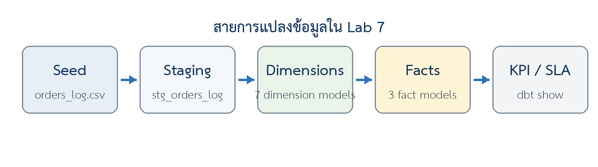
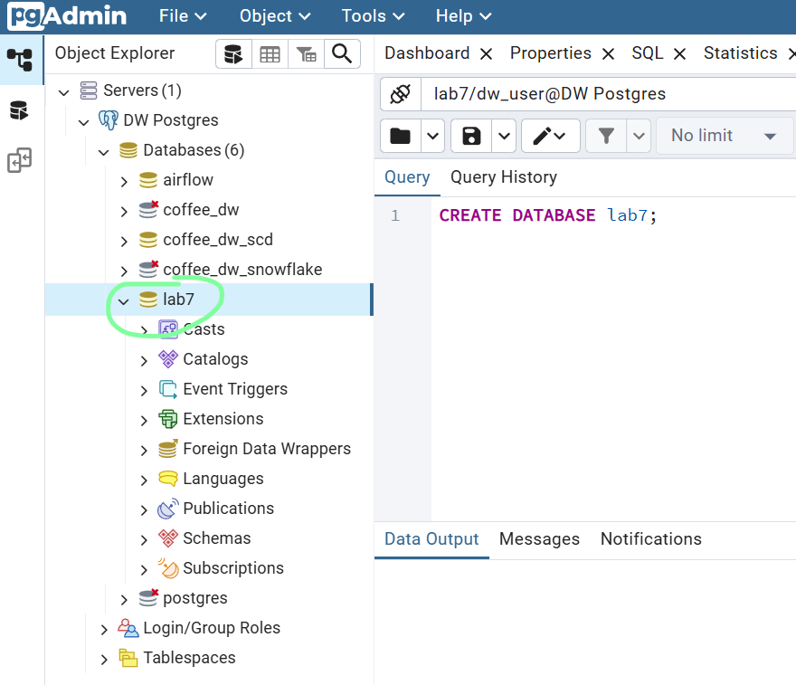

# 📦 Week 7: Fact Table Design with dbt

> **Course:** Data Warehousing (การสร้างคลังข้อมูล)
> **Topic:** การออกแบบ Fact Table — Transaction, Periodic Snapshot และ Accumulating Snapshot ด้วย dbt
> **Duration:** 2 Hours

> 💡 **Lab concept / แนวคิดหลัก:** ออกแบบและสร้าง **Transaction Fact**, **Periodic Snapshot** และ
> **Accumulating Snapshot** ด้วย dbt โดยกำหนด **Grain**, **Measures**, **Keys** และ **Tests**
> ให้สอดคล้องกับ KPI/SLA

> 📷 The screenshot blocks below point at `docs/screenshots/`. Capture each output as you run the
> lab and drop the PNGs there — filenames already match.

---

## 🎯 Learning Objectives / วัตถุประสงค์

1. เลือกประเภท **Fact Table** (Transaction / Periodic Snapshot / Accumulating Snapshot / Factless Fact) ให้เหมาะสมกับ KPI ได้
2. จำแนก **Measures** เป็น **Additive**, **Semi-additive** และ **Non-additive** ได้
3. ออกแบบ Fact Table ที่มี **Foreign Keys**, **Degenerate Dimension** และ **Audit Columns** ได้
4. สร้าง ทดสอบ และตรวจสอบ Fact Table ใน PostgreSQL ผ่านโมเดล dbt ได้
5. ใช้ `dbt test` ตรวจ **Referential Integrity** ด้วย `relationships` และยืนยัน **grain** ด้วย `unique` / `not_null` ได้
6. ใช้ `dbt show --inline` ทดลอง Query ตาม KPI/SLA โดยไม่ต้องสร้างตารางเพิ่มได้

---

## 🧰 Tools & Stack Overview / เครื่องมือที่ใช้

| Tool                            | What is it?                  | What is it used for in this lab?                                                                        |
| ------------------------------- | ---------------------------- | ------------------------------------------------------------------------------------------------------- |
| **PostgreSQL 16**         | Relational Database (RDBMS)  | ฐานข้อมูลหลักที่ทำงานผ่าน Docker — เก็บฐาน`lab7`                     |
| **dbt-postgres**          | Transformation Framework     | สร้างโมเดล จัดลำดับ dependency โหลด seed และทดสอบคุณภาพข้อมูล |
| **pgAdmin 4**             | Database GUI Management Tool | สร้างฐานข้อมูล และตรวจสอบ schema / ตาราง / ผลลัพธ์                  |
| **Metabase**              | BI / Dashboard Tool          | ทางเลือกสำหรับทดลองสร้างคำถามหรือ Dashboard จาก Fact Table          |
| **Docker Compose**        | Containerization             | สร้างสภาพแวดล้อมจำลองจาก`DWH_Lab(3).zip`                                      |
| **VS Code / Text Editor** | Editor                       | สร้างไฟล์`.sql` และ `.yml` ของโครงการ dbt                                     |

**Dataset / ชุดข้อมูล**

| Dataset            |  Rows | Unique`order_id` | Date range                                                            | Status values                                          |
| ------------------ | ----: | :----------------: | --------------------------------------------------------------------- | ------------------------------------------------------ |
| `orders_log.csv` | 2,000 |       2,000       | `2024-01-01` → `2025-07-05` (รวม order / shipped / delivered) | `ORDERED`, `SHIPPED`, `DELIVERED`, `CANCELLED` |

> 📝 **กำหนด Grain ก่อนเริ่มสร้าง Fact:** ในชุดข้อมูลปัจจุบัน **1 แถวแทน 1 รายการ**
> ใน `orders_log` และ `order_id` ไม่ซ้ำกัน จึงสามารถใช้ `order_id` เป็น **Degenerate Dimension**
> และทดสอบ `unique` ได้ หากระบบจริงมีหลายสินค้าในหนึ่ง order ต้องเพิ่ม `order_line_id`
> หรือคีย์ระดับบรรทัดก่อนสร้าง Transaction Fact

<details>
<summary><b>📷 ภาพรวม lineage ของ Lab 7</b></summary>



</details>

---

## 📁 Files in This Week / ไฟล์ในสัปดาห์นี้

| File / Folder                                                                                                         | Description                                                    |
| --------------------------------------------------------------------------------------------------------------------- | -------------------------------------------------------------- |
| 📂[docs/](./docs/)                                                                                                     | Lab instructions                                               |
| ├── 📝[Lab7 Fact Table Design with dbt.docx](<./docs/Lab7%20Fact%20Table%20Design%20with%20dbt.docx>)               | Lab instruction (Word)                                         |
| ├── 📄[Lab7 Fact Table Design with dbt.pdf](<./docs/Lab7%20Fact%20Table%20Design%20with%20dbt.pdf>)                 | Lab instruction (PDF)                                          |
| └── 📂[screenshots/](./docs/screenshots/)                                                                           | Images referenced by this README                               |
| &nbsp;&nbsp;&nbsp;&nbsp;└── 📷 [lab7-lineage.png](./docs/screenshots/lab7-lineage.png)                              | Seed → Staging → Dimensions → Facts → KPI/SLA lineage      |
| 📂[lab-week07/](./lab-week07/)                                                                                         | **Lab working directory**                                |
| ├── 📂[dbt_root/](./lab-week07/dbt_root/)                                                                           | Holds`profiles.yml` — the dbt connection profile            |
| │&nbsp;&nbsp;&nbsp;└── ⚙️ [profiles.yml](./lab-week07/dbt_root/profiles.yml)                                     | Connects dbt to PostgreSQL, database`lab7`                   |
| └── 📂[dbt/lab7/](./lab-week07/dbt/lab7/)                                                                           | dbt project — models & tests are created during the lab       |
| &nbsp;&nbsp;&nbsp;&nbsp;├── ⚙️ [dbt_project.yml](./lab-week07/dbt/lab7/dbt_project.yml)                           | Project config — materializations per folder                  |
| &nbsp;&nbsp;&nbsp;&nbsp;└── 📂 [seeds/](./lab-week07/dbt/lab7/seeds/)                                               | Seed CSV, already in place                                     |
| &nbsp;&nbsp;&nbsp;&nbsp;&nbsp;&nbsp;&nbsp;&nbsp;└── 📊 [orders_log.csv](./lab-week07/dbt/lab7/seeds/orders_log.csv) | 2,000 order rows — the single source for every model in Lab 7 |

---

## 🔧 Part 0: Start the Environment & Connect Tools / เริ่มระบบและเชื่อมต่อเครื่องมือ

> 💡 **Note:** If your Docker stack from Week 1 is already running, confirm with `docker compose ps` and skip to Part 1.

### 0.1 Start Docker Containers / สตาร์ทระบบด้วย Docker

Reuse the Week 1 stack (it contains `dw_postgres`, `dw_dbt`, `pgAdmin`, and `Metabase`):

**Mac / Linux:**

```bash
cd week01-data-warehouse-setup/lab-week01
echo -e "AIRFLOW_UID=$(id -u)" > .env
docker compose up -d
docker compose ps
```

**Windows (PowerShell):**

```powershell
cd week01-data-warehouse-setup/lab-week01
Set-Content -Path .env -Value "AIRFLOW_UID=50000"
docker compose up -d
docker compose ps
```

> 💡 Tip: paste as a single line if the line breaks cause errors.

---

### 0.2 Connect pgAdmin to PostgreSQL / เชื่อมต่อ pgAdmin กับ PostgreSQL

1. Open your browser and go to **pgAdmin**: [http://localhost:28880](http://localhost:28880)
2. Log in with the default credentials:
   - **Email:** `dw_user@mail.com`
   - **Password:** `dw_pass`
3. Register the PostgreSQL Server (if not already connected):
   - Right-click **Servers** ➡️ **Register** ➡️ **Server...**
   - Under the **General** tab:
     - **Name:** `DW Postgres`
   - Under the **Connection** tab:
     - **Host name/address:** `dw_postgres` *(Internal Docker container name)*
     - **Port:** `5432`
     - **Maintenance database:** `airflow`
     - **Username:** `dw_user`
     - **Password:** `dw_pass`
   - Click **Save**.

---

## 🧩 Part 1: Classify Measures by Additivity / จำแนก Measures ตาม Additivity

ให้นักศึกษาจำแนก **Measures** ใน **Google Form** โดยพิจารณาจาก **Grain** และ **มิติที่นำไปรวม**
**ไม่พิจารณาจากชื่อคอลัมน์เพียงอย่างเดียว**

Measures ทั้งหมดที่จะเกิดขึ้นใน Lab นี้ — เติมคอลัมน์ขวาก่อนตอบใน Google Form:

| Measure                                                           | Fact ที่อยู่               | Additivity |
| ----------------------------------------------------------------- | --------------------------------- | :--------: |
| `quantity`                                                      | `fact_orders_txn`               |     ?     |
| `gross_amount`                                                  | `fact_orders_txn`               |     ?     |
| `discount_amount`                                               | `fact_orders_txn`               |     ?     |
| `net_amount`                                                    | `fact_orders_txn`               |     ?     |
| `cost_amount`                                                   | `fact_orders_txn`               |     ?     |
| `margin_amount`                                                 | `fact_orders_txn`               |     ?     |
| `unit_price`                                                    | `fact_orders_txn`               |     ?     |
| `orders_count`                                                  | `fact_orders_daily_snapshot`    |     ?     |
| `qty_sold`                                                      | `fact_orders_daily_snapshot`    |     ?     |
| `days_to_ship` / `days_to_deliver` / `days_ship_to_deliver` | `fact_orders_lifecycle`         |     ?     |
| `cancel_rate_pct`                                               | คำนวณตอน Query (Part 6.6) |     ?     |

> 💡 **คำใบ้:** ถามตัวเองว่า *"รวมข้ามทุกมิติได้ไหม"* → ได้ทั้งหมดคือ **Additive**,
> รวมข้ามบางมิติได้แต่ **ข้ามเวลาไม่ได้** คือ **Semi-additive**, และค่าที่ต้อง
> **คำนวณใหม่จากตัวตั้งและตัวหาร** คือ **Non-additive**

---

## 📥 Part 2: Prepare the Environment & dbt Project / เตรียมสภาพแวดล้อมและ dbt project

### 2.1 เปิด services และสร้างฐานข้อมูล

ใน pgAdmin ➡️ Query Tool (หรือ psql) รันคำสั่ง:

```sql
CREATE DATABASE lab7;
```

<details>
<summary><b>📷 pgAdmin — create database <code>lab7</code></b></summary>



</details>

> 💡 **ทางเลือกจาก Terminal** (เหมือนกันทุก OS):

```bash
docker exec -it dw_postgres psql -U dw_user -d airflow -c "CREATE DATABASE lab7;"
```

> ⚠️ **กรณี database มีอยู่แล้ว:** ถ้าแจ้งว่า `database "lab7" already exists` ใช้ฐานเดิมต่อได้
> แต่ถ้าต้องการเริ่มใหม่ทั้งหมดให้ `DROP DATABASE lab7;` ก่อน แล้วสร้างซ้ำ

---

### 2.2 จัดเตรียมโฟลเดอร์ / Create the project skeleton

สร้างไฟล์และโฟลเดอร์ต่อไปนี้ภายใน `DWH_Lab`:

```text
dbt_root/
└── profiles.yml
dbt/
└── lab7/
    ├── dbt_project.yml
    ├── seeds/
    │   ├── orders_log.csv
    │   └── properties.yml
    ├── models/
    │   ├── staging/
    │   │   └── stg_orders_log.sql
    │   ├── dimensions/
    │   │   ├── dim_date.sql
    │   │   ├── dim_product.sql
    │   │   ├── dim_customer.sql
    │   │   ├── dim_store.sql
    │   │   ├── dim_staff.sql
    │   │   ├── dim_payment_method.sql
    │   │   └── dim_order_status.sql
    │   ├── facts/
    │   │   ├── fact_orders_txn.sql
    │   │   ├── fact_orders_daily_snapshot.sql
    │   │   └── fact_orders_lifecycle.sql
    │   └── schema.yml
    └── tests/
        └── assert_daily_snapshot_grain.sql
```

> ⚠️ **ชื่อไฟล์ fact:** ผังในใบ Lab หัวข้อ 2.2 เขียนชื่อไฟล์ว่า `fct_orders_*.sql` แต่ SQL ทุกไฟล์,
> `schema.yml` และ `ref()` ทุกจุดในใบ Lab เรียกใช้ชื่อ **`fact_orders_*`** README นี้จึงใช้
> **`fact_orders_*`** ให้ตรงกันทั้งหมด — ถ้าตั้งชื่อไฟล์เป็น `fct_*` ตามผังเดิม
> `ref('fact_orders_txn')` จะหาโมเดลไม่เจอ

Create the folders (only the shell syntax differs):

**Mac / Linux:**

```bash
cd DWH_Lab
mkdir -p dbt_root dbt/lab7/seeds \
  dbt/lab7/models/staging dbt/lab7/models/dimensions dbt/lab7/models/facts \
  dbt/lab7/tests
```

**Windows (PowerShell):**

```powershell
cd DWH_Lab
New-Item -ItemType Directory -Force dbt_root, dbt/lab7/seeds, `
  dbt/lab7/models/staging, dbt/lab7/models/dimensions, dbt/lab7/models/facts, `
  dbt/lab7/tests
```

> 💡 Tip: paste as a single line if the line breaks cause errors.

> 📝 **ตำแหน่งไฟล์ dataset:** คัดลอก `orders_log.csv` ไปไว้ที่ `dbt/lab7/seeds/orders_log.csv`
> — ในรีโปนี้ไฟล์อยู่ที่ [`lab-week07/dbt/lab7/seeds/orders_log.csv`](./lab-week07/dbt/lab7/seeds/orders_log.csv) ให้แล้ว

---

### 2.3 กำหนดการเชื่อมต่อ PostgreSQL — `dbt_root/profiles.yml`

```yaml
lab7:
  target: dev
  outputs:
    dev:
      type: postgres
      host: postgres
      port: 5432
      user: dw_user
      password: dw_pass
      dbname: lab7
      schema: dbt
      threads: 4
```

> ⚠️ **ชื่อ host:** dbt ทำงานใน Docker network จึงเชื่อม PostgreSQL ด้วยชื่อ service `postgres`
> และพอร์ตภายใน `5432` — **ไม่ใช้** `localhost` หรือพอร์ต `25432`

---

### 2.4 กำหนดค่า Project dbt — `dbt/lab7/dbt_project.yml`

```yaml
name: 'lab7'
version: '1.0.0'
config-version: 2

profile: 'lab7'

model-paths: ['models']
seed-paths: ['seeds']
test-paths: ['tests']
macro-paths: ['macros']

clean-targets:
  - 'target'
  - 'dbt_packages'

models:
  staging:
    +materialized: view
  dimensions:
    +materialized: table
  facts:
    +materialized: table
```

> ⚠️ **ถ้า dbt เตือน `Configuration paths exist in your dbt_project.yml file which do not apply to any resources`:**
> คีย์ระดับแรกใต้ `models:` คือ **ชื่อ project/package** ไม่ใช่ชื่อโฟลเดอร์ เมื่อ dbt เตือนแบบนี้
> แปลว่า `+materialized` **ยังไม่ถูกนำไปใช้** และ dimensions/facts จะกลายเป็น `view`
> ให้ครอบอีกชั้นด้วยชื่อ project:
>
> ```yaml
> models:
>   lab7:
>     staging:
>       +materialized: view
>     dimensions:
>       +materialized: table
>     facts:
>       +materialized: table
> ```

> 📝 **กำหนด seed เป็น `varchar` ก่อน** เพื่อให้ **staging เป็นจุดเดียวที่ควบคุมการ `cast`
> ชนิดข้อมูล** และรักษารหัสที่อาจมีเลขศูนย์นำหน้า

> 📝 **ชื่อ schema:** โปรเจกต์นี้ไม่ตั้ง `+schema` เพิ่ม ทุกอย่าง (seed, staging, dimensions, facts)
> จึงไปอยู่ใน `lab7.dbt` ตาม `schema: dbt` ใน `profiles.yml`

---

### 2.5 ตรวจสอบ Seed — `dbt/lab7/seeds/properties.yml`

```yaml
version: 2

seeds:
  - name: orders_log
    description: 'ข้อมูลคำสั่งซื้อดิบจาก orders_log.csv'
    config:
      column_types:
        order_id: varchar(20)
        order_date: varchar(10)
        shipped_date: varchar(10)
        delivered_date: varchar(10)
        product_code: varchar(10)
        product_name: varchar(100)
        category: varchar(50)
        size: varchar(10)
        unit_price: varchar(30)
        quantity: varchar(30)
        discount_amount: varchar(30)
        net_amount: varchar(30)
        cost_amount: varchar(30)
        margin_amount: varchar(30)
        customer_code: varchar(10)
        customer_name: varchar(100)
        store_code: varchar(10)
        store_name: varchar(100)
        staff_code: varchar(10)
        staff_name: varchar(100)
        payment_method: varchar(50)
        status: varchar(20)
    columns:
      - name: order_id
        tests:
          - not_null
          - unique
      - name: status
        tests:
          - accepted_values:
              values: ['ORDERED', 'SHIPPED', 'DELIVERED', 'CANCELLED']
```

---

### 2.6 เริ่ม Docker และโหลด Seed

เปิด Terminal ที่โฟลเดอร์ `DWH_Lab` แล้วรันคำสั่งตามลำดับ (เหมือนกันทุก OS):

```bash
docker exec -it dw_dbt bash
cd lab7
dbt debug
dbt seed --full-refresh
dbt show --select orders_log
```

<details>
<summary><b>Show Output — <code>dbt debug</code></b></summary>


</details>

<details>
<summary><b>Show Output — <code>dbt seed --full-refresh</code></b></summary>


</details>

<details>
<summary><b>Show Output — <code>dbt show --select orders_log</code></b></summary>


</details>

**จุดตรวจสอบ / Checkpoint**

| จุดตรวจสอบ          | ค่าที่ควรได้                                   |
| ----------------------------- | ---------------------------------------------------------- |
| `dbt debug`                 | `All checks passed`                                      |
| `dbt seed`                  | โหลด`orders_log` สำเร็จ **2,000 แถว** |
| ตำแหน่งใน PostgreSQL | database`lab7`, schema `dbt`, table `orders_log`     |

---

## 🧱 Part 3: Staging & Dimension Models / สร้าง Staging และ Dimension Models

### 3.1 Staging Model — `dbt/lab7/models/staging/stg_orders_log.sql`

Staging model ทำหน้าที่ `trim` ข้อความ แปลงค่าว่างเป็น `NULL` และ `cast` ชนิดข้อมูลให้พร้อมใช้
โดยยัง **รักษา grain เดิม 1 แถวต่อรายการ**

```sql
{{ config(materialized='view') }}

select
    trim(order_id) as order_id,
    nullif(trim(order_date), '')::date as order_date,
    nullif(trim(shipped_date), '')::date as shipped_date,
    nullif(trim(delivered_date), '')::date as delivered_date,
    trim(product_code) as product_code,
    trim(product_name) as product_name,
    trim(category) as category,
    nullif(trim(size), '') as size,
    nullif(trim(unit_price), '')::numeric(12, 2) as unit_price,
    nullif(trim(quantity), '')::integer as quantity,
    nullif(trim(discount_amount), '')::numeric(12, 2)
        as discount_amount,
    nullif(trim(net_amount), '')::numeric(12, 2) as net_amount,
    nullif(trim(cost_amount), '')::numeric(12, 2) as cost_amount,
    nullif(trim(margin_amount), '')::numeric(12, 2) as margin_amount,
    trim(customer_code) as customer_code,
    trim(customer_name) as customer_name,
    trim(store_code) as store_code,
    trim(store_name) as store_name,
    trim(staff_code) as staff_code,
    trim(staff_name) as staff_name,
    trim(payment_method) as payment_method,
    trim(status) as status

from {{ ref('orders_log') }}
```

> 📝 **`nullif(trim(x), '')`** สำคัญกับ `shipped_date` / `delivered_date` เพราะออเดอร์ที่ยังไม่ส่ง
> หรือถูกยกเลิกจะมีค่าว่าง — ต้องเป็น `NULL` ไม่ใช่สตริงว่าง ก่อน `cast` เป็น `date`

---

### 3.2 Date Dimension — `dbt/lab7/models/dimensions/dim_date.sql`

สร้างวันที่ต่อเนื่องตั้งแต่วันสั่งซื้อแรกถึง milestone ล่าสุด เพื่อให้ **Periodic Snapshot
มีวันที่ที่ไม่มีรายการได้**

```sql
with bounds as (
    select
        min(order_date) as min_date,
        max(
            greatest(
                order_date,
                coalesce(shipped_date, order_date),
                coalesce(delivered_date, order_date)
            )
        ) as max_date
    from {{ ref('stg_orders_log') }}

),

date_spine as (
    select g.date_day::date as full_date
    from bounds
    cross join lateral generate_series(
        bounds.min_date,
        bounds.max_date,
        interval '1 day'
    ) as g(date_day)

)

select
    to_char(full_date, 'YYYYMMDD')::integer as date_key,
    full_date,
    extract(year from full_date)::integer as year,
    extract(month from full_date)::integer as month,
    extract(day from full_date)::integer as day,
    (
        extract(year from full_date)::integer * 100
        + extract(month from full_date)::integer
    ) as yyyymm
from date_spine
```

> 💡 **`greatest(...)` + `coalesce(...)`** ทำให้ขอบขวาของ spine ครอบ `delivered_date` ที่ไกลสุด
> ไม่ใช่แค่ `order_date` — จำเป็นต่อ role-playing date keys ใน Part 4.3

---

### 3.3 Product Dimension — `dbt/lab7/models/dimensions/dim_product.sql`

```sql
select
    md5(product_code) as product_key,
    product_code,
    max(product_name) as product_name,
    max(category) as category,
    case
        when bool_or(size in ('S', 'M', 'L')) then 'S/M/L'
        else '-'
    end as size_domain

from {{ ref('stg_orders_log') }}
group by product_code
```

> 💡 **`md5(...)` เป็น surrogate key** ของ Lab นี้ — สร้างคีย์คงที่จากรหัสธุรกิจโดยไม่ต้องใช้ `SERIAL`

---

### 3.4 Customer, Store และ Staff Dimensions

`dbt/lab7/models/dimensions/dim_customer.sql`

```sql
select
    md5(customer_code) as customer_key,
    customer_code,
    max(customer_name) as customer_name

from {{ ref('stg_orders_log') }}
group by customer_code
```

`dbt/lab7/models/dimensions/dim_store.sql`

```sql
select
    md5(store_code) as store_key,
    store_code,
    max(store_name) as store_name

from {{ ref('stg_orders_log') }}
group by store_code
```

`dbt/lab7/models/dimensions/dim_staff.sql`

```sql
select
    md5(staff_code) as staff_key,
    staff_code,
    max(staff_name) as staff_name

from {{ ref('stg_orders_log') }}
group by staff_code
```

---

### 3.5 Payment Method และ Order Status Dimensions

`dbt/lab7/models/dimensions/dim_payment_method.sql`

```sql
select
    md5(payment_method) as payment_method_key,
    payment_method

from {{ ref('stg_orders_log') }}
group by payment_method
```

`dbt/lab7/models/dimensions/dim_order_status.sql`

```sql
select
    md5(status) as status_key,
    status

from {{ ref('stg_orders_log') }}
group by status
```

> 📝 ทั้งสองตารางเป็น **mini-dimension** ที่ถอดออกมาจากคอลัมน์ข้อความ ทำให้ fact เก็บแค่คีย์
> และเปลี่ยนชื่อ/เพิ่ม attribute ได้ที่เดียว

---

## 🧮 Part 4: Fact Models / สร้าง Fact Models

### 4.1 Transaction Fact — `dbt/lab7/models/facts/fact_orders_txn.sql`

- **Grain:** 1 แถว = 1 รายการใน `orders_log` (ข้อมูลชุดนี้มี 1 แถวต่อ `order_id`)
- **Degenerate Dimension:** `order_id`
- **Additive Measures:** `quantity`, `gross_amount`, `discount_amount`, `net_amount`, `cost_amount`, `margin_amount`
- **Audit Columns:** `load_datetime`, `batch_id`, `source_system`

```sql
select
    md5(s.order_id) as order_fact_key,
    -- Degenerate dimension
    s.order_id,
    -- Foreign keys
    d.date_key as order_date_key,
    p.product_key,
    c.customer_key,
    st.store_key,
    sf.staff_key,
    pm.payment_method_key,
    os.status_key,
    -- Measures
    s.unit_price,
    s.quantity,
    (s.unit_price * s.quantity)::numeric(14, 2) as gross_amount,
    s.discount_amount,
    s.net_amount,
    s.cost_amount,
    s.margin_amount,
    -- Audit columns
    cast('{{ run_started_at }}' as timestamptz) as load_datetime,
    '{{ invocation_id }}' as batch_id,
    'orders_log.csv'::varchar as source_system

from {{ ref('stg_orders_log') }} as s
join {{ ref('dim_date') }} as d
    on s.order_date = d.full_date
join {{ ref('dim_product') }} as p
    on s.product_code = p.product_code
join {{ ref('dim_customer') }} as c
    on s.customer_code = c.customer_code
join {{ ref('dim_store') }} as st
    on s.store_code = st.store_code
join {{ ref('dim_staff') }} as sf
    on s.staff_code = sf.staff_code
join {{ ref('dim_payment_method') }} as pm
    on s.payment_method = pm.payment_method
join {{ ref('dim_order_status') }} as os
    on s.status = os.status
```

> 📝 **Audit Columns:** `run_started_at` และ `invocation_id` เป็นตัวแปรที่ dbt ใส่ให้ทุก run
> ทำให้สืบย้อนได้ว่าแถวนี้มาจากการรันรอบไหน

> ⚠️ **`join` ธรรมดา (inner) ทั้งหมด** หมายความว่าถ้าแถวใดหา dimension ไม่เจอ แถวนั้นจะหลุดหายไป
> เงียบ ๆ — `dbt test` ในส่วนที่ 5 จึงต้องตรวจว่า `fact_orders_txn` ยังมี **2,000 แถว**

---

### 4.2 Periodic Snapshot Fact — `dbt/lab7/models/facts/fact_orders_daily_snapshot.sql`

- **Grain:** 1 แถว = 1 วัน × 1 สาขา × 1 สินค้า
- สร้าง **grid** ครบทุกวัน–สาขา–สินค้า และ **เติม 0** เมื่อไม่มีรายการ
- **Snapshot Measures** ในชุดนี้เป็น **daily flow** จึงรวมข้ามเวลาได้

```sql
with snapshot_grid as (
    select
        d.date_key as snapshot_date_key,
        s.store_key,
        p.product_key
    from {{ ref('dim_date') }} as d
    cross join {{ ref('dim_store') }} as s
    cross join {{ ref('dim_product') }} as p

),

daily_activity as (
    select
        order_date_key as snapshot_date_key,
        store_key,
        product_key,
        count(distinct order_id)::integer as orders_count,
        sum(quantity)::integer as qty_sold,
        sum(gross_amount)::numeric(14, 2) as gross_amount,
        sum(discount_amount)::numeric(14, 2) as discount_amount,
        sum(net_amount)::numeric(14, 2) as net_amount,
        sum(margin_amount)::numeric(14, 2) as margin_amount
    from {{ ref('fact_orders_txn') }}
    group by order_date_key, store_key, product_key

)

select
    g.snapshot_date_key,
    g.store_key,
    g.product_key,
    coalesce(a.orders_count, 0) as orders_count,
    coalesce(a.qty_sold, 0) as qty_sold,
    coalesce(a.gross_amount, 0)::numeric(14, 2) as gross_amount,
    coalesce(a.discount_amount, 0)::numeric(14, 2)
        as discount_amount,
    coalesce(a.net_amount, 0)::numeric(14, 2) as net_amount,
    coalesce(a.margin_amount, 0)::numeric(14, 2) as margin_amount,
    cast('{{ run_started_at }}' as timestamptz) as load_datetime,
    '{{ invocation_id }}' as batch_id

from snapshot_grid as g
left join daily_activity as a
    on g.snapshot_date_key = a.snapshot_date_key
    and g.store_key = a.store_key
    and g.product_key = a.product_key
```

> 💡 **เหตุผลที่ไม่ใช้ `GROUP BY` อย่างเดียว:** ถ้า aggregate เฉพาะวันที่มีรายการ ผลลัพธ์จะเป็น
> **Aggregate Fact** มากกว่า **Periodic Snapshot** แบบเต็ม การสร้าง **grid** ทำให้ทุก period มีแถว
> แม้ measures เป็น `0` ซึ่งเหมาะกับการวิเคราะห์วันที่ไม่มีการขาย และ Dashboard ที่ต้องการ
> **แกนเวลาต่อเนื่อง**

---

### 4.3 Accumulating Snapshot Fact — `dbt/lab7/models/facts/fact_orders_lifecycle.sql`

- **Grain:** 1 แถว = 1 คำสั่งซื้อ
- **Role-playing Date Keys:** `order_date_key`, `shipped_date_key`, `delivered_date_key`
- **Non-additive Measures:** `days_to_ship`, `days_to_deliver`, `days_ship_to_deliver`
- **Materialization:** `incremental` โดยใช้ `order_id` เป็น `unique_key`

```sql
{{
    config(
        materialized='incremental',
        unique_key='order_id',
        incremental_strategy='delete+insert'
    )
}}

select
    s.order_id,
    od.date_key as order_date_key,
    sd.date_key as shipped_date_key,
    dd.date_key as delivered_date_key,

    case
        when s.shipped_date is not null
            then s.shipped_date - s.order_date
    end as days_to_ship,
    case
        when s.delivered_date is not null
            then s.delivered_date - s.order_date
    end as days_to_deliver,
    case
        when s.shipped_date is not null
            and s.delivered_date is not null
            then s.delivered_date - s.shipped_date
    end as days_ship_to_deliver,

    os.status_key as current_status_key,
    cast('{{ run_started_at }}' as timestamptz) as load_datetime,
    '{{ invocation_id }}' as batch_id
from {{ ref('stg_orders_log') }} as s
left join {{ ref('dim_date') }} as od
    on s.order_date = od.full_date
left join {{ ref('dim_date') }} as sd
    on s.shipped_date = sd.full_date
left join {{ ref('dim_date') }} as dd
    on s.delivered_date = dd.full_date
join {{ ref('dim_order_status') }} as os
    on s.status = os.status
```

> ⚠️ **`left join` สาม role-playing dates:** ต่างจาก Part 4.1 ที่ใช้ inner join — ที่นี่ต้องเป็น
> `left join` เพราะออเดอร์ที่ยังไม่ส่ง/ถูกยกเลิกไม่มี `shipped_date` หรือ `delivered_date`
> ถ้าใช้ inner join แถวเหล่านั้นจะหายไปและ grain จะไม่ครบ 2,000

> 💡 **พฤติกรรม Incremental:** เมื่อข้อมูล order เดิมมี `shipped_date`, `delivered_date` หรือ
> `status` เปลี่ยน dbt จะใช้ `order_id` หาแถวเดิม แล้วแทนที่ด้วยสถานะล่าสุด เนื่องจาก source
> ไม่มี `updated_at` ตัวอย่างนี้ยังอ่าน source ทั้งหมดในแต่ละรอบ แต่แสดงหลักการ **update**
> ของ Accumulating Snapshot

---

## ✅ Part 5: Data Tests & Build / กำหนด Data Tests และ Build

### 5.1 Tests ของ Models — `dbt/lab7/models/schema.yml`

dbt model ไม่ได้สร้าง **Foreign Key constraint** แบบ `CREATE TABLE` เดิม จึงใช้
**`relationships` test** ตรวจ **Referential Integrity** และใช้ **`unique` / `not_null`** ยืนยัน **grain**

<details>
<summary><b>📄 Full <code>schema.yml</code> — คลิกเพื่อดูทั้งไฟล์</b></summary>

```yaml
version: 2

models:
  - name: stg_orders_log
    description: 'ข้อมูลคำสั่งซื้อที่ cast ชนิดข้อมูลแล้ว'
    columns:
      - name: order_id
        tests: [not_null, unique]
      - name: order_date
        tests: [not_null]
      - name: product_code
        tests: [not_null]
      - name: customer_code
        tests: [not_null]
      - name: store_code
        tests: [not_null]
      - name: staff_code
        tests: [not_null]

  - name: dim_date
    columns:
      - name: date_key
        tests: [not_null, unique]
      - name: full_date
        tests: [not_null, unique]

  - name: dim_product
    columns:
      - name: product_key
        tests: [not_null, unique]
      - name: product_code
        tests: [not_null, unique]

  - name: dim_customer
    columns:
      - name: customer_key
        tests: [not_null, unique]
      - name: customer_code
        tests: [not_null, unique]

  - name: dim_store
    columns:
      - name: store_key
        tests: [not_null, unique]
      - name: store_code
        tests: [not_null, unique]

  - name: dim_staff
    columns:
      - name: staff_key
        tests: [not_null, unique]
      - name: staff_code
        tests: [not_null, unique]

  - name: dim_payment_method
    columns:
      - name: payment_method_key
        tests: [not_null, unique]
      - name: payment_method
        tests: [not_null, unique]

  - name: dim_order_status
    columns:
      - name: status_key
        tests: [not_null, unique]
      - name: status
        tests: [not_null, unique]

  - name: fact_orders_txn
    description: 'Transaction Fact ที่ grain ระดับรายการใน orders_log'
    columns:
      - name: order_fact_key
        tests: [not_null, unique]
      - name: order_id
        tests: [not_null, unique]
      - name: order_date_key
        tests:
          - not_null
          - relationships:
              to: ref('dim_date')
              field: date_key
      - name: product_key
        tests:
          - not_null
          - relationships:
              to: ref('dim_product')
              field: product_key
      - name: customer_key
        tests:
          - not_null
          - relationships:
              to: ref('dim_customer')
              field: customer_key
      - name: store_key
        tests:
          - not_null
          - relationships:
              to: ref('dim_store')
              field: store_key
      - name: staff_key
        tests:
          - not_null
          - relationships:
              to: ref('dim_staff')
              field: staff_key
      - name: payment_method_key
        tests:
          - not_null
          - relationships:
              to: ref('dim_payment_method')
              field: payment_method_key
      - name: status_key
        tests:
          - not_null
          - relationships:
              to: ref('dim_order_status')
              field: status_key

  - name: fact_orders_daily_snapshot
    description: 'Periodic Snapshot ระดับวัน-สาขา-สินค้า'
    columns:
      - name: snapshot_date_key
        tests:
          - not_null
          - relationships:
              to: ref('dim_date')
              field: date_key
      - name: store_key
        tests:
          - not_null
          - relationships:
              to: ref('dim_store')
              field: store_key
      - name: product_key
        tests:
          - not_null
          - relationships:
              to: ref('dim_product')
              field: product_key

  - name: fact_orders_lifecycle
    description: 'Accumulating Snapshot ระดับคำสั่งซื้อ'
    columns:
      - name: order_id
        tests: [not_null, unique]
      - name: order_date_key
        tests:
          - not_null
          - relationships:
              to: ref('dim_date')
              field: date_key
      - name: shipped_date_key
        tests:
          - relationships:
              to: ref('dim_date')
              field: date_key
      - name: delivered_date_key
        tests:
          - relationships:
              to: ref('dim_date')
              field: date_key
      - name: current_status_key
        tests:
          - not_null
          - relationships:
              to: ref('dim_order_status')
              field: status_key
```

</details>

> 📝 **`shipped_date_key` / `delivered_date_key` มีเฉพาะ `relationships` ไม่มี `not_null`**
> — เพราะค่าเหล่านี้เป็น `NULL` ได้ตามธุรกิจ (`relationships` test จะข้ามแถวที่เป็น `NULL` ให้เอง)

---

### 5.2 Singular Test สำหรับ Grain ของ Daily Snapshot

`dbt/lab7/tests/assert_daily_snapshot_grain.sql`

```sql
select
    snapshot_date_key,
    store_key,
    product_key,
    count(*) as row_count

from {{ ref('fact_orders_daily_snapshot') }}
group by snapshot_date_key, store_key, product_key
having count(*) > 1
```

> 💡 **Singular test ผ่านเมื่อ query คืน 0 แถว** — ที่นี่หมายความว่าไม่มีคู่
> (วัน, สาขา, สินค้า) ใดซ้ำกัน คือ grain ถูกต้อง

---

### 5.3 Build Project

```bash
dbt build

dbt ls --resource-type model

dbt show --inline "select count(*) as row_count from {{ ref('fact_orders_txn') }}"

dbt show --inline "select count(*) as row_count from {{ ref('fact_orders_daily_snapshot') }}"

dbt show --inline "select count(*) as row_count from {{ ref('fact_orders_lifecycle') }}"
```

<details>
<summary><b>Show Output — <code>dbt build</code></b></summary>


</details>

<details>
<summary><b>Show Output — <code>dbt ls --resource-type model</code></b></summary>


</details>

<details>
<summary><b>Show Output — row counts ของ Fact ทั้งสาม</b></summary>


</details>

**จำนวนแถวที่คาดหวัง / Expected row counts**

| Model                          | จำนวนแถวที่คาดหวัง | ที่มา                                                         |
| ------------------------------ | -----------------------------------: | ------------------------------------------------------------------ |
| `stg_orders_log`             |                                2,000 | เท่ากับ seed                                                |
| `dim_date`                   |                                  552 | วันที่ต่อเนื่อง`2024-01-01` ถึง `2025-07-05` |
| `dim_product`                |                                   12 | `product_code` ไม่ซ้ำ                                      |
| `dim_customer`               |                                  484 | `customer_code` ที่ปรากฏ                                 |
| `dim_store`                  |                                    6 | `store_code` ไม่ซ้ำ                                        |
| `dim_staff`                  |                                    6 | `staff_code` ไม่ซ้ำ                                        |
| `dim_payment_method`         |                                    4 | วิธีชำระเงิน                                           |
| `dim_order_status`           |                                    4 | สถานะคำสั่งซื้อ                                     |
| `fact_orders_txn`            |                                2,000 | 1 แถวต่อ`order_id`                                         |
| `fact_orders_daily_snapshot` |                               39,744 | 552 วัน × 6 สาขา × 12 สินค้า                        |
| `fact_orders_lifecycle`      |                                2,000 | 1 แถวต่อ`order_id`                                         |

> 💡 **ตรวจเลขเร็ว ๆ:** `552 × 6 × 12 = 39,744` และ `2024-01-01` → `2025-07-05`
> คือ `366 + 186 = 552` วัน

---

## 📈 Part 6: Query KPI/SLA with dbt / ทดลอง Query ตาม KPI/SLA ด้วย dbt

ใช้ `dbt show --inline` เพื่อ **compile Jinja**, รัน SQL กับ PostgreSQL และแสดงผลใน Terminal
**โดยไม่สร้างตาราง KPI เพิ่ม**

### 6.1 ยอดขายรวมต่อวันจาก Transaction Fact

```bash
dbt show --inline "
select
    d.full_date as order_date,
    sum(t.net_amount) as total_revenue
from {{ ref('fact_orders_txn') }} as t
join {{ ref('dim_date') }} as d
    on t.order_date_key = d.date_key
group by d.full_date
order by d.full_date
" --limit 20
```

<details>
<summary><b>Show Output — daily revenue จาก Transaction Fact</b></summary>


</details>

---

### 6.2 ยอดขายรวมต่อวันจาก Daily Snapshot

```bash
dbt show --inline "
select
    d.full_date as snapshot_date,
    sum(s.net_amount) as total_revenue
from {{ ref('fact_orders_daily_snapshot') }} as s
join {{ ref('dim_date') }} as d
    on s.snapshot_date_key = d.date_key
group by d.full_date
order by d.full_date
" --limit 20
```

<details>
<summary><b>Show Output — daily revenue จาก Periodic Snapshot</b></summary>


</details>

> ✅ **การเทียบผลสอง Fact:** วันที่มีรายการ ยอดรวมจาก **Transaction Fact** และ
> **Daily Snapshot** ต้องเท่ากัน ส่วน **Daily Snapshot** จะแสดงวันที่ไม่มีรายการเป็น `0` ด้วย
> เพราะมีแถวครบทุกวัน

---

### 6.3 Top 5 สินค้าที่ทำกำไรมากที่สุด

```bash
dbt show --inline "
select
    p.product_code,
    p.product_name,
    sum(t.margin_amount) as total_margin
from {{ ref('fact_orders_txn') }} as t
join {{ ref('dim_product') }} as p
    on t.product_key = p.product_key
group by p.product_code, p.product_name
order by total_margin desc
" --limit 5
```

<details>
<summary><b>Show Output — Top 5 by margin</b></summary>


</details>

| ลำดับ | สินค้า        | `total_margin` ที่คาดหวัง |
| :--------: | ------------------- | ------------------------------------: |
|     1     | `P004` Cappuccino |                              5,850.30 |
|     2     | `P003` Latte      |                              5,539.52 |
|     3     | `P202` Cheesecake |                              5,138.94 |
|     4     | `P005` Mocha      |                              5,074.15 |
|     5     | `P001` Espresso   |                              4,863.33 |

---

### 6.4 SLA เฉลี่ย: วันจากสั่งซื้อถึงส่งสำเร็จ

```bash
dbt show --inline "
select
    avg(days_to_ship)::numeric(10, 4) as avg_days_to_ship,
    avg(days_to_deliver)::numeric(10, 4) as avg_days_to_deliver,
    avg(days_ship_to_deliver)::numeric(10, 4)
        as avg_days_ship_to_deliver
from {{ ref('fact_orders_lifecycle') }}
where days_to_deliver is not null
"
```

<details>
<summary><b>Show Output — SLA averages</b></summary>


</details>

| Measure                      | ค่าที่คาดหวังโดยประมาณ |
| ---------------------------- | -------------------------------------------: |
| `avg_days_to_ship`         |                                0.9887 วัน |
| `avg_days_to_deliver`      |                                2.9800 วัน |
| `avg_days_ship_to_deliver` |                                1.9913 วัน |

> ⚠️ **ตัวเลขในใบ Lab:** ใบ Lab พิมพ์ `avg_days_to_ship` เป็น `0.9870` แต่ค่าที่คำนวณจาก
> `orders_log.csv` จริงคือ **`0.9887`** — ยืนยันได้จากอีกสองค่าในตารางเดียวกัน
> (`2.9800 − 1.9913 = 0.9887`) ให้ยึดตามผลที่ `dbt show` แสดงจริง

---

### 6.5 ยอดขายแยกตามวิธีชำระเงิน

```bash
dbt show --inline "
select
    pm.payment_method,
    sum(t.net_amount) as revenue
from {{ ref('fact_orders_txn') }} as t
join {{ ref('dim_payment_method') }} as pm
    on t.payment_method_key = pm.payment_method_key
group by pm.payment_method
order by revenue desc
"
```

<details>
<summary><b>Show Output — revenue by payment method</b></summary>


</details>

| `payment_method` | `revenue` ที่คาดหวัง |
| ------------------ | -------------------------------: |
| QR PromptPay       |                        49,042.75 |
| Mobile Wallet      |                        47,088.88 |
| Cash               |                        45,047.18 |
| Credit Card        |                        42,734.80 |

---

### 6.6 อัตรายกเลิกออเดอร์

```bash
dbt show --inline "
select
    100.0
    * sum(case when os.status = 'CANCELLED' then 1 else 0 end)
    / count(*) as cancel_rate_pct
from {{ ref('fact_orders_txn') }} as t
join {{ ref('dim_order_status') }} as os
    on t.status_key = os.status_key
"
```

<details>
<summary><b>Show Output — cancel rate</b></summary>


</details>

> ✅ **ผลลัพธ์ตรวจสอบ:** ข้อมูลมี `CANCELLED` **173 รายการ** จาก **2,000 รายการ** ดังนั้น
> `cancel_rate_pct` เท่ากับ **8.65%** — measure นี้เป็น **Non-additive** และต้องคำนวณใหม่
> จากจำนวนยกเลิกหารด้วยจำนวนทั้งหมด (ห้ามหาค่าเฉลี่ยของอัตราแต่ละวัน)

---

## 🧠 Part 7: Fact Table Concept Summary / สรุปแนวคิด Fact Table

| Fact Type                       | Grain ใน Lab                           | เหมาะกับคำถาม                                                                             |
| ------------------------------- | ---------------------------------------- | ------------------------------------------------------------------------------------------------------ |
| **Transaction Fact**      | 1 รายการใน`orders_log`         | ยอดขาย กำไร จำนวนสินค้า แยกตามมิติต่าง ๆ                           |
| **Periodic Snapshot**     | 1 วัน × 1 สาขา × 1 สินค้า | แนวโน้มรายวัน วันที่ไม่มีรายการ และ Dashboard                         |
| **Accumulating Snapshot** | 1 คำสั่งซื้อ                   | ระยะเวลาแต่ละ milestone และ SLA ของกระบวนการ                               |
| **Factless Fact**         | ขึ้นกับ event/coverage            | นับเหตุการณ์ที่ไม่มี numeric measure เช่น การเข้าร่วมกิจกรรม |

> 📝 **Factless Fact ไม่ได้สร้างใน Lab นี้** — อยู่ในตารางเพื่อเทียบแนวคิด และเป็นตัวเลือกหนึ่ง
> ในคำถาม Part 1

---

## 📤 Submission / สิ่งที่ต้องส่ง

ส่งคำตอบผ่าน **[Google Form — Lab 7: Fact Table Design with dbt](https://docs.google.com/forms/d/1fa2Mdzy7yZhFbyLcPVNDQrOXl90uL03pM8GsYGdKN3o/viewform)**

| รายการ                                    | รูปแบบ                                 |
| ----------------------------------------------- | -------------------------------------------- |
| **จำแนก Measures ตาม Additivity** | ตอบใน Google Form                       |
| **ผลลัพธ์ Query ตาม KPI/SLA**   | กรอกค่าผลลัพธ์ใน Google Form |

**ผลลัพธ์ที่ต้องกรอกจาก Part 6:**

| # | KPI / SLA                                                                     | ที่มา |
| :-: | ----------------------------------------------------------------------------- | ---------- |
| 1 | Top 5 สินค้าที่ทำกำไรมากที่สุด                        | Part 6.3   |
| 2 | `avg_days_to_ship` / `avg_days_to_deliver` / `avg_days_ship_to_deliver` | Part 6.4   |
| 3 | ยอดขายแยกตามวิธีชำระเงิน                              | Part 6.5   |
| 4 | `cancel_rate_pct`                                                           | Part 6.6   |

---

## 🛠️ dbt Cheat Sheet

> ⚠️ เปิด shell ใน container ก่อน — `docker exec -it dw_dbt bash` แล้ว `cd lab7`
> เพื่อไม่ให้ Jinja ใน `--inline` ถูก host shell แปลงค่า

| Command                                                             | Description                                        |
| ------------------------------------------------------------------- | -------------------------------------------------- |
| `docker exec -it dw_dbt bash`                                     | Open a shell inside the dbt container              |
| `dbt debug`                                                       | Test the database connection                       |
| `dbt seed --full-refresh`                                         | Rebuild`orders_log` from the seed CSV            |
| `dbt show --select orders_log`                                    | Preview the seeded rows                            |
| `dbt run --select path:models/staging`                            | Build the staging view only                        |
| `dbt run --select path:models/dimensions`                         | Build the 7 dimension tables                       |
| `dbt run --select path:models/facts`                              | Build the 3 fact tables                            |
| `dbt build`                                                       | Run seeds + models + all tests in dependency order |
| `dbt test`                                                        | Run the data tests only                            |
| `dbt ls --resource-type model`                                    | List every model in the project                    |
| `dbt show --inline "select ... {{ ref('fact_orders_txn') }} ..."` | Compile & run ad-hoc SQL without creating a table  |
| `dbt run --select fact_orders_lifecycle --full-refresh`           | Rebuild the incremental fact from scratch          |
| `dbt docs generate`                                               | Build the documentation site                       |
| `dbt docs serve --host 0.0.0.0 --port 8080 --no-browser`          | Serve the docs on port 8080                        |

---

## 🧾 Fact Design Quick Reference

|          Concept          | ใน Lab นี้                                                               | ทำไมต้องมี                                                        |
| :-----------------------: | ----------------------------------------------------------------------------- | --------------------------------------------------------------------------- |
|      **Grain**      | ประกาศก่อนเขียน SQL ทุกครั้ง                           | กันการนับซ้ำ และบอกได้ว่า measure ใดรวมได้  |
|  **Foreign Keys**  | `product_key`, `customer_key`, `store_key`, `staff_key`, …           | เชื่อม fact กับ dimension โดยไม่เก็บข้อความซ้ำ |
| **Degenerate Dim.** | `order_id` เก็บใน fact โดยไม่มี dimension ของตัวเอง  | สืบย้อนถึงเอกสารต้นทางได้                          |
|  **Role-playing**  | `dim_date` ถูก join 3 ครั้งใน `fact_orders_lifecycle`           | วัดระยะเวลาระหว่าง milestone                              |
|  **Audit Columns**  | `load_datetime`, `batch_id`, `source_system`                            | รู้ว่าแถวนี้มาจาก run ไหน และไฟล์ใด            |
|      **Tests**      | `unique`/`not_null` ยืนยัน grain, `relationships` ยืนยัน FK | ทดแทน constraint ที่ dbt ไม่ได้สร้าง                     |

---

*Data Warehouse — DSBA8 | Week 7*
