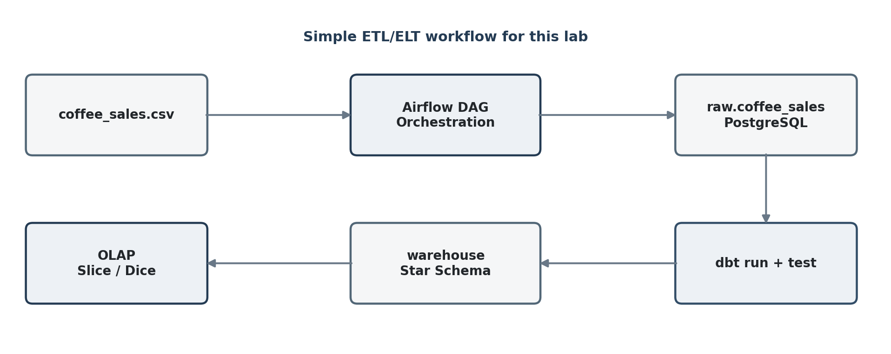
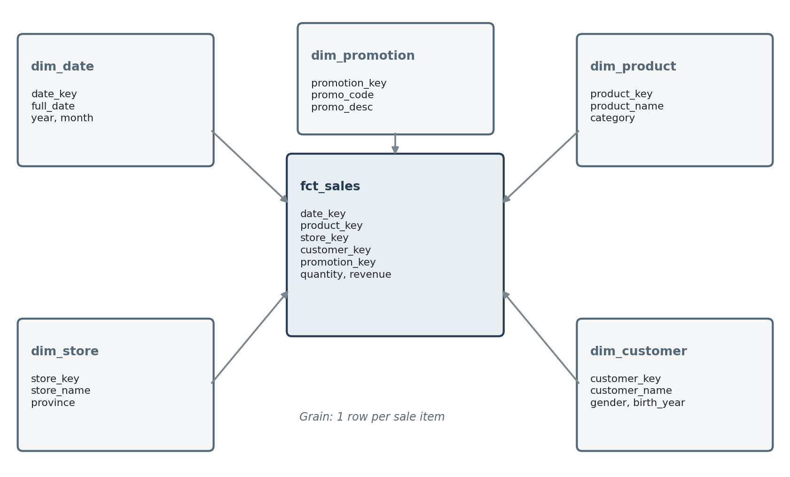

# 📦 Week 10: Workflow Orchestration with Airflow & dbt

> **Course:** Data Warehousing (การสร้างคลังข้อมูล)  
> **Topic:** การจัดกระบวนการ ETL ด้วย Apache Airflow และ dbt + OLAP Slice / Dice  
> **Duration:** 2 Hours

> 💡 **Lab concept / แนวคิดหลัก:** ประกอบ **Pipeline เดียว** ที่วิ่งตั้งแต่ไฟล์ CSV จนถึงคำตอบเชิงวิเคราะห์ —
> **Airflow** เป็นคนสั่งว่า *อะไรทำก่อน–หลัง* (ตรวจไฟล์ → โหลดเข้า `raw` → เรียก `dbt run` → `dbt test` → สรุปผล)
> ส่วน **dbt** เป็นคนแปลงข้อมูลด้วย SQL ให้กลายเป็น **Star Schema** ใน schema `warehouse`
> แล้วปิดท้ายด้วยการ Query แบบ **Slice** และ **Dice** จาก Star Schema นั้น

> 📷 The screenshot blocks below point at `docs/screenshots/`. Capture each output as you run the
> lab and drop the PNGs there — filenames already match.

---

## 🎯 Learning Objectives / วัตถุประสงค์

1. อธิบายบทบาทที่แตกต่างกันของ **Airflow** (Orchestration) และ **dbt** (Transformation) ในกระบวนการนำข้อมูลเข้าสู่ Data Warehouse ได้
2. สร้าง **DAG** เพื่อกำหนดลำดับงาน ตรวจสอบไฟล์ต้นทาง โหลดข้อมูลเข้าสู่ Raw Schema และเรียกใช้ dbt ได้
3. ใช้ dbt สร้าง **Staging Model**, **Dimension Table** และ **Fact Table** แบบง่ายใน PostgreSQL ได้
4. ตรวจสอบสถานะงานและ Log ผ่าน **Airflow UI** รวมถึงใช้ `dbt test` ตรวจสอบคุณภาพข้อมูลพื้นฐานได้
5. เขียน SQL เพื่อทำ **OLAP Operation** แบบ **Slice** และ **Dice** จาก Star Schema ได้

---

## 🧰 Tools & Stack Overview / เครื่องมือที่ใช้

| Tool | What is it? | หน้าที่ใน Lab |
|---|---|---|
| **Apache Airflow 3.2.2** | Workflow orchestrator | จัดลำดับงาน แสดงสถานะ และเก็บ Log ของ Pipeline |
| **dbt + dbt-postgres** | Transformation framework | แปลงข้อมูลจาก Raw Schema เป็น Star Schema และทดสอบข้อมูล |
| **PostgreSQL 16** | Relational database | เก็บ Airflow metadata ในฐานข้อมูล `airflow` และเก็บ Raw Data กับ Data Warehouse ของ Lab ในฐานข้อมูล `lab10` โดยแยกด้วย Schema |
| **pgAdmin 4** | DB management UI | สร้างฐานข้อมูล `lab10` และตรวจสอบตาราง |
| **Metabase** | BI & visualization | ทดลองคำสั่ง SQL สำหรับ Slice และ Dice ผ่าน Native Query |
| **Docker Compose** | Containerization | เปิด services `postgres`, `airflow-*`, `pgadmin`, `metabase`, `dbt` |
| **VS Code / Text Editor** | Editor | สร้างไฟล์ `.py`, `.sql` และ `.yml` |

**Dataset / ชุดข้อมูล**

| Dataset | Rows | รายละเอียด |
|---|---:|---|
| [`coffee_sales.csv`](./data/coffee_sales.csv) | 3,000 | รายการขายเดือน **กรกฎาคม 2024** (`2024-07-01` → `2024-07-31`) ไฟล์เดียวกับ Lab 4 / 5 / 8 |

**ลำดับ Task ใน DAG**

| # | Task | ทำอะไร |
|:-:|---|---|
| 1 | `check_source_file` | ตรวจสอบว่าไฟล์ CSV มีอยู่และมีข้อมูล |
| 2 | `load_raw_csv` | ล้างข้อมูลเดิมใน Raw Table แล้วโหลดข้อมูลจาก CSV |
| 3 | `dbt_run` | สร้าง Staging View, Dimension Tables และ Fact Table |
| 4 | `dbt_test` | ตรวจสอบ `not_null` และ `unique` ตามที่กำหนดใน `schema.yml` |
| 5 | `validate_warehouse` | สรุปจำนวนแถวและยอดขายรวมลงใน Airflow Log |

**แผนเวลาโดยประมาณ**

| กิจกรรม | เวลา |
|---|---:|
| ทำความเข้าใจบทบาท Airflow และ dbt | 10 นาที |
| เตรียมโครงสร้างโฟลเดอร์และ Docker Compose | 15 นาที |
| สร้าง dbt Project และ Star Schema | 35 นาที |
| สร้าง Airflow DAG | 25 นาที |
| Run, Monitor และตรวจสอบผล | 20 นาที |
| ทดลอง Slice และ Dice | 15 นาที |

---

## 📁 Files in This Week / ไฟล์ในสัปดาห์นี้

| File / Folder | Description |
|---|---|
| 📂 [docs/](./docs/) | Lab instructions |
| ├── 📝 [Lab10 Airflow with dbt ETL and OLAP.docx](./docs/Lab10%20Airflow%20with%20dbt%20ETL%20and%20OLAP.docx) | Lab instruction (Word) |
| ├── 📄 [Lab10 Airflow with dbt ETL and OLAP.pdf](./docs/Lab10%20Airflow%20with%20dbt%20ETL%20and%20OLAP.pdf) | Lab instruction (PDF) |
| └── 📂 [screenshots/](./docs/screenshots/) | Images referenced by this README |
| 📂 [data/](./data/) | Dataset |
| └── 📊 [coffee_sales.csv](./data/coffee_sales.csv) | 3,000 sales rows — คัดลอกไปไว้ใน `raw_data/` (Part 2.2) |
| 📂 [script/](./script/) | **ไฟล์ `.py` / `.sql` / `.yml` ทั้งหมดของ Lab เตรียมไว้ให้** — ใช้กับ "คำสั่งลัด" ในแต่ละหัวข้อ |
| ├── 📂 [dags/](./script/dags/) | Airflow DAG พร้อมคัดลอก |
| ├── 📂 [dbt/lab10/](./script/dbt/lab10/) | dbt project พร้อมคัดลอกทั้งชุด |
| └── 📂 [dbt_root/](./script/dbt_root/) | `profiles.yml` — **อ้างอิงเท่านั้น ห้ามคัดลอกทับ** (Part 3.1) |
| 📂 [lab-week10/](./lab-week10/) | **Lab working directory** |
| └── 📂 [dbt_root/](./lab-week10/dbt_root/) | Holds `profiles.yml` — the dbt connection profile |
| &nbsp;&nbsp;&nbsp;&nbsp;└── ⚙️ [profiles.yml](./lab-week10/dbt_root/profiles.yml) | Connects dbt to PostgreSQL, database `lab10`, schema `warehouse` |

---

## 🔧 Part 0: Start the Environment & Connect Tools / เริ่มระบบและเชื่อมต่อเครื่องมือ

> 💡 **Note:** If your Docker stack from Week 1 is already running, confirm with `docker compose ps` and skip to Part 1.

### 0.1 Start Docker Containers / สตาร์ทระบบด้วย Docker

Reuse the Week 1 stack (it contains `dw_postgres`, `airflow-*`, `dw_pgadmin`, `dw_metabase`, and `dw_dbt`):

**Mac / Linux:**

```bash
cd week01-data-warehouse-setup/lab-week01
echo -e "AIRFLOW_UID=$(id -u)" > .env
docker compose up -d
docker compose ps
```

**Windows (PowerShell):**

```powershell
cd week01-data-warehouse-setup\lab-week01
Set-Content -Path .env -Value "AIRFLOW_UID=50000"
docker compose up -d
docker compose ps
```

> 💡 Tip: paste as a single line if the line breaks cause errors.

> ⚠️ **Lab นี้ต้องใช้ Airflow จริง ๆ** — ต่างจาก Lab 5–9 ที่ใช้แค่ `postgres` + `dbt`
> ตรวจว่า `airflow-apiserver`, `airflow-scheduler` และ `airflow-init` ขึ้นครบใน `docker compose ps`
> ครั้งแรกอาจใช้เวลา build image สักพัก เพราะ `dockerfile.airflow` ติดตั้ง `dbt-core` + `dbt-postgres`

---

### 0.2 Connect pgAdmin to PostgreSQL / เชื่อมต่อ pgAdmin กับ PostgreSQL

1. Open your browser and go to **pgAdmin**: [http://localhost:28880](http://localhost:28880)
2. Log in with the default credentials:
   - **Email:** `dw_user@mail.com`
   - **Password:** `dw_pass`
3. Register the PostgreSQL Server (if not already connected):
   - Right-click **Servers** ➡️ **Register** ➡️ **Server...**
   - Under the **General** tab:
     - **Name:** `DW Postgres`
   - Under the **Connection** tab:
     - **Host name/address:** `dw_postgres` *(Internal Docker container name)*
     - **Port:** `5432`
     - **Maintenance database:** `airflow`
     - **Username:** `dw_user`
     - **Password:** `dw_pass`
   - Click **Save**.

---

### 0.3 Open the Airflow UI / เปิดหน้าจอ Airflow

1. เปิด [http://localhost:28080](http://localhost:28080)
2. Login ด้วย `airflow` / `airflow`
3. ตอนนี้ยังไม่เห็น DAG ของ Lab — จะมาปรากฏหลังสร้างไฟล์ใน Part 5

---

## 🧠 Part 1: Airflow กับ dbt ทำงานร่วมกันอย่างไร / How Airflow and dbt Fit Together

### 1.1 ภาพรวมการไหลของข้อมูล

Airflow และ dbt **ไม่ได้ทำหน้าที่ซ้ำกัน** แต่ทำงานร่วมกันเป็น Pipeline เดียว

<details>
<summary><b>📷 ภาพที่ 1 — ภาพรวมการไหลของข้อมูลใน Lab</b></summary>



</details>

| เครื่องมือ | รับผิดชอบอะไร | สิ่งที่เห็นใน Lab |
|---|---|---|
| **Airflow** | **Orchestration:** กำหนดว่าอะไรทำก่อน–หลัง เมื่อใด สำเร็จหรือผิดพลาด | DAG, Task, Graph, Log, Retry |
| **dbt** | **Transformation:** ใช้ SQL เปลี่ยนข้อมูล Raw ให้เป็นโมเดลสำหรับวิเคราะห์ | `stg_coffee_sales`, Dimension, Fact, Test |
| **PostgreSQL** | **Storage:** เก็บข้อมูลจริงและผลลัพธ์ของแต่ละขั้นตอน | Schema `raw` และ `warehouse` |

### 1.2 ETL หรือ ELT?

ใน Lab นี้ **Airflow อ่านไฟล์และโหลดเข้า `raw.coffee_sales` ก่อน** จากนั้น **dbt จึง Transform ภายใน PostgreSQL**
ดังนั้นเชิงเทคนิคเป็นรูปแบบ **ELT** แต่เอกสารใช้คำว่า **ETL Pipeline** ในความหมายกว้างของกระบวนการนำข้อมูลเข้าสู่คลังข้อมูล

### 1.3 แผนที่ Schema ที่จะได้

| Schema | สร้างโดย | มีอะไร |
|---|---|---|
| `raw` | Task `load_raw_csv` (psycopg2 `COPY`) | `coffee_sales` — ทุกคอลัมน์เป็น `text` เพื่อให้โหลดง่ายที่สุด |
| `warehouse` | `dbt run` | `stg_coffee_sales` (view) + 5 Dimension + 1 Fact (table) |

> 💡 **ทำไม Raw ถึงเก็บเป็น `text` ทั้งหมด?** เพราะหน้าที่ของขั้น Load คือ "เอาเข้ามาให้ครบก่อน"
> ถ้าบังคับชนิดข้อมูลตั้งแต่ตอน `COPY` แถวเดียวที่ผิดฟอร์แมตจะทำให้ทั้งไฟล์ล้ม
> การแปลงชนิดข้อมูลจึงยกไปทำใน Staging Model ของ dbt แทน

---

## 📥 Part 2: เตรียม Environment / Prepare the Lab Environment

### 2.1 root ของ Lab อยู่ที่ไหน

> ⚠️ **ใบ Lab เรียก root ว่า `DWH_Lab` แต่ในรีโปนี้ชื่อ `lab-week01`**
> `docker-compose.yaml` mount แบบ **relative กับตำแหน่งของตัวมันเอง** (`./dags`, `./raw_data`,
> `./dbt`, `./dbt_root`) ดังนั้นทุกโฟลเดอร์ของ Lab ต้องอยู่ **ข้าง ๆ** `docker-compose.yaml`
> เสมอ ไม่ว่าโฟลเดอร์นั้นจะชื่ออะไร
>
> | สถานะของคุณ | root คือ |
> |---|---|
> | ทำต่อจาก Week 1 มาเรื่อย ๆ | `dsba8-data-warehouse/week01-data-warehouse-setup/lab-week01/` |
> | เริ่มจาก 0 (คอมโดนล้าง / เครื่องใหม่) | `DWH_Lab/` — ได้จากการแตกไฟล์ [`DWH_Lab.zip`](../week01-data-warehouse-setup/lab-week01/DWH_Lab.zip) |
>
> ทั้งสองแบบใช้คำสั่งเดียวกันทุกบรรทัดหลังจาก `cd` เข้า root แล้ว

> 💡 **เช็กว่ายืนถูกที่หรือยัง** — สั่งแล้วต้องเห็น `docker-compose.yaml`
>
> **Mac / Linux:** `ls docker-compose.yaml` · **Windows (PowerShell):** `Test-Path docker-compose.yaml`

---

### 2.2 สร้างโครงสร้างโฟลเดอร์

โครงสร้างที่ต้องได้ **ในโฟลเดอร์เดียวกับ `docker-compose.yaml`**:

```text
lab-week01/                              ← root: โฟลเดอร์ที่มี docker-compose.yaml
│                                          (ถ้าเริ่มจาก 0 โดยแตกไฟล์ DWH_Lab.zip → root ชื่อ DWH_Lab/)
├── docker-compose.yaml                  ← มีอยู่แล้วจาก Week 1 (ต้องแก้ใน Part 2.3)
├── dockerfile.airflow                   ← มีอยู่แล้ว — ติดตั้ง dbt-core + dbt-postgres ไว้ให้แล้ว
├── dags/
│   └── coffee_sales_etl_dag.py
├── raw_data/
│   └── coffee_sales.csv
├── dbt_root/
│   └── profiles.yml
└── dbt/
    └── lab10/
        ├── dbt_project.yml
        └── models/
            ├── sources.yml
            ├── schema.yml
            ├── staging/
            │   └── stg_coffee_sales.sql
            └── marts/
                ├── dim_date.sql
                ├── dim_product.sql
                ├── dim_store.sql
                ├── dim_customer.sql
                ├── dim_promotion.sql
                └── fct_sales.sql
```

> ⚠️ **ใบ Lab วางโปรเจกต์ dbt ไว้ที่ `dbt/` ตรง ๆ — README นี้ใช้ `dbt/lab10/`**
> เพราะใน `DWH_Lab/` ที่แจกมา โฟลเดอร์ `dbt/` ว่างเปล่า จึงวาง `dbt_project.yml` ลงไปตรง ๆ ได้
> แต่ในรีโปนี้ `dbt/` เก็บ **หนึ่งโปรเจกต์ต่อหนึ่งสัปดาห์** อยู่แล้ว (`lab7/`, `lab9/`,
> `coffee_dw_snowflake/`, …) ถ้าวาง `dbt_project.yml` ลงที่ `dbt/` ตรง ๆ container `dw_dbt`
> (ซึ่ง `working_dir: /usr/app` = `dbt/`) จะกลายเป็นโปรเจกต์ `lab10` ทันที — พิมพ์ `dbt run`
> โดยลืม `cd lab9` แล้วจะ **รัน Lab 10 เงียบ ๆ แทนที่จะฟ้อง error**
> วิธีแก้คือเลื่อน mount ลงไปหนึ่งชั้นใน Part 2.3 (`./dbt/lab10:/opt/airflow/dbt`)
> — **โค้ดใน DAG ไม่ต้องแก้เลย** เพราะยังเห็นโปรเจกต์ที่ `/opt/airflow/dbt` เหมือนเดิม

Create the folders (only the shell syntax differs):

**Mac / Linux:**

```bash
cd week01-data-warehouse-setup/lab-week01     # เริ่มจาก 0: cd DWH_Lab
mkdir -p dags raw_data dbt_root \
  dbt/lab10/models/staging dbt/lab10/models/marts
```

**Windows (PowerShell):**

```powershell
cd week01-data-warehouse-setup\lab-week01     # เริ่มจาก 0: cd DWH_Lab
New-Item -ItemType Directory -Force dags, raw_data, dbt_root, `
  dbt/lab10/models/staging, dbt/lab10/models/marts
```

> 💡 Tip: paste as a single line if the line breaks cause errors. คำสั่ง `cd` ด้านบนนับจาก
> root ของรีโป — ถ้าอยู่ที่อื่นให้ใช้ path เต็มแทน

> ⚠️ **ต้อง `mkdir` ให้ครบ *ก่อน* สั่ง `docker compose up` ใน Part 2.3** — ถ้าโฟลเดอร์ยังไม่มี
> Docker จะสร้างให้เองโดยเป็นของ `root` ทำให้ dbt เขียน `target/` ไม่ได้ตอนรัน `dbt_run`

**คัดลอกไฟล์ข้อมูลต้นทางไปไว้ใน `raw_data/`**

**Mac / Linux:**

```bash
cd week01-data-warehouse-setup/lab-week01
cp ../../week10-airflow-orchestration-with-dbt/data/coffee_sales.csv raw_data/
```

**Windows (PowerShell):**

```powershell
cd week01-data-warehouse-setup\lab-week01
Copy-Item ..\..\week10-airflow-orchestration-with-dbt\data\coffee_sales.csv raw_data\
```

<details>
<summary><b>⚡ คำสั่งลัด — วางไฟล์ DAG / SQL / YAML ทั้งหมดของ Lab นี้ในครั้งเดียว</b></summary>

ทุกไฟล์ `.py`, `.sql` และ `.yml` ของ Lab นี้เตรียมไว้แล้วใน [`script/`](./script/) ถ้าไม่อยากสร้างไฟล์
ทีละไฟล์แล้ว copy-paste จาก README ให้คัดลอกทั้งชุดทีเดียว — วางทั้งสามบรรทัดได้เลย:

**Mac / Linux:**

```bash
cd week01-data-warehouse-setup/lab-week01
cp -r ../../week10-airflow-orchestration-with-dbt/script/dbt/lab10/. dbt/lab10/
cp    ../../week10-airflow-orchestration-with-dbt/script/dags/coffee_sales_etl_dag.py dags/
```

**Windows (PowerShell):**

```powershell
cd week01-data-warehouse-setup\lab-week01
Copy-Item -Recurse -Force ..\..\week10-airflow-orchestration-with-dbt\script\dbt\lab10\* dbt\lab10\
Copy-Item ..\..\week10-airflow-orchestration-with-dbt\script\dags\coffee_sales_etl_dag.py dags\
```

> ⚠️ คำสั่งนี้แตะเฉพาะ `dbt/lab10/` และ `dags/` เท่านั้น — **ไม่รวม `dbt_root/profiles.yml`** ซึ่งใช้ร่วมกัน
> ทุก Lab และต้องเพิ่ม block เองตาม Part 3.1 ส่วน `raw_data/coffee_sales.csv` ที่คัดลอกไว้ก่อนหน้า
> จะไม่ถูกลบ เพราะเป็นการ merge ไม่ใช่ replace

> 📝 ถึงจะใช้คำสั่งลัด ก็ยัง**ควรอ่านคำอธิบายของแต่ละไฟล์ใน Part 3–5** เพราะข้อสอบและ
> Google Form ถามจากเหตุผลเบื้องหลัง ไม่ใช่แค่ผลลัพธ์ที่รันได้

> 💡 **บรรทัด `cd` นับจาก root ของรีโป** ถ้าคุณอยู่ใน `lab-week01/` อยู่แล้ว `cd` จะขึ้น error
> แต่บรรทัด copy ถัดไป**ยังทำงานถูกต้อง** เพราะยืนอยู่ที่เดิมอยู่แล้ว — ข้าม error นี้ได้เลย

> 📝 **คนที่เริ่มจาก 0 และวาง `DWH_Lab/` ไว้นอกรีโป** ให้ `cd` เข้า `DWH_Lab` ของตัวเองแทน
> แล้วชี้ต้นทางด้วย path เต็มไปยัง `week10-airflow-orchestration-with-dbt/script/`

</details>

> ⚠️ **`dbt_root/profiles.yml` เป็นไฟล์ที่ใช้ร่วมกันทุก Lab** — ถ้าคุณทำ Lab 3–9 มาแล้ว ไฟล์นี้
> มี profile ของสัปดาห์ก่อนอยู่ ให้ **เพิ่ม** block `lab10:` ต่อท้าย (Part 3.1) **ห้ามเขียนทับทั้งไฟล์**
> ไม่งั้น Lab เก่าจะรันไม่ได้

---

### 2.3 เพิ่ม dbt Project ให้ Airflow มองเห็น

Task `dbt_run` และ `dbt_test` ทำงาน **ภายใน Airflow container** จึงต้อง Mount โฟลเดอร์ `dbt` และ
`dbt_root` เข้าไปใน container ด้วย

เปิดไฟล์ `docker-compose.yaml` แล้วเพิ่ม **Volume สองบรรทัดท้ายสุด** ใต้ `x-airflow-common` ➡️ `volumes:`
โดย **คงรายการเดิมไว้ทั้งหมด**:

**`docker-compose.yaml` — ส่วน `volumes:` ของ `x-airflow-common` หลังแก้แล้ว**

```yaml
  volumes:
    - ${AIRFLOW_PROJ_DIR:-.}/dags:/opt/airflow/dags
    - ${AIRFLOW_PROJ_DIR:-.}/logs:/opt/airflow/logs
    - ${AIRFLOW_PROJ_DIR:-.}/config:/opt/airflow/config
    - ${AIRFLOW_PROJ_DIR:-.}/plugins:/opt/airflow/plugins
    - ${AIRFLOW_PROJ_DIR:-.}/raw_data:/home/raw_data
    - ${AIRFLOW_PROJ_DIR:-.}/dbt/lab10:/opt/airflow/dbt
    - ${AIRFLOW_PROJ_DIR:-.}/dbt_root:/opt/airflow/dbt_root
```

> ⚠️ **บรรทัด `dbt` ต่างจากใบ Lab หนึ่งคำ** — ใบ Lab เขียน `${AIRFLOW_PROJ_DIR:-.}/dbt:/opt/airflow/dbt`
> README นี้ใช้ **`/dbt/lab10`** ตามเหตุผลใน Part 2.2 ปลายทางใน container ยังเป็น `/opt/airflow/dbt`
> เหมือนเดิม ดังนั้น `--project-dir /opt/airflow/dbt` ใน DAG **ไม่ต้องแก้**

หลังบันทึกไฟล์ ให้สั่ง Docker Compose สร้าง Container ใหม่ เพื่อให้การ Mount Volume ที่เพิ่มมีผล:

```bash
docker compose up -d --force-recreate
docker compose ps
```

> ⚠️ **ไม่ต้องใช้ `docker compose down -v`** เพราะจะลบ Named Volume และข้อมูลเดิมทั้งหมด
> (รวมถึงฐานข้อมูลของ Lab 3–9)

**ตรวจว่า container เห็นไฟล์จริงหรือยัง** (เหมือนกันทุก OS):

```bash
docker compose exec airflow-scheduler ls /opt/airflow/dbt /opt/airflow/dbt_root /home/raw_data
```

> ✅ **ผลที่ต้องได้:** เห็น `dbt_project.yml` + `models` ใน `/opt/airflow/dbt`, เห็น `profiles.yml`
> ใน `/opt/airflow/dbt_root` และเห็น `coffee_sales.csv` ใน `/home/raw_data`

---

### 2.4 สร้างฐานข้อมูล `lab10`

สร้างฐานข้อมูลแยกสำหรับ Lab 10 เพื่อให้ Raw Data และ Data Warehouse อยู่ในฐานข้อมูล `lab10`
โดยไม่ปะปนกับฐานข้อมูล `airflow` ที่ใช้เก็บ Airflow metadata

ใน pgAdmin ➡️ Query Tool (หรือ psql) รันคำสั่ง:

```sql
CREATE DATABASE lab10;
```

> 💡 **ทางเลือกจาก Terminal** (เหมือนกันทุก OS):

```bash
docker exec -it dw_postgres psql -U dw_user -d airflow -c "CREATE DATABASE lab10;"
```

> 📝 **หมายเหตุ:** หาก PostgreSQL แจ้งว่า `database "lab10" already exists` แสดงว่าเคยสร้างไว้แล้ว
> สามารถใช้ฐานข้อมูลเดิมต่อได้

---

## 🧱 Part 3: สร้าง dbt Project / Build the dbt Project

### 3.1 Profile สำหรับเชื่อมต่อฐานข้อมูล `lab10`

`dbt_root/profiles.yml`

> 📝 **นี่คือ block ที่ต้อง _เพิ่ม_ ไม่ใช่ทั้งไฟล์** — ถ้าเคยทำ Lab 3–9 ไฟล์นี้จะมี profile
> ของสัปดาห์ก่อน (`dvd_kpi`, `coffee_dw`, `coffee_dw_snowflake`, `coffee_dw_scd`, `lab7`, `lab8`, `lab9`)
> อยู่แล้ว ให้วาง `lab10:` ต่อท้ายโดยไม่ลบของเดิม (ถ้าเริ่มจาก 0 ไฟล์ยังว่าง — ใส่เฉพาะ block นี้ได้เลย)

```yaml
lab10:
  target: dev
  outputs:
    dev:
      type: postgres
      host: postgres
      port: 5432
      user: dw_user
      password: dw_pass
      dbname: lab10
      schema: warehouse
      threads: 4
```

> ⚠️ **จำให้แม่น — ชื่อ host:** เมื่อเชื่อมต่อจาก container หนึ่งไปอีก container หนึ่ง ต้องใช้
> **ชื่อ service คือ `postgres`** และพอร์ตภายใน `5432` — **ไม่ใช้** `localhost`, **ไม่ใช้** พอร์ต `25432`
> และ **ไม่ใช้** ชื่อ container `dw_postgres`

> 📝 **`schema: warehouse`** — ต่างจาก Lab อื่นที่ใช้ `schema: dbt` และ Lab นี้ไม่ได้ตั้ง `+schema`
> รายโฟลเดอร์ ดังนั้น **Model ทุกตัว** (staging + marts) จะไปอยู่ใน schema `warehouse` ตรง ๆ

---

### 3.2 กำหนดค่า dbt Project

`dbt/lab10/dbt_project.yml`

```yaml
name: lab10
version: "1.0.0"
config-version: 2

profile: lab10

model-paths: ["models"]
clean-targets: ["target", "dbt_packages"]

models:
  lab10:
    staging:
      +materialized: view
    marts:
      +materialized: table
```

<details>
<summary><b>⚡ คำสั่งลัด — คัดลอกไฟล์นี้แทนการสร้างเอง</b></summary>

ต้นทาง: [`script/dbt/lab10/dbt_project.yml`](./script/dbt/lab10/dbt_project.yml) — วางทั้งสองบรรทัดได้เลย โดย `cd` นับจาก **root ของรีโป**

**Mac / Linux:**

```bash
cd week01-data-warehouse-setup/lab-week01
cp ../../week10-airflow-orchestration-with-dbt/script/dbt/lab10/dbt_project.yml dbt/lab10/
```

**Windows (PowerShell):**

```powershell
cd week01-data-warehouse-setup\lab-week01
Copy-Item ..\..\week10-airflow-orchestration-with-dbt\script\dbt\lab10\dbt_project.yml dbt\lab10\
```

</details>

> 💡 Profile เชื่อมต่อฐานข้อมูล `lab10` และกำหนด schema เป้าหมายเป็น `warehouse` ดังนั้น Model
> ทั้งหมดจะอยู่ใน `warehouse` schema โดย **Staging เป็น View** และ **Dimension / Fact เป็น Table**

---

### 3.3 ประกาศ Source Table

`dbt/lab10/models/sources.yml`

```yaml
version: 2

sources:
  - name: raw
    schema: raw
    tables:
      - name: coffee_sales
        columns:
          - name: sale_id
            tests:
              - not_null
              - unique
          - name: sale_date
            tests:
              - not_null
```

<details>
<summary><b>⚡ คำสั่งลัด — คัดลอกไฟล์นี้แทนการสร้างเอง</b></summary>

ต้นทาง: [`script/dbt/lab10/models/sources.yml`](./script/dbt/lab10/models/sources.yml) — วางทั้งสองบรรทัดได้เลย โดย `cd` นับจาก **root ของรีโป**

**Mac / Linux:**

```bash
cd week01-data-warehouse-setup/lab-week01
cp ../../week10-airflow-orchestration-with-dbt/script/dbt/lab10/models/sources.yml dbt/lab10/models/
```

**Windows (PowerShell):**

```powershell
cd week01-data-warehouse-setup\lab-week01
Copy-Item ..\..\week10-airflow-orchestration-with-dbt\script\dbt\lab10\models\sources.yml dbt\lab10\models\
```

</details>

> 💡 **`source()` ต่างจาก `ref()`** — `ref()` ชี้ไปยัง Model ที่ dbt สร้างเอง ส่วน `source()`
> ชี้ไปยังตารางที่ **ระบบอื่นสร้าง** (ในที่นี้คือ Task `load_raw_csv` ของ Airflow)
> การประกาศ source ไว้ทำให้ dbt วาด Lineage ได้ครบตั้งแต่ Raw และรัน test กับตาราง Raw ได้ด้วย

---

### 3.4 สร้าง Staging Model

Raw Table เก็บข้อมูลเป็นข้อความเพื่อให้การ Load ง่าย ส่วน Staging Model ทำหน้าที่
**แปลงชนิดข้อมูล** และ **เลือกเฉพาะคอลัมน์ที่ต้องใช้**

`dbt/lab10/models/staging/stg_coffee_sales.sql`

```sql
select
    sale_id::integer as sale_id,
    invoice_number,
    sale_date::date as sale_date,
    customer_code,
    customer_name,
    gender,
    birth_year::integer as birth_year,
    product_code,
    product_name,
    lower(trim(category)) as category,
    size,
    unit_price::numeric(10, 2) as unit_price,
    quantity::integer as quantity,
    revenue::numeric(12, 2) as revenue,
    store_code,
    store_name,
    province,
    nullif(trim(promo_code), '') as promo_code,
    nullif(trim(promo_desc), '') as promo_desc,
    points_redeemed::integer as points_redeemed
from {{ source('raw', 'coffee_sales') }}
```

<details>
<summary><b>⚡ คำสั่งลัด — คัดลอกไฟล์นี้แทนการสร้างเอง</b></summary>

ต้นทาง: [`script/dbt/lab10/models/staging/stg_coffee_sales.sql`](./script/dbt/lab10/models/staging/stg_coffee_sales.sql) — วางทั้งสองบรรทัดได้เลย โดย `cd` นับจาก **root ของรีโป**

**Mac / Linux:**

```bash
cd week01-data-warehouse-setup/lab-week01
cp ../../week10-airflow-orchestration-with-dbt/script/dbt/lab10/models/staging/stg_coffee_sales.sql dbt/lab10/models/staging/
```

**Windows (PowerShell):**

```powershell
cd week01-data-warehouse-setup\lab-week01
Copy-Item ..\..\week10-airflow-orchestration-with-dbt\script\dbt\lab10\models\staging\stg_coffee_sales.sql dbt\lab10\models\staging\
```

</details>

> 💡 **สองบรรทัดที่ทำงานหนักที่สุด**
> - `lower(trim(category))` — รวม `Coffee`, `coffee `, ` COFFEE` ให้เป็นค่าเดียวกัน มิฉะนั้น
>   `dim_product` จะแตกเป็นหลายแถวต่อสินค้าหนึ่งตัว
> - `nullif(trim(promo_code), '')` — CSV เก็บ "ไม่มีโปรโมชัน" เป็น **ข้อความว่าง** ไม่ใช่ `NULL`
>   ถ้าไม่แปลงก่อน `dim_promotion` จะมีแถวขยะ `''` เพิ่มมาหนึ่งแถว

---

### 3.5 ตรวจการเชื่อมต่อ

รันจากภายใน Airflow container (เพราะ Task `dbt_run` ก็จะรันจากที่นี่):

```bash
docker compose exec airflow-scheduler dbt debug \
  --project-dir /opt/airflow/dbt \
  --profiles-dir /opt/airflow/dbt_root
```

<details>
<summary><b>Show Output — <code>dbt debug</code></b></summary>


</details>

> ✅ **ผลที่ต้องได้:** `Connection test: OK` และ `All checks passed`

> 💡 Tip: paste as a single line if the line breaks cause errors (Windows PowerShell ใช้ backtick
> `` ` `` แทน `\` ถ้าจะขึ้นบรรทัดใหม่)

---

## ⭐ Part 4: สร้าง Star Schema ด้วย dbt / Build the Star Schema

เพื่อให้สอดคล้องกับ Star Schema ใน Lab ก่อนหน้า Lab นี้ใช้ **5 Dimension + 1 Fact** โดยกำหนด
**Grain** ของ Fact Table เป็น **1 แถวต่อรายการขาย** และใช้ `md5()` สร้าง **Surrogate Key**
ที่คงที่จาก **Business Key**

<details>
<summary><b>📷 ภาพที่ 2 — Star Schema แบบย่อที่สร้างด้วย dbt</b></summary>



</details>

### 4.1 Dimension สินค้า

`dbt/lab10/models/marts/dim_product.sql`

```sql
with products as (
    select distinct
        product_code,
        product_name,
        category,
        size,
        unit_price
    from {{ ref('stg_coffee_sales') }}
)

select
    md5(product_code) as product_key,
    product_code,
    product_name,
    category,
    size,
    unit_price
from products
```

<details>
<summary><b>⚡ คำสั่งลัด — คัดลอกไฟล์นี้แทนการสร้างเอง</b></summary>

ต้นทาง: [`script/dbt/lab10/models/marts/dim_product.sql`](./script/dbt/lab10/models/marts/dim_product.sql) — วางทั้งสองบรรทัดได้เลย โดย `cd` นับจาก **root ของรีโป**

**Mac / Linux:**

```bash
cd week01-data-warehouse-setup/lab-week01
cp ../../week10-airflow-orchestration-with-dbt/script/dbt/lab10/models/marts/dim_product.sql dbt/lab10/models/marts/
```

**Windows (PowerShell):**

```powershell
cd week01-data-warehouse-setup\lab-week01
Copy-Item ..\..\week10-airflow-orchestration-with-dbt\script\dbt\lab10\models\marts\dim_product.sql dbt\lab10\models\marts\
```

</details>

> ⚠️ **`select distinct` มี 5 คอลัมน์ แต่ `md5()` ใช้แค่ `product_code`** — จะปลอดภัยก็ต่อเมื่อ
> **หนึ่ง `product_code` มีชื่อ / หมวด / ขนาด / ราคาเดียวเท่านั้น** ในชุดข้อมูลนี้เป็นจริง
> (P001–P005 ตัวละหนึ่งขนาดหนึ่งราคา) จึงได้ **5 แถว** และ test `unique` ผ่าน
> ถ้าวันหนึ่งสินค้าตัวเดียวมีหลายขนาด `distinct` จะคืนหลายแถวแต่ `product_key` ซ้ำ →
> `dbt test` จะ **Fail ทันที** และต้องเปลี่ยนไปใช้ `md5(concat_ws('|', product_code, size))` แทน

---

### 4.2 Dimension ร้านค้า

`dbt/lab10/models/marts/dim_store.sql`

```sql
with stores as (
    select distinct
        store_code,
        store_name,
        province
    from {{ ref('stg_coffee_sales') }}
)

select
    md5(store_code) as store_key,
    store_code,
    store_name,
    province
from stores
```

<details>
<summary><b>⚡ คำสั่งลัด — คัดลอกไฟล์นี้แทนการสร้างเอง</b></summary>

ต้นทาง: [`script/dbt/lab10/models/marts/dim_store.sql`](./script/dbt/lab10/models/marts/dim_store.sql) — วางทั้งสองบรรทัดได้เลย โดย `cd` นับจาก **root ของรีโป**

**Mac / Linux:**

```bash
cd week01-data-warehouse-setup/lab-week01
cp ../../week10-airflow-orchestration-with-dbt/script/dbt/lab10/models/marts/dim_store.sql dbt/lab10/models/marts/
```

**Windows (PowerShell):**

```powershell
cd week01-data-warehouse-setup\lab-week01
Copy-Item ..\..\week10-airflow-orchestration-with-dbt\script\dbt\lab10\models\marts\dim_store.sql dbt\lab10\models\marts\
```

</details>

---

### 4.3 Dimension ลูกค้า

`dbt/lab10/models/marts/dim_customer.sql`

```sql
with customers as (
    select distinct
        customer_code,
        customer_name,
        gender,
        birth_year
    from {{ ref('stg_coffee_sales') }}
)

select
    md5(customer_code) as customer_key,
    customer_code,
    customer_name,
    gender,
    birth_year
from customers
```

<details>
<summary><b>⚡ คำสั่งลัด — คัดลอกไฟล์นี้แทนการสร้างเอง</b></summary>

ต้นทาง: [`script/dbt/lab10/models/marts/dim_customer.sql`](./script/dbt/lab10/models/marts/dim_customer.sql) — วางทั้งสองบรรทัดได้เลย โดย `cd` นับจาก **root ของรีโป**

**Mac / Linux:**

```bash
cd week01-data-warehouse-setup/lab-week01
cp ../../week10-airflow-orchestration-with-dbt/script/dbt/lab10/models/marts/dim_customer.sql dbt/lab10/models/marts/
```

**Windows (PowerShell):**

```powershell
cd week01-data-warehouse-setup\lab-week01
Copy-Item ..\..\week10-airflow-orchestration-with-dbt\script\dbt\lab10\models\marts\dim_customer.sql dbt\lab10\models\marts\
```

</details>

> 💡 **`dim_customer` แบบนี้คือ SCD Type 1** — ถ้าลูกค้าเปลี่ยนชื่อ แถวเดิมจะถูกเขียนทับใน
> การ Build รอบถัดไป ไม่เก็บประวัติ (ต่างจาก Lab 6 และ Lab 9 ที่ทำ Type 2 ด้วย `dbt snapshot`)

---

### 4.4 Dimension โปรโมชัน

`dbt/lab10/models/marts/dim_promotion.sql`

```sql
with promotions as (
    select distinct
        promo_code,
        promo_desc
    from {{ ref('stg_coffee_sales') }}
    where promo_code is not null
)

select
    md5(promo_code) as promotion_key,
    promo_code,
    promo_desc
from promotions
```

<details>
<summary><b>⚡ คำสั่งลัด — คัดลอกไฟล์นี้แทนการสร้างเอง</b></summary>

ต้นทาง: [`script/dbt/lab10/models/marts/dim_promotion.sql`](./script/dbt/lab10/models/marts/dim_promotion.sql) — วางทั้งสองบรรทัดได้เลย โดย `cd` นับจาก **root ของรีโป**

**Mac / Linux:**

```bash
cd week01-data-warehouse-setup/lab-week01
cp ../../week10-airflow-orchestration-with-dbt/script/dbt/lab10/models/marts/dim_promotion.sql dbt/lab10/models/marts/
```

**Windows (PowerShell):**

```powershell
cd week01-data-warehouse-setup\lab-week01
Copy-Item ..\..\week10-airflow-orchestration-with-dbt\script\dbt\lab10\models\marts\dim_promotion.sql dbt\lab10\models\marts\
```

</details>

> 📝 **โปรโมชันเป็นข้อมูลทางเลือก:** `dim_promotion` เก็บเฉพาะโปรโมชันที่มีรหัส ส่วนรายการขาย
> ที่ไม่ได้ใช้โปรโมชัน (**1,039 จาก 3,000 แถว**) ยังคงอยู่ใน `fct_sales` โดยมี `promotion_key`
> เป็น `NULL` — นี่คือเหตุผลที่ `fct_sales` ต้องใช้ `left join` กับ dimension ตัวนี้ตัวเดียว

---

### 4.5 Dimension วัน

`dbt/lab10/models/marts/dim_date.sql`

```sql
with dates as (
    select distinct sale_date
    from {{ ref('stg_coffee_sales') }}
)

select
    to_char(sale_date, 'YYYYMMDD')::integer as date_key,
    sale_date as full_date,
    extract(year from sale_date)::integer as year,
    extract(month from sale_date)::integer as month_number,
    to_char(sale_date, 'Mon') as month_name,
    extract(day from sale_date)::integer as day_of_month
from dates
```

<details>
<summary><b>⚡ คำสั่งลัด — คัดลอกไฟล์นี้แทนการสร้างเอง</b></summary>

ต้นทาง: [`script/dbt/lab10/models/marts/dim_date.sql`](./script/dbt/lab10/models/marts/dim_date.sql) — วางทั้งสองบรรทัดได้เลย โดย `cd` นับจาก **root ของรีโป**

**Mac / Linux:**

```bash
cd week01-data-warehouse-setup/lab-week01
cp ../../week10-airflow-orchestration-with-dbt/script/dbt/lab10/models/marts/dim_date.sql dbt/lab10/models/marts/
```

**Windows (PowerShell):**

```powershell
cd week01-data-warehouse-setup\lab-week01
Copy-Item ..\..\week10-airflow-orchestration-with-dbt\script\dbt\lab10\models\marts\dim_date.sql dbt\lab10\models\marts\
```

</details>

> 📝 **`dim_date` สร้างจากวันที่ที่มีการขายจริงเท่านั้น** จึงได้ **31 แถว** (ทั้งเดือน ก.ค. 2024
> มีการขายครบทุกวันพอดี) ไม่ใช่ปฏิทินเต็มปี — Data Warehouse จริงมักสร้าง `dim_date` ล่วงหน้า
> ครอบคลุมทุกวันไม่ว่าจะมีธุรกรรมหรือไม่ เพื่อให้รายงาน "วันที่ยอดขาย = 0" ได้ด้วย

---

### 4.6 Fact ยอดขาย

`dbt/lab10/models/marts/fct_sales.sql`

```sql
select
    md5(s.sale_id::text) as sales_key,
    s.invoice_number,
    d.date_key,
    p.product_key,
    st.store_key,
    c.customer_key,
    pr.promotion_key,
    s.quantity,
    s.unit_price,
    s.revenue,
    s.points_redeemed
from {{ ref('stg_coffee_sales') }} s
join {{ ref('dim_date') }} d
    on s.sale_date = d.full_date
join {{ ref('dim_product') }} p
    on s.product_code = p.product_code
join {{ ref('dim_store') }} st
    on s.store_code = st.store_code
join {{ ref('dim_customer') }} c
    on s.customer_code = c.customer_code
left join {{ ref('dim_promotion') }} pr
    on s.promo_code = pr.promo_code
```

<details>
<summary><b>⚡ คำสั่งลัด — คัดลอกไฟล์นี้แทนการสร้างเอง</b></summary>

ต้นทาง: [`script/dbt/lab10/models/marts/fct_sales.sql`](./script/dbt/lab10/models/marts/fct_sales.sql) — วางทั้งสองบรรทัดได้เลย โดย `cd` นับจาก **root ของรีโป**

**Mac / Linux:**

```bash
cd week01-data-warehouse-setup/lab-week01
cp ../../week10-airflow-orchestration-with-dbt/script/dbt/lab10/models/marts/fct_sales.sql dbt/lab10/models/marts/
```

**Windows (PowerShell):**

```powershell
cd week01-data-warehouse-setup\lab-week01
Copy-Item ..\..\week10-airflow-orchestration-with-dbt\script\dbt\lab10\models\marts\fct_sales.sql dbt\lab10\models\marts\
```

</details>

> ⚠️ **สี่ `join` แรกเป็น inner join** — ถ้า dimension ตัวใดหลุดไปแม้แถวเดียว (เช่น สะกดจังหวัด
> หรือรหัสสินค้าไม่ตรง) แถวขายนั้นจะ **หายไปเงียบ ๆ** จาก `fct_sales`
> ทางกันคือดูจำนวนแถวใน Part 6.2 — ต้องได้ **3,000 เท่ากับ `raw.coffee_sales` พอดี**
> ถ้าน้อยกว่า แปลว่ามีแถวหลุด ไม่ใช่ข้อมูลซ้ำ

---

### 4.7 กำหนด Data Tests

`dbt/lab10/models/schema.yml`

```yaml
version: 2

models:
  - name: dim_date
    columns:
      - {name: date_key, tests: [not_null, unique]}

  - name: dim_product
    columns:
      - {name: product_key, tests: [not_null, unique]}
      - {name: product_code, tests: [not_null, unique]}

  - name: dim_store
    columns:
      - {name: store_key, tests: [not_null, unique]}
      - {name: store_code, tests: [not_null, unique]}

  - name: dim_customer
    columns:
      - {name: customer_key, tests: [not_null, unique]}
      - {name: customer_code, tests: [not_null, unique]}

  - name: dim_promotion
    columns:
      - {name: promotion_key, tests: [not_null, unique]}
      - {name: promo_code, tests: [not_null, unique]}

  - name: fct_sales
    columns:
      - {name: sales_key, tests: [not_null, unique]}
      - {name: date_key, tests: [not_null]}
      - {name: product_key, tests: [not_null]}
      - {name: store_key, tests: [not_null]}
      - {name: customer_key, tests: [not_null]}
      - {name: quantity, tests: [not_null]}
      - {name: revenue, tests: [not_null]}
```

<details>
<summary><b>⚡ คำสั่งลัด — คัดลอกไฟล์นี้แทนการสร้างเอง</b></summary>

ต้นทาง: [`script/dbt/lab10/models/schema.yml`](./script/dbt/lab10/models/schema.yml) — วางทั้งสองบรรทัดได้เลย โดย `cd` นับจาก **root ของรีโป**

**Mac / Linux:**

```bash
cd week01-data-warehouse-setup/lab-week01
cp ../../week10-airflow-orchestration-with-dbt/script/dbt/lab10/models/schema.yml dbt/lab10/models/
```

**Windows (PowerShell):**

```powershell
cd week01-data-warehouse-setup\lab-week01
Copy-Item ..\..\week10-airflow-orchestration-with-dbt\script\dbt\lab10\models\schema.yml dbt\lab10\models\
```

</details>

> 📝 **`promotion_key` ไม่ได้ถูก test ว่า `not_null` ใน `fct_sales`** — ถูกต้องแล้ว เพราะรายการ
> ที่ไม่มีโปรโมชันต้องเป็น `NULL` ได้ ต่างจาก Foreign Key อีก 4 ตัวที่ห้ามว่าง

> 📝 **ขอบเขตของ Lab:** Surrogate Key ของสินค้า ร้านค้า ลูกค้า โปรโมชัน และรายการขายสร้างด้วย
> `md5()` จาก Business Key จึงได้ค่าเดิมทุกครั้งที่ Build ใหม่ ต่างจาก `row_number()`
> ในงานจริงควรกำหนดมาตรฐานการจัดรูปแบบ Business Key ให้ชัดเจน และออกแบบการเก็บประวัติด้วย
> **SCD** แยกต่างหาก

---

## 🌬️ Part 5: สร้าง Airflow DAG / Build the Airflow DAG

สร้างไฟล์ต่อไปนี้โดยคัดลอกโค้ดทั้งหมด — **DAG จะเป็นผู้เรียก `dbt run` และ `dbt test` ตามลำดับ**

`dags/coffee_sales_etl_dag.py`

```python
from pathlib import Path

import psycopg2
import pendulum
from airflow.sdk import dag, task
from airflow.providers.standard.operators.bash import BashOperator


CSV_PATH = Path("/home/raw_data/coffee_sales.csv")


@dag(
    dag_id="coffee_sales_etl",
    description="Load coffee sales and build a star schema with dbt",
    start_date=pendulum.datetime(2026, 1, 1, tz="UTC"),
    schedule=None,
    catchup=False,
    default_args={"retries": 1},
    tags=["lab", "dbt", "warehouse"],
)
def coffee_sales_etl():

    @task
    def check_source_file():
        if not CSV_PATH.exists():
            raise FileNotFoundError(f"Source file not found: {CSV_PATH}")

        with CSV_PATH.open("r", encoding="utf-8-sig") as file:
            row_count = sum(1 for _ in file) - 1

        if row_count <= 0:
            raise ValueError("The CSV file has no data rows")

        print(f"Found {row_count:,} rows in {CSV_PATH}")
        return row_count

    @task
    def load_raw_csv():
        columns = """
            sale_id, invoice_number, sale_date, customer_code,
            customer_name, gender, birth_year, product_code,
            product_name, category, size, unit_price, quantity,
            revenue, store_code, store_name, province, staff_code,
            staff_name, position, promo_code, promo_desc,
            points_redeemed
        """

        create_table_sql = """
            create schema if not exists raw;
            create table if not exists raw.coffee_sales (
                sale_id text,
                invoice_number text,
                sale_date text,
                customer_code text,
                customer_name text,
                gender text,
                birth_year text,
                product_code text,
                product_name text,
                category text,
                size text,
                unit_price text,
                quantity text,
                revenue text,
                store_code text,
                store_name text,
                province text,
                staff_code text,
                staff_name text,
                position text,
                promo_code text,
                promo_desc text,
                points_redeemed text
            );
            truncate table raw.coffee_sales;
        """

        connection = psycopg2.connect(
            host="postgres",
            port=5432,
            dbname="lab10",
            user="dw_user",
            password="dw_pass",
        )

        try:
            with connection.cursor() as cursor:
                cursor.execute(create_table_sql)
                with CSV_PATH.open("r", encoding="utf-8-sig") as file:
                    cursor.copy_expert(
                        f"""
                        copy raw.coffee_sales ({columns})
                        from stdin with (format csv, header true)
                        """,
                        file,
                    )
                cursor.execute("select count(*) from raw.coffee_sales")
                row_count = cursor.fetchone()[0]
            connection.commit()
        finally:
            connection.close()

        print(f"Loaded {row_count:,} rows into raw.coffee_sales")
        return row_count

    dbt_run = BashOperator(
        task_id="dbt_run",
        bash_command=(
            "dbt run "
            "--project-dir /opt/airflow/dbt "
            "--profiles-dir /opt/airflow/dbt_root"
        ),
    )

    dbt_test = BashOperator(
        task_id="dbt_test",
        bash_command=(
            "dbt test "
            "--project-dir /opt/airflow/dbt "
            "--profiles-dir /opt/airflow/dbt_root"
        ),
    )

    @task
    def validate_warehouse():
        connection = psycopg2.connect(
            host="postgres",
            port=5432,
            dbname="lab10",
            user="dw_user",
            password="dw_pass",
        )
        try:
            with connection.cursor() as cursor:
                cursor.execute("""
                    select
                        count(*) as fact_rows,
                        sum(quantity) as total_quantity,
                        sum(revenue) as total_revenue
                    from warehouse.fct_sales
                """)
                result = cursor.fetchone()
        finally:
            connection.close()

        print(
            "Warehouse summary: "
            f"rows={result[0]:,}, "
            f"quantity={result[1]:,}, "
            f"revenue={result[2]:,.2f}"
        )

    source_ok = check_source_file()
    raw_loaded = load_raw_csv()
    warehouse_ok = validate_warehouse()

    source_ok >> raw_loaded >> dbt_run >> dbt_test >> warehouse_ok


coffee_sales_etl()
```

<details>
<summary><b>⚡ คำสั่งลัด — คัดลอกไฟล์นี้แทนการสร้างเอง</b></summary>

ต้นทาง: [`script/dags/coffee_sales_etl_dag.py`](./script/dags/coffee_sales_etl_dag.py) — วางทั้งสองบรรทัดได้เลย โดย `cd` นับจาก **root ของรีโป**

**Mac / Linux:**

```bash
cd week01-data-warehouse-setup/lab-week01
cp ../../week10-airflow-orchestration-with-dbt/script/dags/coffee_sales_etl_dag.py dags/
```

**Windows (PowerShell):**

```powershell
cd week01-data-warehouse-setup\lab-week01
Copy-Item ..\..\week10-airflow-orchestration-with-dbt\script\dags\coffee_sales_etl_dag.py dags\
```

</details>

> 📝 **จุดสังเกต:** เครื่องหมาย `>>` ใช้กำหนด **Dependency** ของ Task **ไม่ได้** หมายความว่า
> Airflow ส่งข้อมูลทุกแถวจาก Task หนึ่งไปอีก Task หนึ่ง — ข้อมูลจริงอยู่ในไฟล์และ PostgreSQL
> ส่วน **XCom** ใช้เพียงค่าขนาดเล็ก เช่น `row_count`

> 💡 **อ่านโค้ดเป็นสามชั้น**
> - `@task` (TaskFlow API) — เขียน Python ธรรมดา คืนค่าแล้วกลายเป็น XCom ให้อัตโนมัติ
> - `BashOperator` — สั่ง command ใน container เดียวกับ Airflow worker จึงเรียก `dbt` ได้ตรง ๆ
> - `truncate` + `copy` — ทำให้ Pipeline นี้เป็น **Full Refresh** รันซ้ำกี่รอบข้อมูลก็ไม่ซ้ำ
>   (ต่างจาก Incremental Load ใน Lab 9)

---

## ▶️ Part 6: Run และติดตามผลใน Airflow / Run and Monitor

### 6.1 Trigger DAG

1. เปิด [http://localhost:28080](http://localhost:28080) แล้ว Login ด้วย `airflow` / `airflow`
2. ค้นหา DAG ชื่อ **`coffee_sales_etl`**
3. เปิดสวิตช์ **Unpause** เนื่องจาก Environment กำหนด `DAGS_ARE_PAUSED_AT_CREATION` เป็น `true`
4. กด **Trigger DAG** และรอให้ Task ทั้งหมดเป็นสีเขียว
5. เปิด **Graph View** เพื่อดู Dependency แล้วคลิกแต่ละ Task เพื่อเปิด **Log**

**สิ่งที่ควรเห็น**

```text
check_source_file
        |
        v
load_raw_csv
        |
        v
dbt_run
        |
        v
dbt_test
        |
        v
validate_warehouse
```

<details>
<summary><b>📷 Airflow Graph View — Task ทั้ง 5 สำเร็จ</b></summary>


</details>

<details>
<summary><b>Show Output — Log ของ <code>validate_warehouse</code></b></summary>


</details>

> 💡 **DAG ไม่โผล่ใน 30 วินาทีแรกถือว่าปกติ** — scheduler สแกนโฟลเดอร์ `dags/` เป็นรอบ
> ถ้าเกิน 1–2 นาทีแล้วยังไม่เห็น ให้ดู Part 8 (`airflow dags list-import-errors`)

---

### 6.2 ผลตรวจสอบที่คาดหวัง

| ตาราง / ค่า | ผลที่คาดหวัง |
|---|---:|
| `raw.coffee_sales` | 3,000 แถว |
| `warehouse.dim_product` | 5 แถว |
| `warehouse.dim_store` | 3 แถว |
| `warehouse.dim_customer` | 2,745 แถว |
| `warehouse.dim_promotion` | 2 แถว |
| `warehouse.dim_date` | 31 แถว |
| `warehouse.fct_sales` | 3,000 แถว |
| `sum(quantity)` | 6,023 |
| `sum(revenue)` | 320,240.00 |

> ✅ ตัวเลขทั้ง 9 ค่านี้ **ตรวจสอบกับ `coffee_sales.csv` จริงแล้ว** — ถ้าได้ไม่ตรง ให้ย้อนดู
> Part 4.6 (แถวหลุดจาก inner join) หรือ Part 3.4 (`lower(trim(category))` / `nullif(...)`)

---

### 6.3 ตรวจสอบด้วย SQL

รันใน pgAdmin ➡️ Query Tool โดยเชื่อมต่อฐานข้อมูล **`lab10`**:

```sql
select 'raw' as object_name, count(*) as row_count
from raw.coffee_sales
union all
select 'dim_product', count(*) from warehouse.dim_product
union all
select 'dim_store', count(*) from warehouse.dim_store
union all
select 'dim_customer', count(*) from warehouse.dim_customer
union all
select 'dim_promotion', count(*) from warehouse.dim_promotion
union all
select 'dim_date', count(*) from warehouse.dim_date
union all
select 'fct_sales', count(*) from warehouse.fct_sales;
```

<details>
<summary><b>Show Output — row counts</b></summary>


</details>

> 💡 **ทางเลือกจาก Terminal** (เหมือนกันทุก OS):

```bash
docker exec -it dw_postgres psql -U dw_user -d lab10 -c "select count(*) as fact_rows, sum(quantity) as qty, sum(revenue) as revenue from warehouse.fct_sales;"
```

---

### 6.4 ทดลอง Run ซ้ำ

Trigger DAG อีกรอบ — **จำนวนแถวควรยังคงเท่าเดิม** เพราะ

- `load_raw_csv` ใช้ `TRUNCATE` เพื่อล้างข้อมูลเดิมแล้วโหลดใหม่
- dbt สร้าง Table ตามผลลัพธ์ล่าสุด (`+materialized: table` = `create or replace`)

กระบวนการนี้เป็น **Full Refresh แบบง่าย ไม่ใช่ Incremental Load**

> 💡 **เทียบกับ Lab 9:** Full Refresh ง่ายและปลอดภัยเมื่อข้อมูลเล็ก แต่พอข้อมูลโตขึ้น
> การโหลดใหม่ทั้งก้อนทุกวันจะแพงมาก — จึงต้องใช้ `materialized='incremental'` แบบ Lab 9 แทน

---

## 🔎 Part 7: OLAP Operation — Slice และ Dice

ใช้ **SQL Editor ใน pgAdmin** หรือ **Native Query ใน Metabase** ([http://localhost:23000](http://localhost:23000))
โดยเชื่อมต่อฐานข้อมูล **`lab10`**

### 7.1 Slice — เลือกค่าหนึ่งจาก Dimension หนึ่ง

**โจทย์:** เลือกเฉพาะยอดขายของจังหวัด **Bangkok** แล้วสรุปตามประเภทสินค้า
การกำหนด `province` เพียงค่าเดียวเปรียบเสมือนการ **ตัด Cube ออกมาเป็น Slice หนึ่ง**

```sql
select
    p.category,
    sum(f.quantity) as total_quantity,
    sum(f.revenue) as total_revenue
from warehouse.fct_sales f
join warehouse.dim_product p
    on f.product_key = p.product_key
join warehouse.dim_store s
    on f.store_key = s.store_key
where s.province = 'Bangkok'
group by p.category
order by p.category;
```

**ผลลัพธ์ที่คาดหวัง**

| category | total_quantity | total_revenue |
|---|---:|---:|
| bakery | 446 | 19,291.50 |
| coffee | 1,189 | 67,085.00 |
| tea | 389 | 20,735.00 |

<details>
<summary><b>Show Output — Slice result</b></summary>


</details>

---

### 7.2 Dice — เลือกช่วงหรือชุดค่าจากหลาย Dimension

**โจทย์:** เลือกเฉพาะ **Bangkok และ Chiang Mai**, เฉพาะ **coffee และ tea**, และเฉพาะ
**วันที่ 1–15 กรกฎาคม 2024** — การกรองพร้อมกันหลาย Dimension ทำให้ได้ **Sub-cube** ขนาดเล็กลง

```sql
select
    s.province,
    p.category,
    sum(f.quantity) as total_quantity,
    sum(f.revenue) as total_revenue
from warehouse.fct_sales f
join warehouse.dim_date d
    on f.date_key = d.date_key
join warehouse.dim_product p
    on f.product_key = p.product_key
join warehouse.dim_store s
    on f.store_key = s.store_key
where s.province in ('Bangkok', 'Chiang Mai')
  and p.category in ('coffee', 'tea')
  and d.full_date between date '2024-07-01' and date '2024-07-15'
group by s.province, p.category
order by s.province, p.category;
```

**ผลลัพธ์ที่คาดหวัง**

| province | category | total_quantity | total_revenue |
|---|---|---:|---:|
| Bangkok | coffee | 576 | 32,645.00 |
| Bangkok | tea | 216 | 11,440.00 |
| Chiang Mai | coffee | 579 | 32,716.00 |
| Chiang Mai | tea | 209 | 11,137.50 |

<details>
<summary><b>Show Output — Dice result</b></summary>


</details>

---

### 7.3 สรุปความแตกต่าง

| Operation | ลักษณะการกรอง | ตัวอย่างใน Lab |
|---|---|---|
| **Slice** | กำหนด **ค่าเดียว** ใน Dimension **หนึ่งตัว** | `province = 'Bangkok'` |
| **Dice** | กำหนด **หลายค่า / หลายช่วง** ใน **หลาย Dimension** | 2 จังหวัด + 2 ประเภทสินค้า + ช่วงวันที่ |

> 💡 **ทำไม Star Schema ถึงทำให้ Slice/Dice ง่าย** — ทุกเงื่อนไขกรองอยู่บน **Dimension**
> ส่วน `fct_sales` เก็บแค่ Foreign Key กับตัวเลข การเพิ่มมุมมองใหม่จึงเป็นแค่การ `join`
> dimension เพิ่มอีกตัว ไม่ต้องแก้ Fact Table เลย

---

## 🩺 Part 8: การแก้ปัญหาเบื้องต้น / Troubleshooting

| อาการ | จุดที่ควรตรวจสอบ |
|---|---|
| **DAG ไม่ปรากฏ** | ชื่อไฟล์ต้องลงท้าย `.py` ตรวจ Import Error และ Log ของ `airflow-scheduler` |
| **`dbt: command not found`** | Build image ใหม่หลังตรวจว่า `dockerfile.airflow` มีคำสั่ง `pip install dbt-core dbt-postgres` |
| **`Connection refused`** | ภายใน container ต้องใช้ `host: postgres` และ `port: 5432` **ไม่ใช่** `localhost:25432` |
| **ไม่พบ `coffee_sales.csv`** | ตรวจว่าไฟล์อยู่ `raw_data/` และ Volume ชี้ไป `/home/raw_data` |
| **ไม่พบ `profiles.yml`** | ตรวจ Volume `dbt_root` และใช้ `--profiles-dir /opt/airflow/dbt_root` |
| **`Runtime Error: fatal: Project not found`** | Volume ชี้ผิดชั้น — ต้องเป็น `./dbt/lab10:/opt/airflow/dbt` (Part 2.3) ไม่ใช่ `./dbt:...` |
| **ตารางไปอยู่ schema อื่น** | ตรวจ `schema: warehouse` ใน `profiles.yml` และตรวจว่า DAG ใช้ Project / Profile ที่ถูกต้อง |
| **`dbt test` ล้มเหลว** | เปิด Log ของ Task `dbt_test` แล้วดูชื่อ Test ที่ Fail ก่อนตรวจข้อมูลใน Raw และ Dimension |
| **`Permission denied` ตอนเขียน `target/`** | โฟลเดอร์ `dbt/lab10/` ถูก Docker สร้างให้เองก่อนหน้า — ลบแล้ว `mkdir` ใหม่ตาม Part 2.2 แล้ว `--force-recreate` |
| **`fct_sales` น้อยกว่า 3,000 แถว** | มีแถวหลุดจาก inner join ใน Part 4.6 — ตรวจว่า `product_code` / `store_code` / `customer_code` / `sale_date` ใน staging ตรงกับ dimension ครบ |

**คำสั่งช่วยตรวจสอบ** (เหมือนกันทุก OS):

```bash
# ดูสถานะ container
docker compose ps

# ดู Log ของ scheduler
docker compose logs airflow-scheduler

# ดู DAG import errors
docker compose exec airflow-scheduler airflow dags list-import-errors

# ตรวจการเชื่อมต่อ dbt
docker compose exec airflow-scheduler dbt debug --project-dir /opt/airflow/dbt --profiles-dir /opt/airflow/dbt_root

# ดูว่า container เห็นไฟล์ครบไหม
docker compose exec airflow-scheduler ls /opt/airflow/dbt /opt/airflow/dbt_root /home/raw_data
```

---

## 📤 Submission / สิ่งที่ต้องส่ง

ส่งคำตอบผ่าน **Google Form — Lab 10: Airflow with dbt (ETL & OLAP)** *(ลิงก์จากผู้สอน)*

| รายการ | รูปแบบ |
|---|---|
| **Checkpoint 1** | Screenshot **Graph View ของ Airflow ที่ Task ทั้ง 5 สำเร็จ** (`check_source_file` → `load_raw_csv` → `dbt_run` → `dbt_test` → `validate_warehouse` เขียวครบ) |

> 📝 Screenshot ควรเห็น **ชื่อ DAG `coffee_sales_etl`** และ **สถานะ `success` ของ Task ครบทั้ง 5**
> ในภาพเดียว เพื่อพิสูจน์ว่าทั้ง Pipeline วิ่งจบจริง ไม่ใช่รัน dbt แยกเอง

---

## 🛠️ Cheat Sheet

| Command | Description |
|---|---|
| `docker compose up -d --force-recreate` | สร้าง container ใหม่ให้ Volume ที่เพิ่มมีผล |
| `docker compose ps` | ดูสถานะ container ทั้งหมด |
| `docker compose logs airflow-scheduler` | ดู Log ของ scheduler |
| `docker compose exec airflow-scheduler bash` | เปิด shell ใน Airflow container |
| `docker compose exec airflow-scheduler airflow dags list` | ลิสต์ DAG ทั้งหมดที่ Airflow มองเห็น |
| `docker compose exec airflow-scheduler airflow dags list-import-errors` | ดู Error ตอน import ไฟล์ DAG |
| `docker compose exec airflow-scheduler airflow dags trigger coffee_sales_etl` | สั่ง Trigger DAG จาก CLI |
| `dbt debug --project-dir /opt/airflow/dbt --profiles-dir /opt/airflow/dbt_root` | ทดสอบการเชื่อมต่อฐานข้อมูล |
| `dbt run --project-dir /opt/airflow/dbt --profiles-dir /opt/airflow/dbt_root` | Build staging + dimensions + fact |
| `dbt test --project-dir /opt/airflow/dbt --profiles-dir /opt/airflow/dbt_root` | รัน generic tests ทั้งหมด |
| `dbt run --select fct_sales --project-dir ... --profiles-dir ...` | Build เฉพาะ fact table |
| `docker exec -it dw_postgres psql -U dw_user -d lab10` | เปิด psql ที่ฐานข้อมูล `lab10` |

---

## 🧾 Airflow vs dbt Quick Reference

| คำถาม | Airflow | dbt |
|---|---|---|
| หน่วยของงานเรียกว่าอะไร | **Task** ใน **DAG** | **Model** (ไฟล์ `.sql` หนึ่งไฟล์) |
| เขียนด้วยภาษาอะไร | Python | SQL + Jinja |
| ลำดับงานมาจากไหน | เขียนเองด้วย `>>` | dbt อนุมานเองจาก `ref()` |
| ทำอะไรได้บ้าง | เรียก API, ย้ายไฟล์, รัน Bash, ส่งเมล, retry, schedule | แปลงข้อมูลใน Warehouse, test, docs, lineage |
| เก็บผลลัพธ์ไว้ที่ไหน | Metadata DB (`airflow`) + Log | ตาราง / view ในฐานข้อมูลปลายทาง (`lab10`) |
| ในภาพรวมของ Lab นี้ | **ผู้กำกับ** — สั่งว่าใครทำอะไรเมื่อไร | **นักแสดง** — ลงมือแปลงข้อมูลจริง |

| คำศัพท์ | ความหมายใน Lab นี้ |
|---|---|
| **DAG** | Directed Acyclic Graph — ผังงานที่มีทิศทางและห้ามวนกลับ |
| **Task** | หนึ่งขั้นตอนใน DAG (`check_source_file`, `dbt_run`, …) |
| **XCom** | ช่องส่งค่าเล็ก ๆ ระหว่าง Task เช่น `row_count` — **ไม่ใช่** ที่ส่งข้อมูลทั้งตาราง |
| **Trigger** | สั่งให้ DAG เริ่มทำงานหนึ่งรอบ (`schedule=None` = สั่งเองเท่านั้น) |
| **Full Refresh** | ล้างของเดิมแล้วสร้างใหม่ทั้งหมดทุกรอบ — วิธีที่ Lab นี้ใช้ |
| **Slice** | กรอง Dimension เดียว ค่าเดียว |
| **Dice** | กรองหลาย Dimension หลายค่า / หลายช่วงพร้อมกัน |

---

*Data Warehouse — DSBA8 | Week 10*
